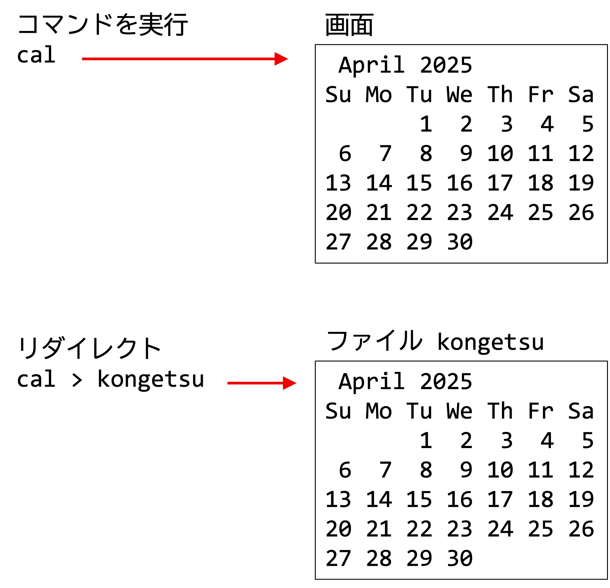
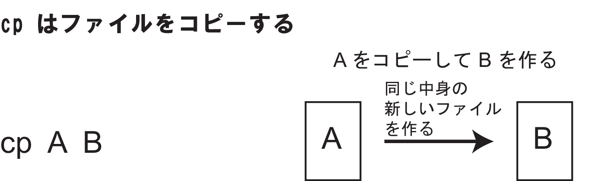
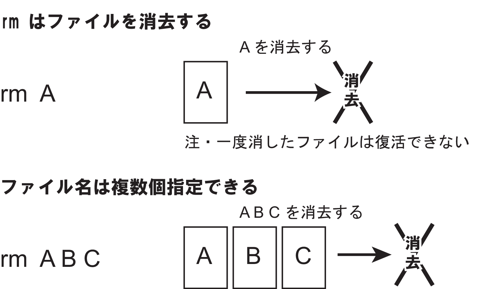
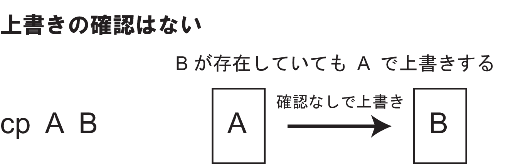

# ファイル操作コマンド

前の章では、ディレクトリの移動や中身の確認方法を学んだ。この章では、UNIXシステムにおけるファイル操作の基本を学ぶ。具体的には、コマンドの実行結果をファイルに保存する方法、ファイルの中身を見る方法、ファイルをコピーする方法、ファイルを削除する方法、そしてファイルの名前を変更したり移動する方法である。これらの操作は、コンピュータを使う上で非常に基本的かつ重要なものであるため、一つ一つ確実に理解していこう。

## 演習の準備

**macOS**
```
unset LANG
```

## コマンドの実行結果をファイルに入れる: リダイレクト

ターミナルでコマンドを実行すると、通常、その結果は画面（専門用語では「標準出力」という）に表示される。例えば `cal` コマンドは今月のカレンダーを表示する。


## カレンダーの表示: `cal`

たとえば2025年4月に実行すると以下のようになる。

```sh
cal
     April 2025       
Su Mo Tu We Th Fr Sa  
       1  2  3  4  5  
 6  7  8  9 10 11 12  
13 14 15 16 17 18 19  
20 21 22 23 24 25 26  
27 28 29 30
```

この実行結果を、画面ではなくファイルに保存したい場合がある。そのようなときに使うのが「**リダイレクト** (redirection)」という機能である。

### 出力をファイルに書き込む: `>`

記号「`>`」を使うと、コマンドの出力の向きを変えて、ファイルに書き出すことができる。
つまり、通常であれば画面（標準出力）に出力するものを、出力の向きを変えて、ファイルに出力できる。

「`cal`」コマンドの実行結果を「`kongetsu`」というファイルに保存してみよう。

```sh
cal > kongetsu
```

今度は、画面には何も表示されなかったはずである。これは、「`cal`」コマンドの実行結果が、画面（標準出力）ではなく、「`kongetsu`」というファイルに書き込まれたからである。

このように、コマンドの実行結果をファイルに保存するには、以下のように書く。

```
「コマンド」 > 「ファイル名」
```

これを**リダイレクト**と呼ぶ。画面に向かっていた出力の流れを、ファイルに向けるイメージである。



もし指定したファイル名が存在しない場合は、新しくファイルが作成される。

**既に同名のファイルが存在していた場合は、警告なしに新しい内容で上書きされてしまう。**
この動作は、意図しないデータ損失に繋がる可能性があるため、十分に理解しておく必要がある。

## ファイル名について

ファイル名は、基本的には自由に付けることができるが、UNIXシステムでコマンドラインから扱う際には、いくつか注意点と推奨される慣習がある。

* **使える文字**: 英数字（アルファベット `a-z`, `A-Z`、数字 `0-9`）、ハイフン（`-`）、アンダースコア（`_`）、ドット（`.`）などが安全でよく使われる。
    *   例: 「`report.txt`」「`my_document_ver2.docx`」「`image-001.jpg`」「`backup_2025-04-01.tar.gz`」
* **避けるべき文字・注意が必要な文字**:
    * **スペース**: ファイル名にスペースを含めると、コマンドラインで一つのファイル名として認識させるために引用符で囲むなどの特別な扱いが必要になり、非常に面倒である。代わりにハイフンやアンダースコアを使おう。例: 「`my report.txt`」ではなく「`my-report.txt`」や「`my_report.txt`」
    * **特殊記号**:「`*`」「`?`」「`&`」「`|`」「`<`」「`>`」「`$`」「`!`」「`\`」「(`」「`)`」「`;」などは、シェル（コマンドを解釈・実行するプログラム）にとって特別な意味を持つ（ワイルドカード、リダイレクト、コマンド連結など）。これらをファイル名に使うと、予期せぬ動作を引き起こしたり、ファイルを参照できなかったりする原因となるため、避けるべきである。
    * **先頭のハイフン「`-`」**: コマンドのオプション（例: 「`ls -l`」の「`-l`」）と間違われる可能性があるため、ファイル名の先頭をハイフンにするのは避けた方が無難である。
    * **日本語文字**: 近年では多くのシステムで問題なく扱えるが、古いシステムを使っているときは避けた方がいい。
* **大文字・小文字の区別**: UNIXシステムでは、ファイル名の大文字と小文字は厳密に区別される。つまり、「`File.txt`」と「`file.txt`」は異なるファイルとして扱われる。これはWindowsの初期設定とは異なるため注意が必要である。
* **隠しファイル**: ファイル名の先頭をドット「`.`」にすると、「隠しファイル」になる。これらは通常「`ls`」コマンドでは表示されず（「`-a`」オプションが必要）、主にシステムの設定ファイルやアプリケーションが内部的に使用するデータなどに使われる。
    * 例: 「`.bashrc`」（シェルの設定ファイル）、「`.gitconfig`」（Gitの設定ファイル）など

分かりやすく、内容を推測でき、かつコマンドラインで扱いやすいファイル名を付けることを心がけよう。

## ファイルのリストを表示する: `ls`

現在のディレクトリにどんなファイルやディレクトリがあるかを確認するには、「`ls`」コマンドを使う。これは前の章でも学んだ通りである。

**WSL上のUbuntu**
```sh
ls
kongetsu  venv-llm
```

**macOS**

```sh
ls
Desktop		Downloads	Movies		Pictures	kongetsu
Documents	Library		Music		Public
```

先ほど作成した「`kongetsu`」が表示されている。


「「`ls`」コマンドには様々なオプションがあり、「`-l`」（詳細表示）、「`-a`」（隠しファイルも表示）、「`-F`」（ファイル種別表示）などは特によく使われる。

## ファイルの中身を表示する: `cat`
ファイルの中身を画面に表示するには「`cat`」コマンドを使う。「`cat`」は「con**cat**enate（連結する）」という英語が由来であり、複数のファイルの中身を連結して表示するよいう意味であるが、単一のファイルの中身の表示にもよく用いられる。

先ほど作成した「`kongetsu`」の中身を見てみよう。

```sh
cat kongetsu 
     April 2025       
Su Mo Tu We Th Fr Sa  
       1  2  3  4  5  
 6  7  8  9 10 11 12  
13 14 15 16 17 18 19  
20 21 22 23 24 25 26  
27 28 29 30
```

「`cal`」コマンドの結果が正しく保存されていることが確認できた。

「`cat`」コマンドは、複数のファイルを指定すると、それらを指定された順番に連結して一気に表示する。

```sh
cat 「ファイル名1」 「ファイル名2」 ...
```

例えば、`file1.txt` と `file2.txt` の内容を続けて表示したい場合は `cat file1.txt file2.txt` と入力する。


**注意**: 「`cat`」コマンドで、非常に大きなファイルを表示しようとすると、ターミナルの画面が一瞬で大量のテキストで埋め尽くされてしまうことがある。
大きなファイルの内容を確認したい場合は、後で紹介するページャーの「`less`」コマンドなどを使う。

## ファイルをたくさん作ってみよう

前の章で紹介したように、たとえば2025年のカレンダーを表示するには、「`cal 2025`」である。
今年のカレンダーを「`kotoshi`」というファイルに入れてみよう。以下の「`2025`」の部分には、現在の年を入れる。

```sh
cal 2025 > kotoshi
```

`ls` コマンドで、「kotoshi」ができたか、確かめてみよう。

**WSL上のUbuntu**
```sh
ls
kongetsu  kotoshi  venv-llm
```

**macOS**
```sh
ls
Downloads	Music		kongetsu    Desktop
Library		Pictures	kotoshi     Documents
Movies		Public
```

確かにできている。次は、今年の4月のカレンダーも、同じように「`4gatsu`」というファイルに入
れてみよう。同様に「`2025`」の部分を現在の年号にして欲しい。

そして続けて「`ls`」と打つと、確かに「`4gatsu`」もできていることがわかる。

**WSL上のUbuntu**
```sh
cal 4 2025 > 4gatsu
ls
4gatsu  kongetsu  kotoshi  venv-llm
```

**macOS**
```sh
cal 4 2025 > 4gatsu
ls
4gatsu		Downloads	Music		kongetsu
Desktop		Library		Pictures	kotoshi
Documents	Movies		Public
```

#### 練習
1. 自分が生まれた月のカレンダーを「`tanjoubi`」というファイルに入れてみよう。
2. 「`ls`」でファイルができていることを確認しよう。
3. 「`cat`」でファイルの中身を表示してみよう。

### 出力をファイルに追加: `>>`

既存のファイルの内容を消さずに、コマンドの実行結果をファイルの末尾に追加したい場合は、記号「`>>`」を使う。

例えば、先ほど作成した「`kongetsu`」に、さらに 「`cal`」の結果を追記してみよう。

```sh
cal >> kongetsu
```

中身を確認してみよう。
```sh
cat kongetsu
     April 2025       
Su Mo Tu We Th Fr Sa  
       1  2  3  4  5  
 6  7  8  9 10 11 12  
13 14 15 16 17 18 19  
20 21 22 23 24 25 26  
27 28 29 30   

     April 2025       
Su Mo Tu We Th Fr Sa  
       1  2  3  4  5  
 6  7  8  9 10 11 12  
13 14 15 16 17 18 19  
20 21 22 23 24 25 26  
27 28 29 30   
```
「`>>`」を使った場合、指定したファイルが存在しなければ新しく作成され、存在すればそのファイルの末尾に新しい内容が付け加えられる。

## ファイルのコピー: `cp`

ファイルをコピーするには、「`cp`」コマンドを使う。「`cp`」は「**c**o**p**y – コピー」という意味だ。
「`kotoshi`」というファイルをコピーして、「`thismonth`」というファイルを作るには、次のように打つ。

```sh
cp kongetsu thismonth
```

「`ls`」と「`cat`」で確かめてみよう。

**WSL上のUbuntu**
```sh
ls
4gatsu  kongetsu  kotoshi  thismonth  venv-llm
```
```sh
cat thismonth
     April 2025       
Su Mo Tu We Th Fr Sa  
       1  2  3  4  5  
 6  7  8  9 10 11 12  
13 14 15 16 17 18 19  
20 21 22 23 24 25 26  
27 28 29 30   
```

**macOS**
```sh
 ls
4gatsu		Downloads	Music		kongetsu
Desktop		Library		Pictures	kotoshi
Documents	Movies		Public		thismonth
```
```sh
cat thismonth  
     April 2025       
Su Mo Tu We Th Fr Sa  
       1  2  3  4  5  
 6  7  8  9 10 11 12  
13 14 15 16 17 18 19  
20 21 22 23 24 25 26  
27 28 29 30   
```

確かに、「`thismonth`」というファイルができていて、「`kongetsu`」の中身がコピーされていることがわかる。

まとめると、ファイルをコピーするには、次のようにすればいい。

```sh
cp 「コピー元のファイル名」 「コピー先のファイル名」
```



## ファイルの削除: `rm`

ファイルを削除するには「`rm`」コマンド（**r**e**m**ove の略）を使う。

次のようにして、「`thismonth`」を消してみよう。

```sh
rm thismonth
```

「`ls`」で消えたか確認してみよう。

**WSL上のUbuntu**
```sh
ls
4gatsu  kongetsu  kotoshi  venv-llm
```

**macOS**
```sh
ls
4gatsu		Downloads	Music		kongetsu
Desktop		Library		Pictures	kotoshi
Documents	Movies		Public
```

確かに消えていることがわかる。

**【重要】**
**`rm` コマンドで削除したファイルは、通常、元に戻すことができない！**
Windowsの「ごみ箱」やmacOSの「ゴミ箱」のような、一時的にファイルが保管される場所は、「`rm`」コマンドでは基本的に存在しない。削除を実行した瞬間に、ファイルはシステムから削除されると考えてよい。

**削除する前に、本当に消して良いファイルか、ファイル名を間違えていないか、細心の注意を払って確認すること。** タイプミス一つで、取り返しのつかないことになる可能性がある。



## ファイルの名前変更 (移動): `mv`

ファイルの名前を変更するには「`mv`」コマンド（**m**o**v**e の略）を使う。

「`mv`」は元々「移動 (move)」を意味するコマンドであるが、新しい名前を指定すると、結果としてファイル名の変更として機能する。

では、次のようにして、「`kongetsu`」を「`thismonth`」というファイル名に変えてみよう。

```sh
mv kongetsu thismonth
```

ls で名前が変わっているか、確認してみよう。

**WSL上のUbuntu**
```sh
ls
4gatsu  kotoshi  thismonth  venv-llm
```

**macOS**
```
ls
4gatsu		Downloads	Music		Desktop
Library		Pictures	kotoshi     Documents
Movies		Public		thismonth
```

「`kongetsu`」がなくなって、「`thismonth`」ができていることがわかる。

まとめると、ファイルの名前を変えるには、次のようにすればいい。

```
mv 「現在のファイル名」 「新しいファイル名」
```


#### 練習
1. 「`kotoshi`」をコピーして、「`thisyear`」というファイルを作ってみよう。
2. 「`thisyear`」ができているか、「`ls`」で確かめてみよう。
3. 「`thisyear`」を消してみよう。
4. 「`thisyear`」が消えたか、「`ls`」で確かめてみよう。
5. 「`kotoshi`」の名前を、たとえば「`2025nen`」のように実際の年号に変えて
みよう。
6. 名前が変わっているか、「`ls`」で確かめてみよう。

## ファイル操作時の注意点：上書きと `-i` オプションによる確認

これまで見てきたように、「`cp`」や「`mv`」コマンド、そしてリダイレクト「`>`」は、コピー先や変更後のファイル名、リダイレクト先のファイルが既に存在する場合、**ユーザーに確認することなくファイルを上書きしてしまう。**

これは、WindowsなどのGUI操作での「ファイルの置換またはスキップ」という確認ダイアログに慣れていると、非常に危険な動作に感じられるだろう。慣れないうちは、この仕様が原因で誤って重要なファイルを消してしまうかもしれない。




このような事故を防ぐために、「`cp`」「`mv`」「`rm`」コマンドには「`-i`」（interactive）オプションが用意されている。
このオプションを付けてコマンドを実行すると、上書きや削除が発生する前に、本当に実行してよいか確認のメッセージが表示されるようになる。

例えば、「`file_A.txt`」を「`file_B.txt`」に上書きコピーしようとする場合:

```zsh
% cp -i file_A.txt file_B.txt
overwrite file_B.txt? (y/n [n]) _
```
ここで「`y`」（yes）と入力して <kbd class="keyboard-key nowrap" lang="en" style="border: 1px solid #aaa; border-radius: 2px; box-shadow: 1px 2px 2px #ddd; background-color: #f9f9f9; background-image: linear-gradient(top, #eee, #f9f9f9, #eee); padding: 1px 3px; font-family: inherit; font-size: 0.85em;">Enter</kbd>
キーを押すと上書きが実行され、
「`n`」（no）または何も入力せずに <kbd class="keyboard-key nowrap" lang="en" style="border: 1px solid #aaa; border-radius: 2px; box-shadow: 1px 2px 2px #ddd; background-color: #f9f9f9; background-image: linear-gradient(top, #eee, #f9f9f9, #eee); padding: 1px 3px; font-family: inherit; font-size: 0.85em;">Enter</kbd>  キーを押す（あるいは <kbd class="keyboard-key nowrap" lang="en" style="border: 1px solid #aaa; border-radius: 2px; box-shadow: 1px 2px 2px #ddd; background-color: #f9f9f9; background-image: linear-gradient(top, #eee, #f9f9f9, #eee); padding: 1px 3px; font-family: inherit; font-size: 0.85em;">Ctrl</kbd>+<kbd class="keyboard-key nowrap" lang="en" style="border: 1px solid #aaa; border-radius: 2px; box-shadow: 1px 2px 2px #ddd; background-color: #f9f9f9; background-image: linear-gradient(top, #eee, #f9f9f9, #eee); padding: 1px 3px; font-family: inherit; font-size: 0.85em;">c</kbd> でキャンセルする）と処理は中断される。
「`[n]`」と表示される場合、デフォルトでは No (実行しない) が選択されることを意味している。

同様に、「`mv -i`」や「`rm -i`」も使える。特に「`rm -i`」は、ファイルを削除する前に一つ一つ確認してくれるため、誤操作を防ぐのに非常に役立つ。

```zsh
rm -i old_file.txt
remove old_file.txt? (y/n [n]) _
```

**UNIX操作に慣れないうちは、これらの「`-i`」オプションを使ってもいいだろう。**
あるいは、シェルの設定で「`alias rm='rm -i'`」のように別名（エイリアス）を設定しておけば、単に「`rm`」と入力しただけでも常に「`-i`」オプション付きで実行されるようになり、より安全になる（エイリアスについては後の章で触れる）。


## この章で紹介したコマンドまとめ
| コマンド        | 説明                                                      | 基本的な使い方                                          |
|-----------------|-----------------------------------------------------------|---------------------------------------------------------|
| `>`             | コマンドの実行結果をファイルに**書き込む**する            | `コマンド > ファイル名`                                 |
| `>>`            | コマンドの実行結果をファイルに**追加する**する            | `コマンド >> ファイル名`                                |
| `ls`            | ファイルやディレクトリの一覧を表示する                    | `ls [オプション]`                                       |
| `cat`           | ファイルの中身を画面に表示する（連結も可能）              | `cat ファイル名1 [ファイル名2 ...]`                     |
| `cp`            | ファイルをコピーする                                      | `cp [オプション] コピー元ファイル名 コピー先ファイル名` |
| `rm`            | ファイルを削除する                                        | `rm [オプション] 削除したいファイル名`                  |
| `mv`            | ファイルの名前を変更する (または別の場所に移動する)       | `mv [オプション] 現在のファイル名 新しいファイル名`     |
| `-i` オプション | `cp`, `mv`, `rm` で上書きや削除の前に確認メッセージを表示 | `cp -i ...`, `mv -i ...`, `rm -i ...`                   |
