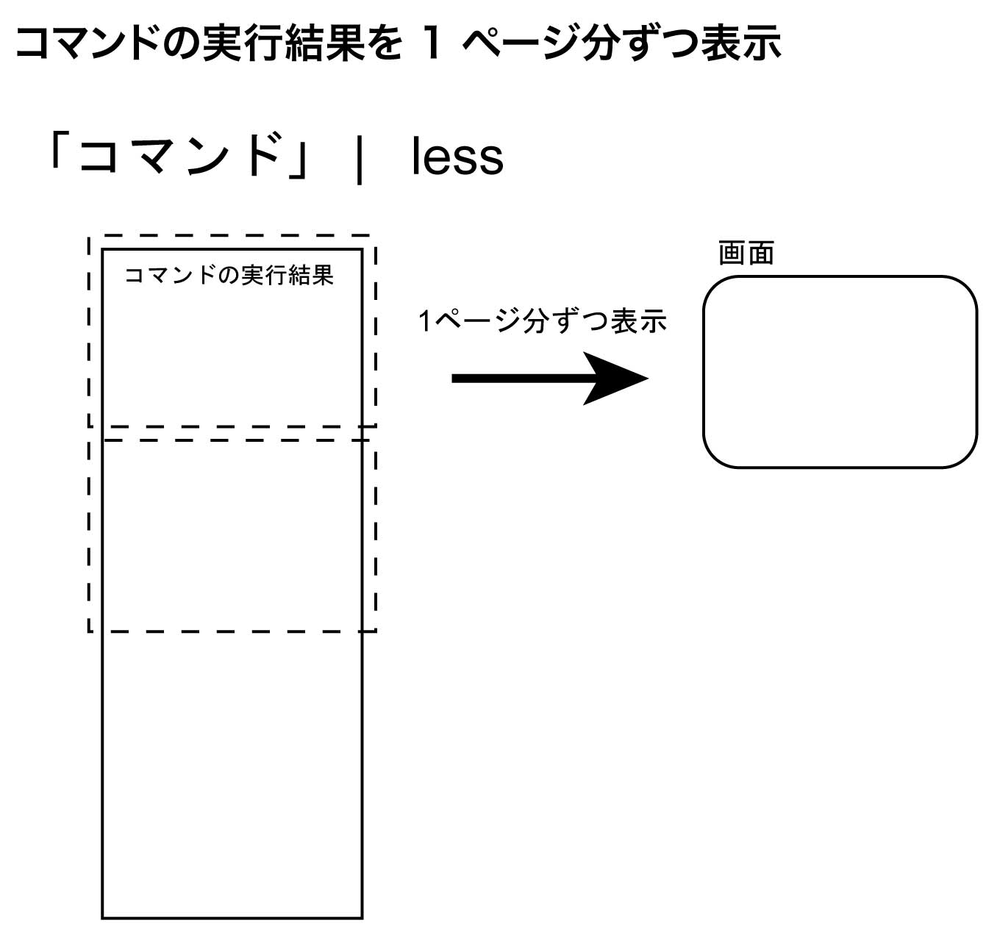

# 1ページずつ表示するページャー

前の章では、ファイルの作成やコピー、削除といった基本的なファイル操作を学んだ。しかし、ファイルの中身が長かったり、コマンドの実行結果がたくさん表示されたりすると、画面がスクロールしてしまい、先頭部分が見えなくなることがある。

この章では、そのような場合に役立つ「ページャー」という種類のコマンドを紹介する。

## 1画面ずつ表示する: ページャー `less`

### ページャーとは何か？

例えば、「`cat`」コマンドで長いファイルの中身を表示しようとすると、あっという間に画面が流れてしまい、最初の方を読むことができない。そのようなとき、「ページャー」を利用すると、ファイルの内容を1画面の大きさに区切って表示し、まるで本を1ページずつめくるように閲覧できる。

UNIXシステムでよく使われるページャーには「`more`」と「`less`」がある。
ここでは、より高機能な「`less`」を紹介する。
「`less`」は WSL上のUbuntu や macOS に標準でインストールされているため、すぐに利用できる。

### 「`less`」でファイルの中を見てみよう

まず、「`cal`」の結果をファイルにリダイレクトしよう。

```sh
cal 2025 > 3years
cal 2026 >> 3years
cal 2027 >> 3years
```

このファイルの中身を「`cat`」で見てみよう。

```sh
cat 3years
```

ファイルが長いので、表示流れてしまうだろう。

次に「`less`」で見てみよう。
```sh
less 3years
```

すると、1画面分表示され、一番下にはファイル名（この場合は「`3years`」や「`(END)`」、またはコロン「`:`」が表示されている。
これが「`less`」の表示である。

表示例
```
…
 5  6  7  8  9 10 11   2  3  4  5  6  7  8   7  8  9 10 11 12 13  
12 13 14 15 16 17 18   9 10 11 12 13 14 15  14 15 16 17 18 19 20  
19 20 21 22 23 24 25  16 17 18 19 20 21 22  21 22 23 24 25 26 27  
26 27 28 29 30 31     23 24 25 26 27 28 29  28 29 30 31           
                      30                                          
(END)
```

### `less`の基本的な操作

「`less`」を使っている間の主な操作はキーボードで行う。

| 動作                                  | キー                     | 備考                                   |
| :------------------------------------ | :----------------------- | :------------------------------------- |
| 次のページへ進む                      | <kbd class="keyboard-key nowrap" lang="en" style="border: 1px solid #aaa; border-radius: 2px; box-shadow: 1px 2px 2px #ddd; background-color: #f9f9f9; background-image: linear-gradient(top, #eee, #f9f9f9, #eee); padding: 1px 3px; font-family: inherit; font-size: 0.85em;">スペース</kbd>または<kbd class="keyboard-key nowrap" lang="en" style="border: 1px solid #aaa; border-radius: 2px; box-shadow: 1px 2px 2px #ddd; background-color: #f9f9f9; background-image: linear-gradient(top, #eee, #f9f9f9, #eee); padding: 1px 3px; font-family: inherit; font-size: 0.85em;">f</kbd>  |                                        |
| 前のページへ戻る                      | <kbd class="keyboard-key nowrap" lang="en" style="border: 1px solid #aaa; border-radius: 2px; box-shadow: 1px 2px 2px #ddd; background-color: #f9f9f9; background-image: linear-gradient(top, #eee, #f9f9f9, #eee); padding: 1px 3px; font-family: inherit; font-size: 0.85em;">b</kbd>                 |                                        |
| 1行下へスクロール                     | <kbd class="keyboard-key nowrap" lang="en" style="border: 1px solid #aaa; border-radius: 2px; box-shadow: 1px 2px 2px #ddd; background-color: #f9f9f9; background-image: linear-gradient(top, #eee, #f9f9f9, #eee); padding: 1px 3px; font-family: inherit; font-size: 0.85em;">j</kbd>または<kbd class="keyboard-key nowrap" lang="en" style="border: 1px solid #aaa; border-radius: 2px; box-shadow: 1px 2px 2px #ddd; background-color: #f9f9f9; background-image: linear-gradient(top, #eee, #f9f9f9, #eee); padding: 1px 3px; font-family: inherit; font-size: 0.85em;">↓</kbd> |                                        |
| 1行上へスクロール                     | <kbd class="keyboard-key nowrap" lang="en" style="border: 1px solid #aaa; border-radius: 2px; box-shadow: 1px 2px 2px #ddd; background-color: #f9f9f9; background-image: linear-gradient(top, #eee, #f9f9f9, #eee); padding: 1px 3px; font-family: inherit; font-size: 0.85em;">k</kbd>または <kbd class="keyboard-key nowrap" lang="en" style="border: 1px solid #aaa; border-radius: 2px; box-shadow: 1px 2px 2px #ddd; background-color: #f9f9f9; background-image: linear-gradient(top, #eee, #f9f9f9, #eee); padding: 1px 3px; font-family: inherit; font-size: 0.85em;">↑</kbd> |                                        |
| 表示されている内容の中で文字列を検索する | <kbd class="keyboard-key nowrap" lang="en" style="border: 1px solid #aaa; border-radius: 2px; box-shadow: 1px 2px 2px #ddd; background-color: #f9f9f9; background-image: linear-gradient(top, #eee, #f9f9f9, #eee); padding: 1px 3px; font-family: inherit; font-size: 0.85em;">/</kbd> の後に検索したい文字を入力して <kbd class="keyboard-key nowrap" lang="en" style="border: 1px solid #aaa; border-radius: 2px; box-shadow: 1px 2px 2px #ddd; background-color: #f9f9f9; background-image: linear-gradient(top, #eee, #f9f9f9, #eee); padding: 1px 3px; font-family: inherit; font-size: 0.85em;">Enter</kbd> | 下方向へ検索。見つかった場合、<kbd class="keyboard-key nowrap" lang="en" style="border: 1px solid #aaa; border-radius: 2px; box-shadow: 1px 2px 2px #ddd; background-color: #f9f9f9; background-image: linear-gradient(top, #eee, #f9f9f9, #eee); padding: 1px 3px; font-family: inherit; font-size: 0.85em;">n</kbd>で次候補、<kbd class="keyboard-key nowrap" lang="en" style="border: 1px solid #aaa; border-radius: 2px; box-shadow: 1px 2px 2px #ddd; background-color: #f9f9f9; background-image: linear-gradient(top, #eee, #f9f9f9, #eee); padding: 1px 3px; font-family: inherit; font-size: 0.85em;">N</kbd>で前候補へ移動 |
| 表示されている内容の中で文字列を逆方向に検索する | <kbd class="keyboard-key nowrap" lang="en" style="border: 1px solid #aaa; border-radius: 2px; box-shadow: 1px 2px 2px #ddd; background-color: #f9f9f9; background-image: linear-gradient(top, #eee, #f9f9f9, #eee); padding: 1px 3px; font-family: inherit; font-size: 0.85em;">?</kbd> の後に検索したい文字を入力して <kbd class="keyboard-key nowrap" lang="en" style="border: 1px solid #aaa; border-radius: 2px; box-shadow: 1px 2px 2px #ddd; background-color: #f9f9f9; background-image: linear-gradient(top, #eee, #f9f9f9, #eee); padding: 1px 3px; font-family: inherit; font-size: 0.85em;">Enter</kbd> | 上方向へ検索。操作は <kbd class="keyboard-key nowrap" lang="en" style="border: 1px solid #aaa; border-radius: 2px; box-shadow: 1px 2px 2px #ddd; background-color: #f9f9f9; background-image: linear-gradient(top, #eee, #f9f9f9, #eee); padding: 1px 3px; font-family: inherit; font-size: 0.85em;">/</kbd> と同様             |
| `less` を終了する                     | <kbd class="keyboard-key nowrap" lang="en" style="border: 1px solid #aaa; border-radius: 2px; box-shadow: 1px 2px 2px #ddd; background-color: #f9f9f9; background-image: linear-gradient(top, #eee, #f9f9f9, #eee); padding: 1px 3px; font-family: inherit; font-size: 0.85em;">q</kbd>                 |                                        |


例えば、<kbd class="keyboard-key nowrap" lang="en" style="border: 1px solid #aaa; border-radius: 2px; box-shadow: 1px 2px 2px #ddd; background-color: #f9f9f9; background-image: linear-gradient(top, #eee, #f9f9f9, #eee); padding: 1px 3px; font-family: inherit; font-size: 0.85em;">スペース</kbd>を押すと次のページが表示され、<kbd class="keyboard-key nowrap" lang="en" style="border: 1px solid #aaa; border-radius: 2px; box-shadow: 1px 2px 2px #ddd; background-color: #f9f9f9; background-image: linear-gradient(top, #eee, #f9f9f9, #eee); padding: 1px 3px; font-family: inherit; font-size: 0.85em;">b</kbd>で前のページに戻ることができる。読み終わったら <kbd class="keyboard-key nowrap" lang="en" style="border: 1px solid #aaa; border-radius: 2px; box-shadow: 1px 2px 2px #ddd; background-color: #f9f9f9; background-image: linear-gradient(top, #eee, #f9f9f9, #eee); padding: 1px 3px; font-family: inherit; font-size: 0.85em;">q</kbd>キーで「`less`」を終了し、元のプロンプト表示に戻る。

画面の一番下にファイル名、コロン「`:`」、あるいはファイルの終端まで行って「`(END)`」と表示されていれば、「`less`」が動作中である。 <kbd class="keyboard-key nowrap" lang="en" style="border: 1px solid #aaa; border-radius: 2px; box-shadow: 1px 2px 2px #ddd; background-color: #f9f9f9; background-image: linear-gradient(top, #eee, #f9f9f9, #eee); padding: 1px 3px; font-family: inherit; font-size: 0.85em;">q</kbd> を押すまで他のコマンドは入力できない。


### 練習: `less` の操作に慣れよう☆
1. 「`3years`」を「`less`」で開いてみよう
2. 「`スペース`」キーで数ページ進んでみよう。
3. <kbd class="keyboard-key nowrap" lang="en" style="border: 1px solid #aaa; border-radius: 2px; box-shadow: 1px 2px 2px #ddd; background-color: #f9f9f9; background-image: linear-gradient(top, #eee, #f9f9f9, #eee); padding: 1px 3px; font-family: inherit; font-size: 0.85em;">b</kbd>で数ページ戻ってみよう。
4. <kbd class="keyboard-key nowrap" lang="en" style="border: 1px solid #aaa; border-radius: 2px; box-shadow: 1px 2px 2px #ddd; background-color: #f9f9f9; background-image: linear-gradient(top, #eee, #f9f9f9, #eee); padding: 1px 3px; font-family: inherit; font-size: 0.85em;">j</kbd> キーや <kbd class="keyboard-key nowrap" lang="en" style="border: 1px solid #aaa; border-radius: 2px; box-shadow: 1px 2px 2px #ddd; background-color: #f9f9f9; background-image: linear-gradient(top, #eee, #f9f9f9, #eee); padding: 1px 3px; font-family: inherit; font-size: 0.85em;">k</kbd> キーで1行ずつスクロールしてみよう。
5. <kbd class="keyboard-key nowrap" lang="en" style="border: 1px solid #aaa; border-radius: 2px; box-shadow: 1px 2px 2px #ddd; background-color: #f9f9f9; background-image: linear-gradient(top, #eee, #f9f9f9, #eee); padding: 1px 3px; font-family: inherit; font-size: 0.85em;">/</kbd> に続けて 「`20`」や「`3`」を入力して <kbd class="keyboard-key nowrap" lang="en" style="border: 1px solid #aaa; border-radius: 2px; box-shadow: 1px 2px 2px #ddd; background-color: #f9f9f9; background-image: linear-gradient(top, #eee, #f9f9f9, #eee); padding: 1px 3px; font-family: inherit; font-size: 0.85em;">Enter</kbd> を押し、検索機能を試してみよう。
6. 検索で見つかった場合、<kbd class="keyboard-key nowrap" lang="en" style="border: 1px solid #aaa; border-radius: 2px; box-shadow: 1px 2px 2px #ddd; background-color: #f9f9f9; background-image: linear-gradient(top, #eee, #f9f9f9, #eee); padding: 1px 3px; font-family: inherit; font-size: 0.85em;">n</kbd> を押して次の候補へ移動できるか試してみよう。<kbd class="keyboard-key nowrap" lang="en" style="border: 1px solid #aaa; border-radius: 2px; box-shadow: 1px 2px 2px #ddd; background-color: #f9f9f9; background-image: linear-gradient(top, #eee, #f9f9f9, #eee); padding: 1px 3px; font-family: inherit; font-size: 0.85em;">N</kbd>で前の候補へ移動できるかも試してみよう。
7.  <kbd class="keyboard-key nowrap" lang="en" style="border: 1px solid #aaa; border-radius: 2px; box-shadow: 1px 2px 2px #ddd; background-color: #f9f9f9; background-image: linear-gradient(top, #eee, #f9f9f9, #eee); padding: 1px 3px; font-family: inherit; font-size: 0.85em;">q</kbd> キーで `less` を終了しよう。

### コマンドの実行結果も1ページずつ: 「`less`」とパイプ

「`less`」は、ファイルの中身だけでなく、次のようにシェルの「パイプ (`|`)」と組み合わせることで、コマンドの実行結果も1画面ずつ区切って表示することができる。

```sh
コマンド | less
```

例えば、カレンダーを「`cal`」コマンドで表示し、その結果を「`less`」で1画面ずつ表示してみよう。

```sh
cal 2025 | less
```

UNIX系システムでは、「`|`」（パイプラインと呼ぶこともある）を使って、あるコマンドの実行結果（標準出力） を、別のコマンドの入力（標準入力）として渡すことができる。
この仕組みを **「パイプ」** と言う。
水道管が水を運ぶように、データが一方向へ流れていくイメージである。
ここでは、「`cal 2025`」の実行結果（つまり、2025年のカレンダー）を、パイプを使って「`less`」コマンドに入力として渡し、1画面ずつ表示させている。

パイプは非常に強力な機能で、複数のコマンドを連携させて複雑な処理を行う際によく使われる。



### ☆練習: パイプと「`less`」を使ってみよう☆
>
1. 「`ls -l /etc/`」というコマンドを実行すると、「`/etc/`」ディレクトリ内のファイルやディレクトリの一覧が詳細情報と共にたくさん表示される。この結果を 「`less`」で表示してみよう。
```sh
ls -l /etc/ | less
```
2. 表示された内容を <kbd class="keyboard-key nowrap" lang="en" style="border: 1px solid #aaa; border-radius: 2px; box-shadow: 1px 2px 2px #ddd; background-color: #f9f9f9; background-image: linear-gradient(top, #eee, #f9f9f9, #eee); padding: 1px 3px; font-family: inherit; font-size: 0.85em;">スペース</kbd> や <kbd class="keyboard-key nowrap" lang="en" style="border: 1px solid #aaa; border-radius: 2px; box-shadow: 1px 2px 2px #ddd; background-color: #f9f9f9; background-image: linear-gradient(top, #eee, #f9f9f9, #eee); padding: 1px 3px; font-family: inherit; font-size: 0.85em;">b</kbd> キーでスクロールしてみよう。
3. <kbd class="keyboard-key nowrap" lang="en" style="border: 1px solid #aaa; border-radius: 2px; box-shadow: 1px 2px 2px #ddd; background-color: #f9f9f9; background-image: linear-gradient(top, #eee, #f9f9f9, #eee); padding: 1px 3px; font-family: inherit; font-size: 0.85em;">/</kbd> を使って、例えば「`conf`」という単語を検索してみよう。
4. <kbd class="keyboard-key nowrap" lang="en" style="border: 1px solid #aaa; border-radius: 2px; box-shadow: 1px 2px 2px #ddd; background-color: #f9f9f9; background-image: linear-gradient(top, #eee, #f9f9f9, #eee); padding: 1px 3px; font-family: inherit; font-size: 0.85em;">q</kbd>で「`less`」を終了しよう。

## ターミナルのスクロールバック機能も便利

実は、「`less`」を使わなくても、最近のターミナルソフト（macOSの「ターミナル.app」やWindowsの「ターミナル」など）には、画面をスクロールして過去の表示を遡って見る機能（スクロールバック機能）が標準で備わっている。

* **Windows ターミナル**: マウスホイールやスクロールバーで操作できる。<kbd class="keyboard-key nowrap" lang="en" style="border: 1px solid #aaa; border-radius: 2px; box-shadow: 1px 2px 2px #ddd; background-color: #f9f9f9; background-image: linear-gradient(top, #eee, #f9f9f9, #eee); padding: 1px 3px; font-family: inherit; font-size: 0.85em;">Ctrl</kbd> + <kbd class="keyboard-key nowrap" lang="en" style="border: 1px solid #aaa; border-radius: 2px; box-shadow: 1px 2px 2px #ddd; background-color: #f9f9f9; background-image: linear-gradient(top, #eee, #f9f9f9, #eee); padding: 1px 3px; font-family: inherit; font-size: 0.85em;">Shift</kbd> + <kbd class="keyboard-key nowrap" lang="en" style="border: 1px solid #aaa; border-radius: 2px; box-shadow: 1px 2px 2px #ddd; background-color: #f9f9f9; background-image: linear-gradient(top, #eee, #f9f9f9, #eee); padding: 1px 3px; font-family: inherit; font-size: 0.85em;">↑</kbd>や<kbd class="keyboard-key nowrap" lang="en" style="border: 1px solid #aaa; border-radius: 2px; box-shadow: 1px 2px 2px #ddd; background-color: #f9f9f9; background-image: linear-gradient(top, #eee, #f9f9f9, #eee); padding: 1px 3px; font-family: inherit; font-size: 0.85em;">↓</kbd> なども使える (設定による)。
* **macOS ターミナル**: マウスホイールやトラックパッドでスクロールできる。また、<kbd class="keyboard-key nowrap" lang="en" style="border: 1px solid #aaa; border-radius: 2px; box-shadow: 1px 2px 2px #ddd; background-color: #f9f9f9; background-image: linear-gradient(top, #eee, #f9f9f9, #eee); padding: 1px 3px; font-family: inherit; font-size: 0.85em;">Command</kbd> + <kbd class="keyboard-key nowrap" lang="en" style="border: 1px solid #aaa; border-radius: 2px; box-shadow: 1px 2px 2px #ddd; background-color: #f9f9f9; background-image: linear-gradient(top, #eee, #f9f9f9, #eee); padding: 1px 3px; font-family: inherit; font-size: 0.85em;">↑</kbd> などでもスクロール可能である。

短い出力結果であれば、このスクロールバック機能で十分なことも多い。
しかし、非常に長い出力や、ファイルの内容をじっくり見たい場合、検索機能も使える「`less`」の方が便利な場面もある。状況に応じて使い分けよう。
