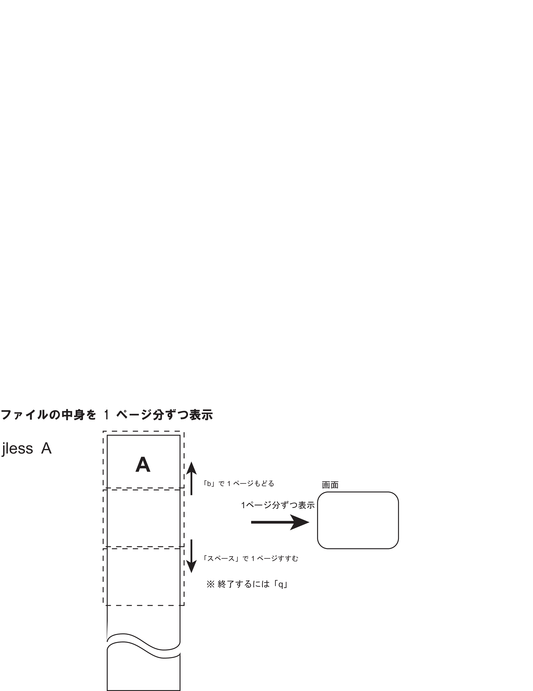
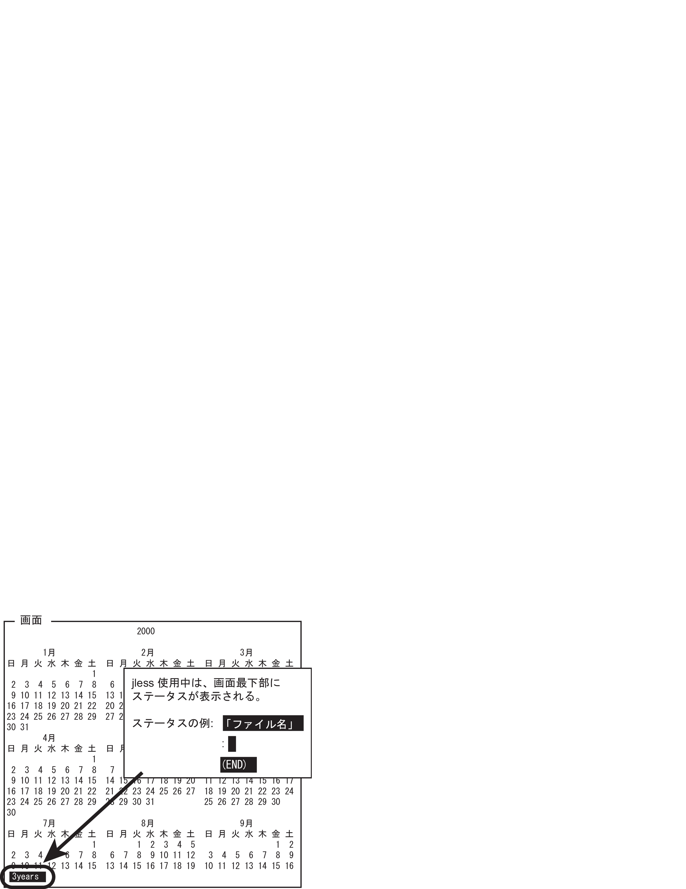
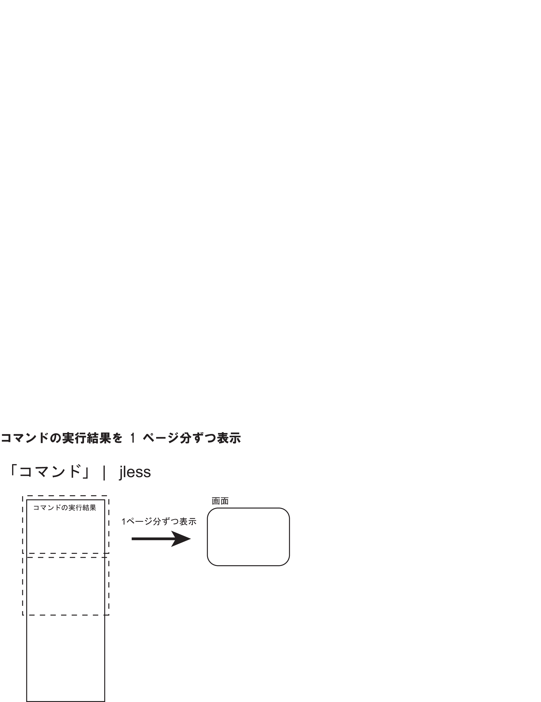

# 長い表示も快適に：ページャー `less` の使い方

前の章では、ファイルの作成やコピー、削除といった基本的なファイル操作を学んだ。しかし、ファイルの中身が長かったり、コマンドの実行結果がたくさん表示されたりすると、画面がスクロールしてしまい、先頭部分が見えなくなることがある。

この章では、そのような場合に役立つ「ページャー」という種類のコマンドを紹介する。

## 1画面ずつ表示する: ページャー `less` (レス)

### ページャーとは何か？

例えば、`cat` コマンドで長いファイルの中身を表示しようとすると、あっという間に画面が流れてしまい、最初の方を読むことができない。そのようなとき、「ページャー」を利用すると、ファイルの内容を1画面の大きさに区切って表示し、まるで本を1ページずつめくるように閲覧できる。

UNIXシステムでよく使われるページャーには `more` (モア) と `less` (レス) がある。ここでは、より高機能な `less` を紹介する。`less` は  WSL上のUbuntu や macOS に標準でインストールされているため、すぐに利用できる。

### `less` でファイルを見てみよう

まず、`cat` でシステムのログを見てみよう。

```zsh
% cat /var/log/syslog # WSL上のUbuntuの場合
% cat /var/log/system.log # macOSの場合
```

ファイルが長いので、表示流れてしまうだろう（短いこともある）。

次に `less` で見てみよう。
```zsh
% less /var/log/syslog # WSL上のUbuntuの場合
% less /var/log/system.log # macOSの場合
```

すると、1画面分表示され、一番下にはファイル名（この場合は `/var/log/syslog` や `/var/log/system.log`）、またはコロン `:` が表示されているはずである。これが `less` の表示である。

macOSの場合の表示例（状況により異なる）：
```
May  9 00:13:49 MacBook-Pro-2024 syslogd[353]: ASL Sender Statistics
May  9 00:31:54 MacBook-Pro-2024 syslogd[353]: ASL Sender Statistics
May  9 00:31:55 MacBook-Pro-2024 syslogd[353]: Configuration Notice:
…
/var/log/system.log
```

### `less` の基本的な操作

`less` を使っている間の主な操作はキーボードで行う。

| 動作                                  | キー                     | 備考                                   |
| :------------------------------------ | :----------------------- | :------------------------------------- |
| 次のページへ進む                      | `スペース` キー または `f` |                                        |
| 前のページへ戻る                      | `b` キー                 |                                        |
| 1行下へスクロール                     | `j` キー または `↓` (下矢印キー) |                                        |
| 1行上へスクロール                     | `k` キー または `↑` (上矢印キー) |                                        |
| 表示されている内容の中で文字列を検索する | `/` の後に検索したい文字を入力して `Enter` | 下方向へ検索。見つかった場合、`n`で次候補、`N`で前候補へ移動 |
| 表示されている内容の中で文字列を逆方向に検索する | `?` の後に検索したい文字を入力して `Enter` | 上方向へ検索。操作は`/`と同様             |
| `less` を終了する                     | `q` キー                 |                                        |


図5.3: `less` の主なキー操作

例えば、`スペース`キーを押すと次のページが表示され、`b`キーで前のページに戻ることができる。読み終わったら `q`キーで `less` を終了し、元のプロンプト表示に戻る。

画面の一番下にファイル名やコロン `:`、あるいはファイルの終端まで行くと `(END)` と表示されていれば、`less` が動作中である。`q` を押すまで他のコマンドは入力できない。


図5.4: `less` 実行中のステータス表示例 (`long_text.txt` の末尾まで表示した場合)

> ### ☆練習1: `less` の操作に慣れよう☆
>
> 1.  `/var/log/syslog` あるいは `/var/log/system.log` を `less` で開いてみよう
> 2.  `スペース` キーで数ページ進んでみよう。
> 3.  `b` キーで数ページ戻ってみよう。
> 4.  `j` キーや `k` キーで1行ずつスクロールしてみよう。
> 5.  `/` に続けて `Linux` や `Darwin`（自分の環境に合わせて、表示されていそうな単語）を入力して `Enter` を押し、検索機能を試してみよう。
> 6.  検索で見つかった場合、`n` キーを押して次の候補へ移動できるか試してみよう。`N` キーで前の候補へ移動できるかも試してみよう。
> 7.  `q` キーで `less` を終了しよう。

### コマンドの実行結果も1ページずつ: `less` とパイプ

`less` は、ファイルの中身だけでなく、次のようにシェルの「パイプ (`|`)」という機能と組み合わせることで、コマンドの実行結果も1画面ずつ区切って表示することができる。

```zsh
「コマンド」 | less
```

例えば、ログを `cat` コマンドで表示し、その結果を `less` で1画面ずつ表示してみよう。

```zsh
% cat /var/log/syslog | less または cat /var/log/system.log | less
```

UNIX系システムでは、「`|`」(パイプラインと呼ぶこともある) を使って、あるコマンドの実行結果 (標準出力) を、別のコマンドの入力 (標準入力) として渡すことができる。この仕組みを **「パイプ」** と言う。水道管が水を運ぶように、データが一方向へ流れていくイメージである。ここでは、`cat ログファイル` の実行結果（つまり、ログファイルの内容）を、パイプを使って `less` コマンドの入力として渡し、1画面ずつ表示させている。これは、`less ログファイル` と同じ結果になるが、パイプの動作を理解するための例として書いた。

パイプは非常に強力な機能で、複数のコマンドを連携させて複雑な処理を行う際によく使われる。


図5.5: パイプ (`|`) を使って `cat` の出力を `less` に渡すイメージ

> ### ☆練習2: パイプと `less` を使ってみよう☆
>
> 1.  `ls -l /etc/` というコマンドを実行すると、`/etc/` ディレクトリ内のファイルやディレクトリの一覧が詳細情報と共にたくさん表示される。この結果を `less` で表示してみよう。
>     ```zsh
>     % ls -l /etc/ | less
>     ```
> 2.  表示された内容を `スペース` キーや `b` キーでスクロールしてみよう。
> 3.  `/` を使って、例えば `conf` という単語を検索してみよう。
> 4.  `q` キーで `less` を終了しよう。

## ターミナルのスクロールバック機能も便利

実は、`less` を使わなくても、最近のターミナルソフト（macOSの「ターミナル.app」やWindowsの「ターミナル」など）には、画面をスクロールして過去の表示を遡って見る機能（スクロールバック機能）が標準で備わっている。

*   **macOS ターミナル**: マウスホイールやトラックパッドでスクロールできる。また、`Command + ↑` などでもスクロール可能である。
*   **Windows ターミナル**: こちらもマウスホイールやスクロールバーで操作できる。`Ctrl + Shift + ↑/↓` なども使える (設定による)。

短い出力結果であれば、このスクロールバック機能で十分なことも多い。しかし、非常に長い出力や、ファイルの内容をじっくり見たい場合、検索機能も使える `less` の方が便利な場面もある。状況に応じて使い分けよう。
