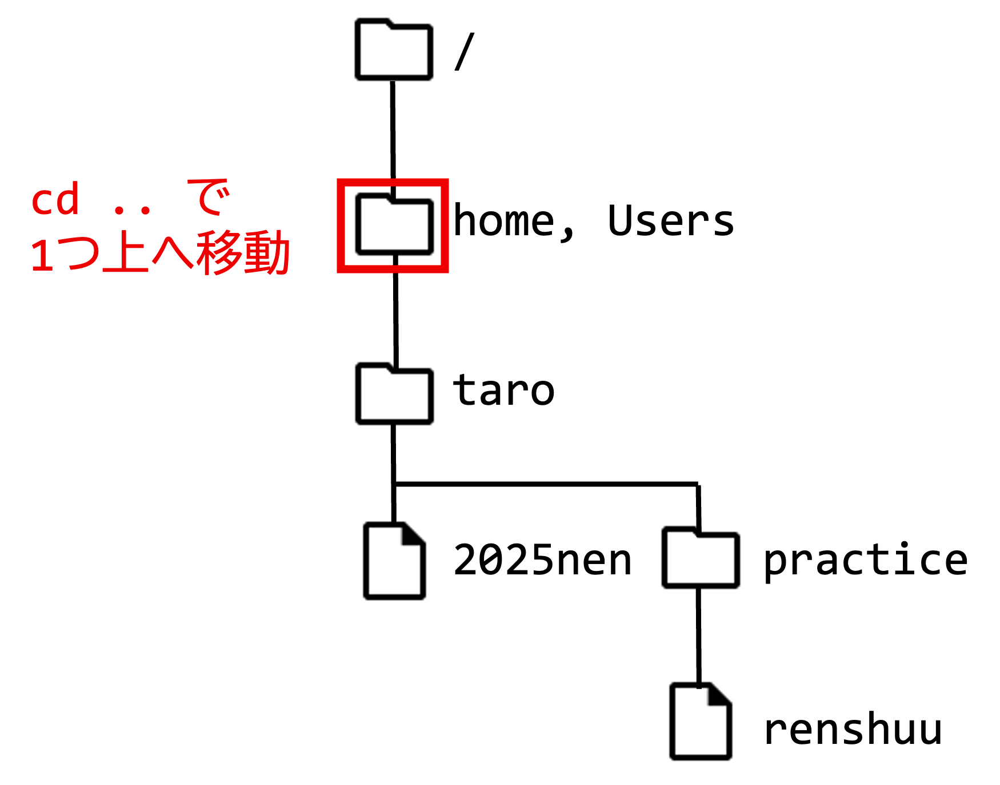
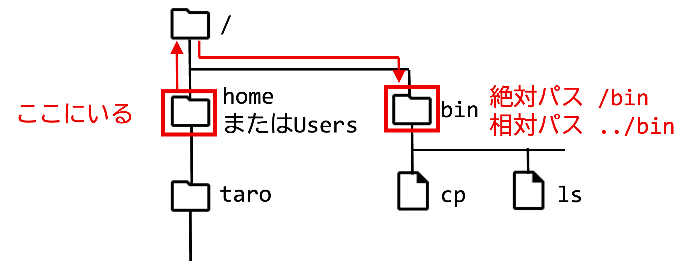

# ディレクトリとパス

## ファイル・システムの全体像：ツリー構造とは？

UNIX系システム（macOSやLinuxなど）では、ファイルやディレクトリ（Windowsでいうフォルダのこと）は、**ツリー構造**と呼ばれる階層的な形で整理されている。

これは、大きな箱（ディレクトリ）の中に小さな箱（ファイルや別のディレクトリ）を入れ子にして、全体を木の枝が広がるような形（ツリー状）で管理するイメージである。

1. たくさんのファイルを、種類ごとに「**ディレクトリ**」という箱に入れて整理する。
2. 「**ディレクトリ**」の中には、さらに別の「**ディレクトリ**」を作ることができ、より細かく分類できる。
3. この「**ディレクトリ**」の構造を図にすると、まるで上下逆さまの木が枝を広げているように見えるため、「ツリー構造」と呼ばれる。

このようなディレクトリ構造は、現在ではWindows、macOS、Linuxなど、ほぼ全てのオペレーティングシステムで採用されている。
Windowsでは「ディレクトリ」のことを「フォルダ」と呼ぶが、意味は同じである。

UNIX系システムには、たくさんのファイルやコマンドが用意されている。
ディレクトリを自由に移動できるようになれば、これらのファイルやコマンドを効果的に利用できるようになる。
また、自分で作成したファイルも、適切にディレクトリに分けて整理することで、見つけやすく、管理しやすくなる。

この章では、ディレクトリの基本的な操作（移動、作成、削除など）について学んでいく。

## UNIX系システムの基本的なディレクトリ構造

### ディレクトリの全体像：どこに何があるのか？

まずは、UNIX系システムの代表的なディレクトリ構造を見てみよう。


上の図は、UNIX系システムの主要なディレクトリを示したものである。
以下に主なディレクトリの役割を説明する。

#### **ルート・ディレクトリ `/`**：全ての始まり

ファイルシステムの頂点に位置するのが「**ルート・ディレクトリ**」であり、「`/`」（スラッシュ）という記号で表される。
「ルート（root）」とは「根」を意味し、ファイルシステムの根っことなる部分である。

ルート・ディレクトリの下には、「`home`」、「`bin`」、「`etc`」など、さまざまな役割を持つディレクトリがある。
これらのディレクトリの中にも、さらに別のディレクトリが存在し、階層構造を形成している。
図で表現すると、木を逆さまにしたような形になる。

#### **ホーム・ディレクトリ `~` または `/home/ユーザー名`、`/Users/ユーザー名`**：あなたの作業場所

ルート・ディレクトリ（`/`）の下には、通常「`home`」（WSL上のUbuntu）や「`Users`」（macOSの場合）といったディレクトリがあり、その中に各ユーザー専用のディレクトリが作成される。
これが「**ホーム・ディレクトリ**」と呼ばれるもので、ユーザーがログインした際に最初にいる場所であり、個人のファイルや設定を保存する基本的な作業スペースである。

例えば、ユーザー名が `taro` の場合
* WSL上のUbuntu: ホーム・ディレクトリは「`/home/taro`」
* macOS: ホーム・ディレクトリは「`/Users/taro`」

ホーム・ディレクトリは、チルダ「`~`」という記号でも表すことができる。これは非常に便利なショートカットである。

これまでの演習で作成したファイルは、特に指定していなければ、全てこのホーム・ディレクトリに保存されているはずである。

#### **`/bin`**： 基本的なコマンド群

「`/bin`」ディレクトリには、「`ls`」や「`cp`」など、UNIXシステムを操作するための最も基本的なコマンド（実行可能なプログラム）が格納されている。
「`bin`」は「バイナリ（binary）」、つまり2進数の略で、コンピュータが直接実行できる形式のファイル（実行ファイル）を指すことが多い（そうでないものもある）。

#### **`/etc`**： システムの設定ファイル

「`etc`」は「エトセトラ（etcetera）」の略で、システム全体に関わる設定ファイルが置かれているディレクトリである。
例えば、ネットワーク設定やユーザーアカウント情報などがここに保存される。

#### **`/tmp`**： 一時的なファイル置き場

「`tmp`」は「テンポラリ（temporary）」の略で、アプリケーションやシステムが一時的にファイルを作成・利用するためのディレクトリである。
ここに保存されたファイルは、システム再起動時などに削除されることがある。

#### **`/usr`**： ユーザー向けのプログラムやデータ

「`usr`」は歴史的には「ユーザー（user）」に関連するファイルが置かれていたが、現在ではシステムが提供する読み取り専用のデータやプログラムの多くがここに格納される。
「UNIX System Resources」の略とも解釈される。

この中にはさらにサブディレクトリがあり、例えば以下のようなものがある。

* 「`/usr/bin`」：「`/bin`」以外の一般的なコマンドが格納される。
* 「`/usr/lib`」：プログラムが利用するライブラリファイルが格納される。
* 「`/usr/share/doc`」：さまざまなプログラムのドキュメントが格納される。

#### **`/var`**： 変化するデータ

「`var`」は「バリアブル（variable）」の略で、システム運用中に内容が変化するデータが格納される。
例えば、システムのログファイル、メール、ウェブサーバーのコンテンツなどである。

### OSによるディレクトリ構造の違い

ここまで紹介したのは、あくまで標準的なUNIX系システムのディレクトリ構成である。
実際のディレクトリ構造は、Linuxの各ディストリビューション（Ubuntu、CentOSなど）、macOSなどによって細部が異なる場合がある。

#### WSL上のUbuntuの場合

WSL上のUbuntuでは、ホーム・ディレクトリは「`/home/ユーザー名`」となり、基本的なディレクトリ構造はLinuxの標準に従う。
特筆すべき点として、Windowsのファイルシステム（Cドライブなど）に、「`/mnt/c`」のようなパスを通じてアクセスできる。

#### macOSの場合

macOSでは、ホーム・ディレクトリは前述の通り「`/Users/ユーザー名`」となる。
なお、macOSの場合、最初からホーム・ディレクトリには「`Desktop`」「`Documents`」「`Downloads`」「`Library`」「`Movies`」「`Music`」「`Pictures`」「`Public`」などのディレクトリが用意されている。
また、システム全体としては、アプリケーションを格納する「`/Applications`」ディレクトリや、システムの中核となるファイルを格納する「`/System`」ディレクトリなど、macOS特有のディレクトリ構成が見られる。

## パス：ファイルやディレクトリの「住所」

UNIX系システムでは、ファイルやディレクトリの場所（位置）を特定するために「**パス**」を使用する。
「パス（path）」とは「道筋」や「経路」を意味し、目的のファイルやディレクトリにたどり着くための「住所」のようなものだと考えればよい。

パスには、「**絶対パス**」と「**相対パス**」の2種類がある。
これらを理解し使いこなすことが、UNIXシステムを効率的に操作するための鍵となる。
パスの概念は、UNIX系システムを使いこなす上で非常に重要である。

### 絶対パス：ルートからの完全な道筋

「絶対パス」とは、ファイルシステムの頂点であるルート・ディレクトリ（`/`）から始まり、目的のファイルやディレクトリに至るまで順番に全てのディレクトリ名を「`/`」で区切って記述する方法である。
つまり、**必ず先頭が `/` で始まる**。


上の図を例に説明しよう。
* ルート・ディレクトリ自体の絶対パスは「`/`」である。
* ルート・ディレクトリの直下にある `home` や `Users` ディレクトリの絶対パスは「`/home`」や「`/Users`」である。
* `home` ディレクトリの中にある `taro` というユーザーのホーム・ディレクトリの絶対パスは「`/home/taro`」、`Users` ディレクトリの中にある `taro` というユーザーのホーム・ディレクトリの絶対パスは「`/Users/taro`」である。
* `taro` のホーム・ディレクトリの中にある `2025nen` というファイルの絶対パスは「`/home/taro/2025nen`」や「`/Users/taro/2025nen`」である。

このように、絶対パスはファイルシステムの根元から目的地までの完全な経路なので、自分が現在どのディレクトリにいるかに関わらず、常に同じである。

ここで注意すべき点は、UNIX系システムのパス表記では、**ファイルもディレクトリも同じように見える**ということである。例えば、「`/home/taro/practice`」というパスがあった場合、`practice` がファイルなのかディレクトリなのかは、パスでは区別がつかない。


これは、UNIX系システムがファイル、ディレクトリ、さらにはハードウェアデバイス（画面、プリンタなど）といった様々なものを、統一的に「ファイル」として扱う設計思想になっていることによる。
これにより、プログラムを作成する際などに、異なる対象を同じように操作できるという利点がある。

### 相対パス：現在地からの道筋

絶対パスは常に一番上からの完全な経路を示すため分かりやすい。
しかし、深い階層にあるファイルやディレクトリを指定する際には非常に長くなってしまうことがある。
そのときに便利なのが「**相対パス**」である。

相対パスとは、**自分が現在いるディレクトリをスタート**にして、目的のファイルやディレクトリまでの道筋を記述する方法である。
絶対パスとは異なり、**先頭が `/` 以外で始まる**。
なお、自分が現在いるディレクトリをカレント(current: 現在)・ディレクトリ、作業ディレクトリという。


例を挙げて説明しよう。仮に、「`taro`」が現在、自分のホーム・ディレクトリ「`/home/taro`」や「`/Users/taro`」にいるとする。

* ホーム・ディレクトリ内にある「`2025nen`」というファイルは、相対パスで単に「`2025nen`」と書ける。絶対パスでは「`/home/taro/2025nen`」や「`/Users/taro/2025nen`」となるが、相対パスは短く書ける。
* ホーム・ディレクトリ内にある「`practice`」というディレクトリも、相対パスで「`practice`」と書ける。
* 「`practice`」ディレクトリの中にある「`renshuu`」というファイルは、相対パスで「`practice/renshuu`」と書ける。

このように、相対パスはカレント・ディレクトリをスタートにして辿っていく。

#### **`.`（ドット1つ）：今いるディレクトリ**

「`.`」（ドット1つ）は現在いる**カレント・ディレクトリ**を指す特別な記号である。

例えば、カレント・ディレクトリが「`/home/taro`」の場合、「`.`」は「`/home/taro`」を意味する。
先の例で `2025nen` ファイルを相対パスで「`2025nen`」と書いたが、これは「`./2025nen`」（カレント・ディレクトリ「`.`」の下の「`2025nen`」）と書いても同じ意味になる。
同様に、「`practice`」は「`./practice`」、「`practice/renshuu`」は「`./practice/renshuu`」とも表現できる。

#### **`..`（ドット2つ）：1つ上のディレクトリ**

相対パスにおいて、「`..`」（ドット2つ）は**1つ上の階層のディレクトリ（親ディレクトリ）**を意味する
これは非常によく使うので、必ず覚えておこう。

例えば、カレント・ディレクトリが「`/home/taro`」の場合、「`..`」は「`/home`」。
「`/Users/taro`」の場合は「`/Users`」を指す。

では、2つ上のディレクトリはどう表現するだろうか？
1つ上が「`..`」で、ディレクトリの区切りが「`/`」なので、2つ上は「`../..`」となる。
つまり、「`/home/taro`」や「`/Users/taro`」にいるとき、「`../..`」はルート・ディレクトリ「`/」 を指すことになる。

#### 相対パスは現在地によって変わる

絶対パスが常に同じ場所は同じになるのに対し、相対パスは**カレント・ディレクトリがどこかによって、実際に指し示す場所が変わる**。

例えば、カレント・ディレクトリが「`/home`」や「`/Users`」の場合を考えてみよう。


*   この場所から見ると、親ディレクトリである `/` は相対パスで「`..`」となる。
*   ホームディレクトリは は相対パスで「`taro`」となる。
*   ホームディレクトリにある「`2025nen`」は は相対パスで「`taro/2025nen`」となる。

このように、相対パスは「自分がいる場所（カレント・ディレクトリ）から見てどう見えるか」で表現される。

### 絶対パスと相対パス、どちらを使うべきか？

絶対パスと相対パスは、どちらを使ってもファイルやディレクトリを特定できる。どちらを使うかは状況によって使い分けるのが一般的である。

* **相対パスが便利な場合**：
  * カレント・ディレクトリの近くにあるファイルやディレクトリを指定する場合。タイプ量が少なく済む。
  * シェル・スクリプトなどで、そのスクリプト・ファイルからの相対的な位置で他のファイルを指定する場合。スクリプトをどこに置いても動きやすくなる。
* **絶対パスが便利な場合**：
  * カレント・ディレクトリから遠く離れた場所や、システムの標準的なディレクトリ（例：「`/bin`」「`/etc`」）を指定する場合。
  * どのカレント・ディレクトリからでも確実に同じ場所を指定したい場合。
  * 設定ファイルなどで、環境に依存しない固定的なパスを指定する場合。

両方の特性を理解し、状況に応じて使い分けることが大切である。

### ☆練習: パスを書いてみよう☆

下の図の空欄に、指示された場所からの相対パスを記入してみよう。
現在、「`/home/taro/practice`」、あるいは「`/Users/taro/practice`」にいるとする）


## ディレクトリ操作コマンド：実際にディレクトリを扱ってみる

ここからは、実際にコマンドを使ってディレクトリを移動したり、作成・削除したりする方法を学ぶ。

### `pwd`： 今どこにいるか確認する

自分が現在どのディレクトリで作業しているか（カレント・ディレクトリ）を表示するには、「`pwd`」コマンドを使用する。「`pwd`」は「**p**rint **w**orking **d**irectory」（作業ディレクトリを表示する）の略である。

使い方は簡単で、ターミナルに次のように入力するだけである。

```sh
pwd
```

例えば、ログイン直後にこのコマンドを実行すると、通常は自分のホーム・ディレクトリの絶対パスが表示される。
ユーザー「`taro`」がログインし、ホーム・ディレクトリが「`/home/taro`」や「`/Users/taro`」の場合：

```sh
pwd
/home/taro または /Users/taro
```
これで、現在いる場所が「`/home/taro`」や「`/Users/taro`」であることが確認できる。


### `cd`：ディレクトリを移動する

ディレクトリ間を移動するには、「`cd`」コマンドを使用する。「`cd`」は「**c**hange **d**irectory」（ディレクトリを変更する）の略である。
使い方は以下の通り。「パス」の部分には、絶対パスまたは相対パスのどちらでも指定できる。

```sh
cd 「移動先のパス」
```

### 1つ上のディレクトリへ移動：「`cd ..`」

カレント・ディレクトリから1つ上の親ディレクトリへ移動するには、相対パス「`..`」を使う。
現在「`/home/taro`」にいるとする。1つ上のディレクトリは「`/home`」や「`/Users`」である。

```sh
cd ..
```
これで、1つ上のディレクトリに移動できた。「`pwd`」で確認してみよう。

```sh
pwd
/home または /Users
```
確かに、「`/home`」や「`/Users`」に移動していることがわかる。



この状態で「`ls`」コマンドを実行すると、「`/home`」や「`/Users`」ディレクトリ内にある他のユーザーのホーム・ディレクトリなどが見える（他のユーザーが存在していれば）。

### ファイルの種類を識別：「`ls -F`」

「`ls`」コマンドの実行結果だけでは、表示された名前がファイルなのかディレクトリなのか区別しにくいことがある。
そのような場合は、「`-F`」オプションを付けて「`ls -F`」と打ってみよう。

「`-F`」は「**F**ile type」を意味し、ファイルの種類に応じて名前の後ろに記号を付けて表示する。
* ディレクトリの場合は、名前に続けて「`/`」が表示される。
* 実行可能なファイルの場合は、名前に続けて「`*`」が表示される。
* シンボリックリンクの場合は、名前に続けて「`@`」が表示される。

```sh
ls -F
taro/
...
```
このように、ディレクトリには「`/`」が付くため、見分けやすくなる。
`ls -F` のように、コマンド名の後に続く「`-`」で始まる文字列を**「オプション」**と呼ぶ。
オプションはコマンドの動作を細かく制御するために使われ、コマンドごとに様々なオプションが用意されている。
どのようなオプションがあるかは、「`man`」コマンドで調べることができる（例:「`man ls`」）。

### 絶対パスで一気に移動：「`cd /bin`」

次に、システムの基本的なコマンドが置かれている「`/bin`」ディレクトリに移動してみよう。



カレント・ディレクトリが「`/home`」や「`/Users`」の場合、「`/bin`」へは相対パスで「`../bin`」（1つ上がってから「`bin`」へ）と書ける。しかし、絶対パスなら単に「`/bin`」と書けるので、こちらの方が簡単である。

```sh
cd /bin
```
「`pwd`」で確認すると、「`/bin`」に移動できているはずである。

```sh
pwd
/bin
```
ここで「`ls -F`」を実行すると、「`cat*`」「`chmod*`」「`cp*`」のように、実行可能なコマンドが多数表示されるだろう。

#### ホーム・ディレクトリへ戻る：「`cd`」または「`cd ~`」

作業の途中で、自分のホーム・ディレクトリに戻りたくなった場合は、引数を何も指定せずに「`cd`」コマンドを実行するだけでよい。

```sh
cd
```
これで、どこにいても一発で自分のホーム・ディレクトリに戻ることができる。


「`pwd`」で確認してみよう。

```sh
pwd
/home/taro または /Users/taro
```
確かにホーム・ディレクトリに戻っている。

また、自分のホーム・ディレクトリは特別な記号「`~`」（チルダ）で表すこともできる。そのため、「`cd ~`」と入力しても、引数なしの「`cd`」と同じくホーム・ディレクトリに戻れる。

試しに、まずルート・ディレクトリ「`/`」に移動してから「`cd ~`」を使ってみよう。

```sh
cd /
pwd
/
```
```sh
cd ~
pwd
/home/taro または /Users/taro
```
チルダ「`~`」は、他人のホーム・ディレクトリを指す際にも使える。
「`~ユーザー名`」とすることで、そのユーザーのホーム・ディレクトリを指定できる。例えば、「`~hanako`」は「`hanako`」さんのホーム・ディレクトリを指す。


### `mkdir`：新しいディレクトリを作る

新しいディレクトリを作成するには、「`mkdir`」コマンドを使用する。「`mkdir`」は「**m**a**k**e **dir**ectory」（ディレクトリを作る）の略である。
使い方は次の通り。

```sh
mkdir 「作成したいディレクトリ名」
```
「作成したいディレクトリ名」には、絶対パスまたは相対パスで指定できる。

では、自分のホーム・ディレクトリの下に「`practice`」という名前のディレクトリを作ってみよう。
まず、「`cd`」でホーム・ディレクトリに戻り、「`pwd`」確認する。

```sh
cd
pwd
/home/taro または /Users/taro
```

ディレクトリ「`practice`」を作ってみよう。

```sh
mkdir practice
```


「`ls -F`」で確認すると、「`practice/`」というディレクトリが作成されているのがわかる。

```sh
ls -F
...
practice/
...
```

作成した「`practice`」ディレクトリに移動してみよう。
カレント・ディレクトリ（ホーム）からの相対パスは「`practice`」なので、次のように入力する。

```sh
cd practice
pwd
/home/taro/practice または /Users/taro/practice
```


### 空のディレクトリを削除する:「`rmdir`」

ディレクトリを削除するには、「`rmdir`」コマンドを使用する。
「`rmdir`」は「**r**e**m**ove **dir**ectory」（ディレクトリを削除する）の略である。
使い方は次の通り。

```sh
rmdir 「削除したいディレクトリ名」
```

**重要な注意点：「`rmdir`」コマンドで削除できるのは、中身が空のディレクトリだけである。** ファイルやサブディレクトリが中に残っている場合はエラーとなり削除できない。

先ほど作成した「`practice`」ディレクトリを削除してみよう。
まず、「`practice`」ディレクトリが空であることを確認し（もし何か入っていれば「`rm`」コマンドで削除する）、親ディレクトリ（この場合はホーム・ディレクトリ）に移動する。

```sh
cd
rmdir practice
```


「`ls -F`」で確認すると、「`practice/`」ディレクトリが削除されているのがわかる。

**注意：中身のあるディレクトリを削除したい場合**
「`rmdir`」は空のディレクトリしか削除できない。
もしファイルやサブディレクトリを含むディレクトリを丸ごと削除したい場合は、「`rm`」コマンドに「`-r`」(recursive: 再帰的) オプションと「`-f`」(force: 強制) オプションを付けて「`rm -rf 「ディレクトリ名」`」のように実行する。
しかし、これは非常に強力で危険なコマンドであり、**間違って使うと重要なファイルを復元不可能な形で消してしまう可能性がある**ため、使用には細心の注意が必要である。

### ディレクトリ間でのファイルの移動とコピー：「`mv`」と「`cp`」

ファイルやディレクトリを、あるディレクトリから別のディレクトリへ移動したりコピーしたりする方法を学ぶ。
「`mv`」（自分が移動）や「`cp`」（ファイルをコピー）コマンドの基本的な使い方は既に学んだが、ここでは移動先やコピー先としてディレクトリを指定する場合を見ていく。

準備として、ホーム・ディレクトリに「`practice`」ディレクトリがなければ作成しよう。

```sh
cd
ls
mkdir practice # practice ディレクトリがなければ作成
```

次に「`renshuu`」という名前のファイルも用意しておこう。
「`touch`」コマンドを使ってみよう。
「`touch`」コマンドは、ファイルが存在していれば更新日時を更新する。ファイルがなければ空のファイルを作る。

```sh
touch renshuu
```

「`ls -F`」で確認してみよう。

```sh
ls -F
...
practice/
renshuu
...
```

#### ファイルをディレクトリにコピーする

「`renshuu`」ファイルを「`practice`」ディレクトリの中にコピーしたい場合、「`cp`」コマンドを次のように使う。

```sh
cp コピー元ファイル コピー先ディレクトリ
```
または、コピー先でファイル名を変更したい場合は以下のようにする。

```sh
cp コピー元ファイル コピー先ディレクトリ/新しいファイル名
```

「`renshuu`」を「`practice`」ディレクトリに同じ名前でコピーするには：
```sh
cp renshuu practice
```

これは「`cp renshuu practice/`」や「`cp renshuu practice/renshuu`」と書いても同じ意味になる。
ディレクトリ名を指定すると、そのディレクトリ内に同じ名前でコピーされる。


コピーできたか確認してみよう。
「`practice`」ディレクトリに移動して「`ls -F`」を実行する。

```sh
cd practice
ls -F
...
renshuu
...
```

「`practice`」ディレクトリ内に「`renshuu`」がコピーされていることがわかる。

#### ファイルをディレクトリから移動する

次に、「`practice`」ディレクトリ内にある「`renshuu`」ファイルを、1つ上のディレクトリ（ホーム・ディレクトリ）に 「`renshuu2`」という名前で移動してみよう。
現在「`practice`」ディレクトリにいるので、移動元は「`renshuu`」（相対パス）、移動先は1つ上のディレクトリの 「`renshuu2`」なので「`../renshuu2`」（相対パス）となる。

```sh
mv renshuu ../renshuu2
```

確認してみよう。
まず、「`practice`」ディレクトリ内で「`ls`」を実行すると、「`renshuu`」がなくなっていることがわかる。

```sh
ls
```
次に、ホーム・ディレクトリに戻って「`ls -F`」を実行すると、「`renshuu2`」が作成されていることがわかる。

```sh
cd
ls -F
...
practice/
renshuu2
...
```


### 「移動」という言葉の整理：「`mv`」と「`cd`」の違い

UNIXコマンドには「`mv`」と「`cd`」があり、どちらも日本語では「移動」と訳されることがあるが、その対象と意味は明確に異なる。

* **「`mv`」（move）**: **「ファイルやディレクトリを」移動または名前を変更**する。このとき、**自分の位置（カレント・ディレクトリ）は変わらない**。
* **「`cd`」（change directory）**: **「自分が」移動**する。**自分の位置（カレント・ディレクトリ）が変わる**。


この違いをしっかり理解しておこう。

## この章で紹介したコマンド

| コマンド | 説明                                                       | 主な使い方                     |
| :------- | :--------------------------------------------------------- | :----------------------------- |
| `pwd`    | 現在いるディレクトリ（カレント・ディレクトリ）を表示する   | `pwd`                          |
| `cd`     | ディレクトリへ移動する（カレント・ディレクトリを変更する） | `cd パス名`                    |
| `mkdir`  | 新しくディレクトリを作成する。`-p`で深くまで一気に作れる   | `mkdir ディレクトリ名`         |
| `rmdir`  | **中身が空**のディレクトリを削除する                       | `rmdir ディレクトリ名`         |
| `ls -F`  | ファイルの種類を識別する記号付きで一覧表示                 | `ls -F`                        |

### 練習 の解答


