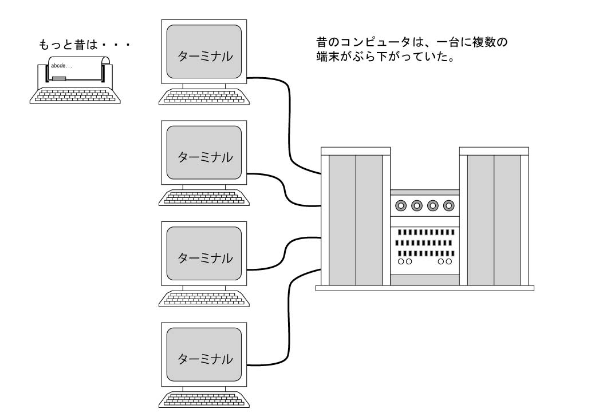

# プロセスとジョブ

## プログラムを同時に実行する仕組み：マルチタスク

現代のコンピュータは、パソコンでもブラウザ、ゲーム、エディタなどを同時に起動して使うことができる。これは同時にいくつものプログラムを実行できるということである。
このような機能をマルチタスク(multitask: 複数の仕事) という。小型のコンピュータで、こんなことができるようになったのは、90年代の半ばのことである。初期のコンピュータは、大型のものでも、一度に一つのプログラムしか実行できなかった。
UNIXが開発された1970年頃に、タイム・シェアリング(時分割)などによって、マルチタスクを実現することができるようになり、ウィンドウをいくつも開いたり、何人もの人で同じコンピュータを同時に使えるようになった。
走っているプログラムのことをプロセスと呼ぶが、マルチタスクのシステムでは同時にプロセスがいくつも走っている。
これは実際には、短い時間でプロセスを切り替えている。
これにより同時に実行しているように見える。

今回は、このプロセスの見方、コントロールの仕方を紹介しよう。プロセスがコントロールできるようになると、プログラムが暴走したといに止めることもできるようになる。

## プロセスを表示する：`ps`

現在どのようなプロセスが実行されているかを確認するには、`ps` コマンドを使用する。「`ps`」は「**P**rocess **S**tatus」（プロセスの状態）の略である。

ターミナルで単に `ps` と入力すると、そのターミナルから起動されたプロセスの一覧が表示される。

**WSL上のUbuntu**
```sh
ps
    PID TTY          TIME CMD
    387 pts/0    00:00:00 bash
    687 pts/0    00:00:00 ps

```

**macOS**
```sh
ps
  PID TTY           TIME CMD
 1347 ttys001    0:00.33 -zsh
```

これはシステム全体で動いているプロセスのごく一部である。

### 自分が実行している全てのプロセスを表示

特定のユーザー（この場合は自分自身）が実行している全てのプロセスを表示するには、「`ps -U ユーザー名`」と入力する。（ユーザー名は自分のログイン名に置き換えること。）

**WSL上のUbuntu**
```sh
ps -U taro
    PID TTY          TIME CMD
    342 ?        00:00:00 systemd
    343 ?        00:00:00 (sd-pam)
    354 pts/1    00:00:00 bash
    387 pts/0    00:00:00 bash
    688 pts/0    00:00:00 ps
```

**mac OS**
```sh
ps -U taro
  PID TTY           TIME CMD
  535 ??         0:01.58 /usr/sbin/distnoted agent
  540 ??         0:05.89 /usr/sbin/cfprefsd agent
  547 ??         0:01.74 /usr/libexec/UserEventAgent (Aqua)
  552 ??         0:01.26 /usr/libexec/knowledge-agent
...
```

これが、指定したユーザーが実行している全てのプロセスの一覧である。
表示される各列の意味は以下の通りである。

* **`PID` (Process ID)**: プロセスID。OSが各プロセスを識別するために割り当てる一意の番号。同じPIDを持つプロセスは同時に存在しない。
* **`TTY` (Teletypewriter)**: プロセスが関連付けられている端末（ターミナルウィンドウ）の番号。どのウィンドウから起動されたコマンドかを示す。`??` や `?` は、特定のターミナルから起動されていないプロセス（例：GUIアプリケーションやシステムプログラム）を指す。
* **`TIME`**: プロセスがこれまでにCPUを使用した累積時間。
* **`CMD` (Command)**: 実行されているコマンド（プログラム）の名前。

### 練習1: プロセスを確認してみよう

1. いくつかのアプリケーション（ウェブブラウザ、ターミナル、エディタなど）を起動してみよう。
2. その後、ターミナルで `ps -U 自分のユーザー名` を実行し、どのようなプロセスがリストに表示されるか確認してみよう。起動したアプリケーションに関連するプロセスが見つかるだろうか？ (ヒント: `CMD` 列に注目)

### システム全体の全てのプロセスを表示する

ユーザーが直接起動したプロセスの他にも、OS自身やシステムサービスなど、バックグラウンドで多数のプロセスが動いている。これらはコンピュータが正常に機能するために不可欠なものである。

システム全体で実行中の全てのプロセスを表示するには、オプションが少し異なる。
* WSL上のUbuntu: 「`ps -aux`」
* macOS: 「`ps aux`」

これらのコマンドは非常に多くの情報を出力するため、「`less`」コマンドと組み合わせて、「`ps -aux | less`や`ps aux | less`」のように1画面ずつ表示できるようにするといいだろう。

**WSL上のUbuntu**
```sh
ps -aux
USER         PID %CPU %MEM    VSZ   RSS TTY      STAT START   TIME COMMAND
root           1  0.0  0.0  21680 12948 ?        Ss   14:45   0:00 /sbin/init
root           2  0.0  0.0   2776  1920 ?        Sl   14:45   0:00 /init
...
```

**macOS**
```sh
ps aux
USER               PID  %CPU %MEM      VSZ    RSS   TT  STAT STARTED      TIME COMMAND
taro               930   0.7  3.3 1865717552 552720   ??  S    11:29AM   2:03.31 /Applications/Go
_windowserver      375   0.7  0.8 412211584 141648   ??  Ss   11:29AM   3:21.22 /System/Library/
root               370   0.2  0.1 426950544  21696   ??  Ss   11:29AM   0:09.28 /usr/libexec/cor
...
```

「`USER`」列が「`root`」（システム管理者）など、自分以外のユーザーになっているものは、システムなどによって実行されているプロセスである。

### `ps` コマンドの主な使い方まとめ：

| コマンド            | 説明                                               |
| :------------------ | :------------------------------------------------- |
| `ps`                | 現在のターミナルで実行されているプロセスを表示     |
| `ps -U ユーザー名`  | 指定したユーザーが実行している全てのプロセスを表示 |
| `ps -aux`           | WSL上のUbuntu: システム全体の全てのプロセスを表示  |
| `ps -aux`          | macOS: システム全体の全てのプロセスを詳細に表示     |

## CPUをたくさん使用しているプロセスを調べる：「`top`」

「`ps`」コマンドは実行した瞬間のプロセスの状態を表示するが、リアルタイムでプロセスの活動状況を監視したい場合は「`top`」コマンドが便利である。
「`top`」を実行すると、CPU使用率の高い順にプロセスが一覧表示され、情報は数秒ごとに自動的に更新される。

ターミナルで「`top`」と入力してみよう。
終了するには「`q`」キーを押す。

**WSL上のUbuntu**
```sh
top
top - 10:46:23 up  0:16,  1 user,  load average: 0.15, 0.21, 0.23
Tasks: 134 total,   1 running, 133 sleeping,   0 stopped,   0 zombie
%Cpu(s):  2.0 us,  1.0 sy,  0.0 ni, 97.0 id,  0.0 wa,  0.0 hi,  0.0 si,  0.0 st
MiB Mem :   7950.8 total,   5621.3 free,   1041.4 used,   1288.1 buff/cache
MiB Swap:   2048.0 total,   2048.0 free,      0.0 used.   6674.0 avail Mem 

  PID USER      PR  NI    VIRT    RES    SHR S  %CPU  %MEM     TIME+ COMMAND
 1234 taro    20   0   12296   6904   6088 S   1.3   0.1   0:00.25 top
  789 taro    20   0   18688  10824   9372 S   0.0   0.1   0:00.12 bash
...
```

**macOS**
```sh
top
Processes: 427 total, 2 running, 425 sleeping, 1696 threads            10:45:22
Load Avg: 1.62, 1.70, 1.67  CPU usage: 7.12% user, 5.30% sys, 87.57% idle
SharedLibs: 242M resident, 49M data, 17M linkedit.
MemRegions: 128257 total, 2142M resident, 83M private, 1044M shared.
PhysMem: 15G used (2353M wired), 1125M unused.
VM: 1993G vsize, 1800M framework vsize, 0(0) swapins, 0(0) swapouts.

PID    COMMAND      %CPU TIME     #TH  #WQ  #POR MEM    PURG   CMPRS  PGRP
12345  Google Chro  25.0 01:23.58 12   2    145  254.5M 0B     0B     12340
23456  WindowServer 10.5 05:45.22 10   3    368  195.2M 4096B  31.4M  23456
...
```

「`top`」の表示はOSによって異なるが、一般的にCPU使用率 「`%CPU`」、メモリ使用量「`MEM`」や「`RES`」、プロセスID 「`PID`」、コマンド名「`COMMAND`」などが表示される。
これにより、どのプロセスがコンピュータの資源を多く消費しているかをリアルタイムで把握できる。

## プロセスを停止させる：「`kill`」

コマンドの実行を途中で止めたい場合、これまで <kbd class="keyboard-key nowrap" lang="en" style="border: 1px solid #aaa; border-radius: 2px; box-shadow: 1px 2px 2px #ddd; background-color: #f9f9f9; background-image: linear-gradient(top, #eee, #f9f9f9, #eee); padding: 1px 3px; font-family: inherit; font-size: 0.85em;">Ctrl</kbd> + <kbd class="keyboard-key nowrap" lang="en" style="border: 1px solid #aaa; border-radius: 2px; box-shadow: 1px 2px 2px #ddd; background-color: #f9f9f9; background-image: linear-gradient(top, #eee, #f9f9f9, #eee); padding: 1px 3px; font-family: inherit; font-size: 0.85em;">c</kbd> を使う方法を紹介してきた。GUIアプリケーションであれば、ウィンドウの閉じるボタンをクリックすることもあるだろう。しかし、これらの方法で終了できないプロセスや、バックグラウンドで動いているプロセスを確実に終了させたい場合には「`kill`」コマンドを使用する。

「`kill`」コマンドは、指定したプロセスID（PID）を持つプロセスに対して「シグナル」と呼ばれるメッセージを送り、プロセスを終了させる。
使い方は以下の通りである。

```sh
kill 「PID番号」
```

実際に試してみよう。まず、意図的に時間のかかるプロセスをバックグラウンドで起動する。ここでは「`sleep`」コマンド（指定した秒数だけ何もしないコマンド）を使う。

```sh
sleep 300 &
[1] 12345      # [ジョブ番号] プロセスID が表示
```

「`&`」を付けてコマンドを実行すると、コマンドはバックグラウンドで実行され、すぐにプロンプトが戻ってくる。
表示された「`12345`」がこの「`sleep`」プロセスのPIDである。
ジョブ番号やPIDは実行したタイミングで異なる。

次に、この「`sleep`」プロセスを「`kill`」コマンドで終了させる。
```sh
kill 12345
```

成功すれば、しばらくして「`[1]+  Terminated              sleep 300`」のようなメッセージが表示され、プロセスが終了したことがわかる。

もしPIDが分からなければ、「`ps -U ユーザー名 | grep コマンド名の一部`」のようにして調べることができる。
「`grep`」は文字列を検索するコマンドである。

例えば、「`sleep`」プロセスのPIDを調べるには以下のようにする。

```sh
ps -U taro | grep sleep
12345 pts/0    00:00:00 sleep 300
```

「`kill`」コマンドで送られるデフォルトのシグナルは「`TERM`」（terminate: 終了）シグナルで、プロセスに「終了してください」と丁寧に依頼するものである。
しかし、プロセスがこの要求を無視して終了しない場合もある。そのような場合は、より強制的な「`KILL`」シグナル（シグナル番号9）を送ることができる。

```sh
kill -KILL 「PID番号」
```

```sh
kill -9 「PID番号」
```

これは非常に強力な方法で、プロセスはほぼ確実に終了するが、プロセスが終了処理（例えば、編集中ファイルの保存など）を行う機会を与えずに強制終了するため、データが失われる可能性がある。**最後の手段として使うべきである。**

### 練習2: プロセスを終了させてみよう

1. ターミナルで「`sleep 1000 &`」のようにして、長時間スリープするプロセスをバックグラウンドで起動してみよう。
2. 「`ps -u 自分のユーザー名`」で、「`sleep`」プロセスのPIDを調べる。
3. 「`kill PID番号`」でそのプロセスを終了させてみよう。
4. 再度「`ps -U 自分のユーザー名`」コマンドを実行し、プロセスがリストから消えていることを確認しよう。

## ジョブとは何か：ターミナルでの作業単位

### ジョブの概念：フォアグラウンドとバックグラウンド

コンピュータの歴史を遡ると、初期の大型コンピュータは複数の「ターミナル（端末）」が接続されて使われていた。

実は、「`w`」や「`who`」などで表示される「`TTY`」とはテレタイプ端末(**t**ele**ty**pewriter)のことである。
テレタイプ端末にはディスプレイがなく、表示は紙に印字されて出てくる。
これらのターミナルは文字しか表示できず、もちろんウィンドウのような概念もなかった。
コマンドを実行すると、その処理が終わるまでユーザーは次のコマンドを入力できず、待つしかなかった。



時間のかかる計算処理などを実行すると、その間ターミナルが占有されて他の処理ができず、非常に不便だった。
この問題を解決するために、「**フォアグラウンドジョブ**」と「**バックグラウンドジョブ**」という考え方が生まれた。

* **フォアグラウンドジョブ (foreground job)**: ユーザーが直接対話しながら操作する、画面の「前面」で実行される作業。ターミナルからの入力を受け付け、実行結果をターミナルに表示する。通常、一つのターミナルでは一度に一つのフォアグラウンドジョブしか実行できない。

* **バックグラウンドジョブ (background job)**: ユーザーの直接的な操作なしに、画面の「背後」で実行される作業。ターミナルからの入力は受け付けないが、実行は継続される。一つのターミナルで複数のバックグラウンドジョブを同時に実行できる。


例えば、時間のかかるファイルの圧縮作業をバックグラウンドで実行させながら、フォアグラウンドでは別のコマンドを実行して他の作業を進める、といった使い方ができる。

### UNIX系システムにおけるジョブ管理

UNIX系システム（WSL上のUbuntuやmacOSなど）では、シェル（コマンド入力の受付役）がこのジョブ管理機能を提供している。プロセスとジョブは密接に関連しているが、ジョブは特にシェルから見たコマンド実行の単位と考えると分かりやすい。

#### フォアグラウンドジョブの実行

ターミナルで通常通りコマンドを入力して実行すると、それはフォアグラウンドジョブとして扱われる。例えば `ls` と入力すると、`ls` コマンドがフォアグラウンドで実行され、その処理が終わるまでシェルは次のコマンド入力を待機する。多くのコマンドは一瞬で終わるので気にならないが、時間のかかるコマンドの場合はその間待たされることになる。

例として、30秒間何もしない「`sleep 30`」コマンドと、その後に「`ls`」を実行するコマンドをグループ化して実行してみよう。

```sh
(sleep 30; date +"%a %b %d %T %Z %Y")
```

このコマンドはフォアグラウンドで実行されるため、30秒間プロンプトは戻ってこず、他のコマンドも入力できない（入力しても実行は30秒後になる）。

#### バックグラウンドジョブの実行：`&` (アンパサンド)

コマンドをバックグラウンドジョブとして実行するには、コマンドの最後にアンパサンド「`&`」を付けて実行する。

```sh
(sleep 30; date +"%a %b %d %T %Z %Y") &
[1] 23456  # [ジョブ番号] プロセスID
```

コマンドの最後に「`&`」を付けると、コマンドはバックグラウンドで実行開始され、すぐにプロンプトが戻ってくる。
これで、「`sleep 30; date +"%a %b %d %T %Z %Y"`」が裏で実行されている間に、別のコマンドをフォアグラウンドで実行できる。
ジョブ番号「`[1]`」とプロセスID「`23456`」が表示され、ジョブとして管理されていることがわかる。


## この章で紹介したコマンドとキー操作

### プロセス関連

| コマンド | 読み方 | 説明                                       | 主な使い方                                   |
| :------- | :----- | :----------------------------------------- | :------------------------------------------- |
| `ps`     | ピーエス | プロセスの状態を表示する                     | `ps`, `ps -U ユーザー名`,  `ps -aux` (Ubuntu), `ps aux` (macOS) |
| `top`    | トップ   | CPU使用率の高い順にプロセスをリアルタイム表示 | `top` (終了は `q` キー)                      |
| `kill`   | キル     | プロセスにシグナルを送り終了させる           | `kill PID番号`, `kill -KILL PID番号` (強制終了)   |

### ジョブ関連

| コマンド/キー操作 | 説明                                           | 主な使い方                |
| :---------------- | :--------------------------------------------- | :------------------------ |
| `&` (末尾に)      | コマンドをバックグラウンドで実行する           | `コマンド &`              |
| `jobs`            | 現在のジョブ一覧を表示する                     | `jobs`                    |
| <kbd class="keyboard-key nowrap" lang="en" style="border: 1px solid #aaa; border-radius: 2px; box-shadow: 1px 2px 2px #ddd; background-color: #f9f9f9; background-image: linear-gradient(top, #eee, #f9f9f9, #eee); padding: 1px 3px; font-family: inherit; font-size: 0.85em;">Ctrl</kbd> + <kbd class="keyboard-key nowrap" lang="en" style="border: 1px solid #aaa; border-radius: 2px; box-shadow: 1px 2px 2px #ddd; background-color: #f9f9f9; background-image: linear-gradient(top, #eee, #f9f9f9, #eee); padding: 1px 3px; font-family: inherit; font-size: 0.85em;">z</kbd> | フォアグラウンドジョブを一時停止（サスペンド）させる |              |
| `bg`              | 一時停止中のジョブをバックグラウンドで実行再開 | `bg %ジョブ番号` (省略可) |
| `fg`              | バックグラウンドジョブをフォアグラウンドに戻す | `fg %ジョブ番号` (省略可) |
