# ディレクトリとパス：コンピュータ内のファイルを理解する

## ファイル・システムの全体像：ツリー構造とは？

UNIX系システム（macOSやLinuxなど）では、ファイルやディレクトリ（Windowsでいうフォルダのこと）は、**ツリー構造**と呼ばれる階層的な形で整理されている。

これは、大きな箱（ディレクトリ）の中に小さな箱（ファイルや別のディレクトリ）を入れ子にして、全体を木の枝が広がるような形（ツリー状）で管理するイメージである。

1.  たくさんのファイルを、種類ごとに「**ディレクトリ**」という名前の箱に入れて整理する。
2.  「**ディレクトリ**」の中には、さらに別の「**ディレクトリ**」を作ることができ、より細かく分類できる。
3.  この「**ディレクトリ**」の構造を図にすると、まるで木が枝を広げているように見えるため、「ツリー構造」と呼ばれる。

このようなディレクトリ構造は、現在ではWindows、macOS、Linuxなど、ほぼ全てのオペレーティングシステムで採用されている。Windowsでは「ディレクトリ」のことを「フォルダ」と呼ぶが、意味は同じである。

UNIX系システムには、たくさんのファイルやコマンドが用意されている。ディレクトリの中を自由に移動できるようになれば、これらのファイルやコマンドを効果的に利用できるようになる。また、自分で作成したファイルも、適切にディレクトリに分けて整理することで、見つけやすく、管理しやすくなる。

この章では、ディレクトリの基本的な操作（移動、作成、削除など）について学んでいく。

## UNIX系システムの基本的なディレクトリ構造

### ディレクトリの全体像：どこに何があるのか？

まずは、UNIX系システムの代表的なディレクトリ構造を見てみよう。

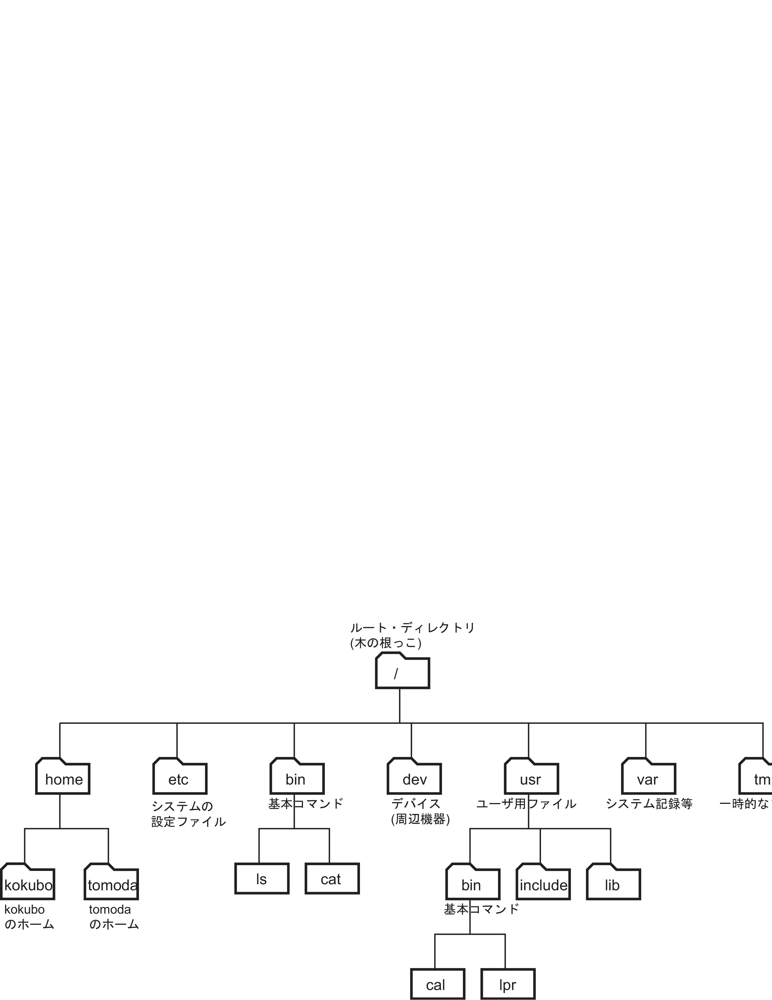
図6.1: UNIX系システムの主要なディレクトリ構造の例 (実際はより複雑である)

上の図は、UNIX系システムの主要なディレクトリを示したものである。以下に主なディレクトリの役割を説明する。

#### **ルート・ディレクトリ `/`**：全ての始まり

ファイルシステムの頂点に位置するのが「**ルート・ディレクトリ**」であり、「`/`」（スラッシュ）という記号で表される。「ルート（root）」とは「根」を意味し、文字通りファイルシステムの根っことなる部分である。

ルート・ディレクトリの下には、「`home`」、「`bin`」、「`etc`」など、さまざまな役割を持つディレクトリが枝のように連なっている。これらのディレクトリの中にも、さらに別のディレクトリが存在し、階層構造を形成している。図で表現すると、木を逆さまにしたような形になる。

#### **ホーム・ディレクトリ `~` または `/home/ユーザー名`、`/Users/ユーザー名`**：あなたの作業場所

ルート・ディレクトリ（`/`）の下には、通常「`home`」（Linux系の場合）や「`Users`」（macOSの場合）というディレクトリがあり、その中に各ユーザー専用のディレクトリが作成される。これが「**ホーム・ディレクトリ**」と呼ばれるもので、ユーザーがログインした際に最初に位置する場所であり、個人のファイルや設定を保存する基本的な作業スペースとなる。

例えば、ユーザー名が `taro` の場合、
*   Ubuntuでは、ホーム・ディレクトリは一般的に `/home/taro` となる。
*   macOSでは、ホーム・ディレクトリは `/Users/taro` となる。

ホーム・ディレクトリは、チルダ「`~`」という記号でも表すことができる。これは非常に便利なショートカットである。

これまでの演習で作成したファイルは、特に指定していなければ、全てこのホーム・ディレクトリに保存されているはずである。

#### **`/bin`** (ビン)：基本的なコマンド群

「`/bin`」ディレクトリには、`ls`（ファイル一覧表示）や `cat`（ファイル内容表示）など、UNIXシステムを操作するための最も基本的なコマンド（実行可能なプログラム）が格納されている。「`bin`」は「バイナリ（binary）」の略で、コンピュータが直接実行できる形式のファイル（実行ファイル）を指すことが多い。

#### **`/etc`** (エトセ、イーティーシー)：システムの設定ファイル

「`etc`」は「エトセトラ（etcetera）」の略で、システム全体に関わる設定ファイルが置かれているディレクトリである。例えば、ネットワーク設定やユーザーアカウント情報などがここに保存される。

#### **`/tmp`** (テンプ、ティーエムピー)：一時的なファイル置き場

「`tmp`」は「テンポラリ（temporary）」の略で、アプリケーションやシステムが一時的にファイルを作成・利用するためのディレクトリである。ここに保存されたファイルは、システム再起動時などに削除されることがある。

#### **`/usr`** (ユーザ、ユーエスアール)：ユーザー向けのプログラムやデータ

「`usr`」は歴史的には「ユーザー（user）」に関連するファイルが置かれていたが、現在ではシステムが提供する読み取り専用のデータやプログラムの多くがここに格納される。「UNIX System Resources」の略とも解釈される。
この中にはさらにサブディレクトリがあり、例えば以下のようなものがある。
*   `/usr/bin`：`/bin` 以外の一般的なコマンドが格納される。
*   `/usr/lib`：プログラムが利用するライブラリファイルが格納される。
*   `/usr/share/doc`：さまざまなプログラムのドキュメントが格納される。

#### **`/var`** (ヴァー、ブイエーアール)：変化するデータ

「`var`」は「バリアブル（variable）」の略で、システム運用中に内容が変化するデータが格納される。例えば、システムのログファイル、メールスプール、ウェブサーバーのコンテンツなどがここに置かれる。

### OSによるディレクトリ構造の違い

ここまで紹介したのは、あくまで標準的なUNIX系システムのディレクトリ構成である。実際のディレクトリ構造は、macOSやLinuxの各ディストリビューション（Ubuntu、CentOSなど）によって細部が異なる場合がある。

#### macOSの場合

macOSでは、ホーム・ディレクトリは前述の通り「`/Users/ユーザー名`」となる。また、アプリケーションを格納する「`/Applications`」ディレクトリや、システムの中核となるファイルを格納する「`/System`」ディレクトリなど、macOS特有のディレクトリ構成が見られる。

#### WSL (Windows Subsystem for Linux) Ubuntuの場合

WSL上のUbuntuでは、ホーム・ディレクトリは「`/home/ユーザー名`」となり、基本的なディレクトリ構造はLinuxの標準に従う。特筆すべき点として、Windowsのファイルシステム（Cドライブなど）には、「`/mnt/c`」のようなパスを通じてアクセスできる。

## パス：ファイルやディレクトリの「住所」

UNIX系システムでは、ファイルやディレクトリの場所（位置）を特定するために「**パス**」という文字列を使用する。「パス（path）」とは「道筋」や「経路」を意味し、目的のファイルやディレクトリにたどり着くための「住所」のようなものだと考えればよい。

パスには、「**絶対パス**」と「**相対パス**」の2種類がある。これらを理解し使いこなすことが、UNIXシステムを効率的に操作するための鍵となる。

[^2]: ただし、セキュリティ上の理由から、全ての場所に自由にアクセスしたり、変更を加えたりできるわけではない。

パスの概念は、UNIX系システムを使いこなす上で非常に重要なポイントの一つである。

### 絶対パス：ルートからの完全な道筋

「絶対パス」とは、ファイルシステムの頂点であるルート・ディレクトリ（`/`）から始まり、目的のファイルやディレクトリに至るまでの全てのディレクトリ名を順番に「`/`」で区切って記述する方法である。**必ず先頭が `/` で始まる**のが特徴である。

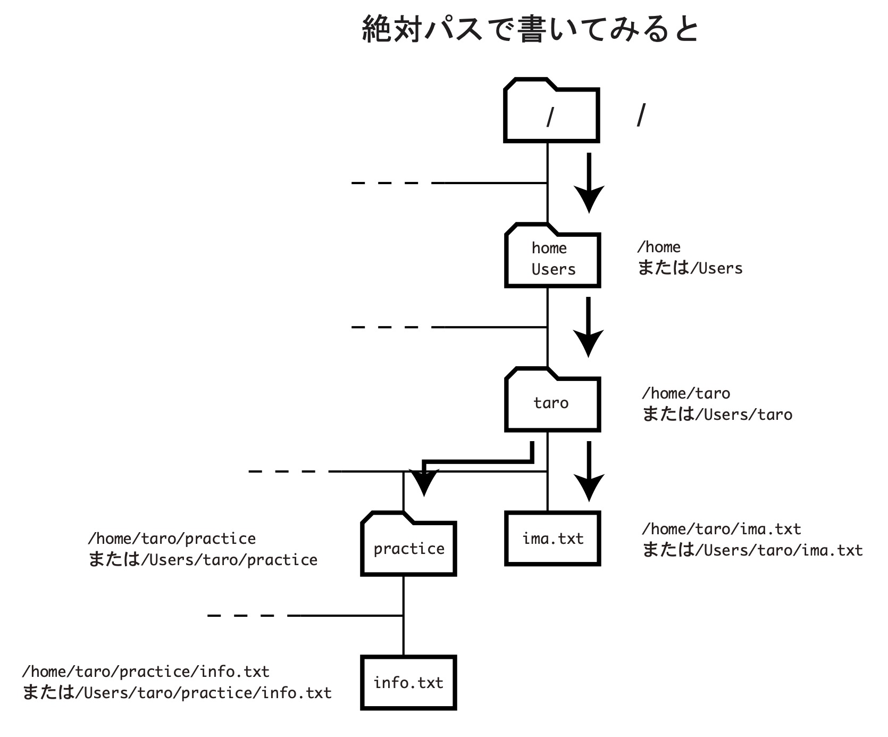
図6.3: 絶対パスの概念図。ルートディレクトリ `/` から目的地までの経路を示す。

上の図を例に説明しよう。
*   ルート・ディレクトリ自体の絶対パスは「`/`」である。
*   ルート・ディレクトリの直下にある `home` ディレクトリの絶対パスは「`/home`」である（macOSの場合は `/Users`）。
*   `home` ディレクトリの中にある `taro` というユーザーのホーム・ディレクトリの絶対パスは「`/home/taro`」である（macOSの場合は `/Users/taro`）。
*   `taro` さんのホーム・ディレクトリの中にある `ima.txt` というファイルの絶対パスは「`/home/taro/ima.txt`」である（macOSの場合は `/Users/taro/ima.txt`）。

このように、絶対パスは常にファイルシステムの根元から目的地までの完全な経路を示すため、自分が現在どのディレクトリにいるか（カレントディレクトリ）に関わらず、常に一意に場所を特定できる。

ここで注意すべき点は、UNIX系システムのパス表記では、**ファイルもディレクトリも同じように見える**ということである。例えば、「`/home/taro/practice`」というパスがあった場合、`practice` がファイルなのかディレクトリなのかは、この表記だけでは判別できない。

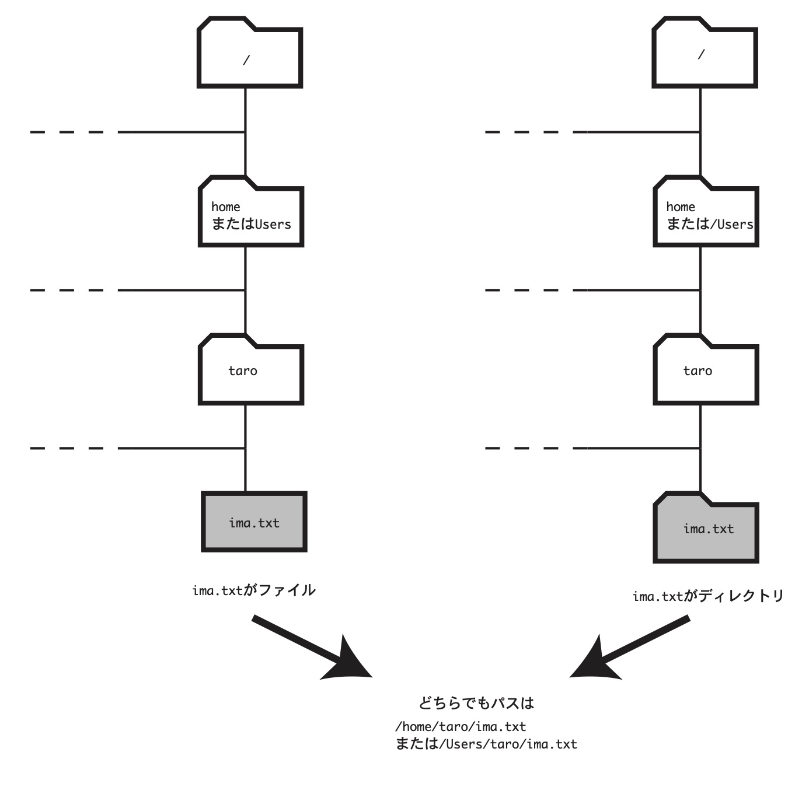
図6.4: パス名だけではファイルかディレクトリかの区別はつかない例

これは、UNIX系システムがファイル、ディレクトリ、さらにはハードウェアデバイス（画面、プリンタなど）といった様々なものを、統一的に「ファイル」という概念で扱おうとする設計思想に基づいている。これにより、プログラムを作成する際などに、これらの異なる対象を比較的同じように操作できるという利点がある。

### 相対パス：現在地からの道筋

絶対パスは常に完全な経路を示すため分かりやすいが、深い階層にあるファイルやディレクトリを指定する際には非常に長くなってしまうことがある。そこで便利なのが「**相対パス**」である。

相対パスとは、**自分が現在いるディレクトリ（カレントディレクトリ）を基準**として、目的のファイルやディレクトリまでの道筋を記述する方法である。絶対パスとは異なり、**先頭が `/` 以外で始まる**（または `.` や `..` で始まる）。

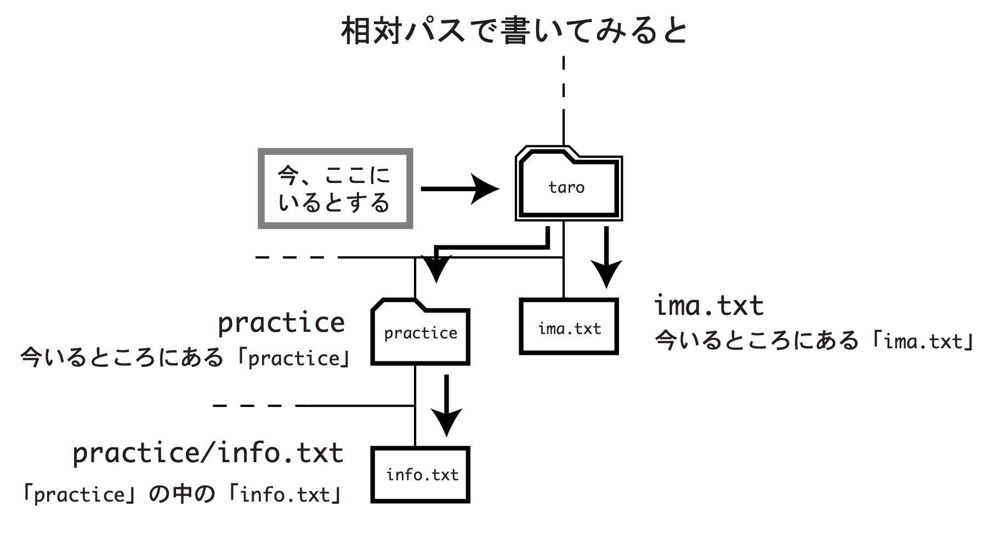
図6.5: 相対パスの概念図。カレントディレクトリからの相対的な位置を示す。

例を挙げて説明しよう。仮に、`taro` さんが現在、自分のホーム・ディレクトリ `/home/taro`（macOSでは `/Users/taro`）にいるとする。

*   ホーム・ディレクトリ内にある `ima.txt` というファイルは、相対パスで単に「`ima.txt`」と書ける。絶対パスでは `/home/taro/ima.txt` （macOSでは `/Users/taro/ima.txt` ）となるが、相対パスならずっと短い。
*   ホーム・ディレクトリ内にある `practice` というディレクトリも、相対パスで「`practice`」と書ける。
*   `practice` ディレクトリの中にある `info.txt` というファイルは、相対パスで「`practice/info.txt`」と書ける。

このように、相対パスはカレントディレクトリからの位置関係を示す。

#### **`.`（ドット1つ）：今いるディレクトリ**

相対パスにおいて、「`.`」（ドット1つ）は**カレントディレクトリ（現在作業しているディレクトリ）そのもの**を指す特別な記号である。

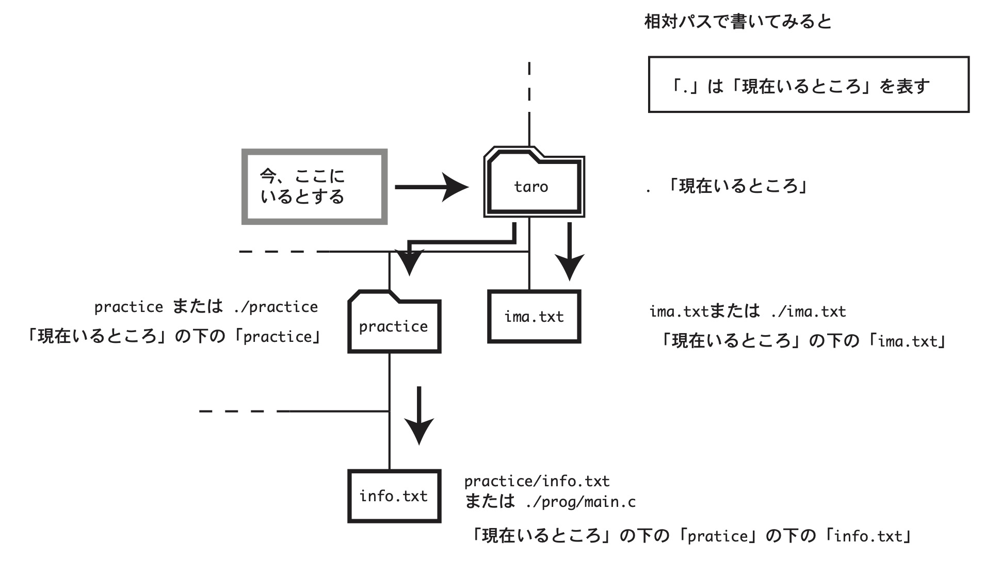
図6.6: `.` (ドット1つ) がカレントディレクトリを指すことを示す図

例えば、カレントディレクトリが `/home/taro` の場合、「`.`」は `/home/taro` を意味する。
先の例で `ima.txt` ファイルを相対パスで「`ima.txt`」と書いたが、これは「`./ima.txt`」（カレントディレクトリの下の `ima.txt`）と書いても同じ意味になる。同様に、「`practice`」は「`./practice`」、「`practice/info.txt`」は「`./practice/info.txt`」とも表現できる。通常は `./` を省略することが多い。

#### **`..`（ドット2つ）：1つ上のディレクトリ**

相対パスにおいて、「`..`」（ドット2つ）は**1つ上の階層のディレクトリ（親ディレクトリ）**を指す特別な記号である。これは非常によく使うので、必ず覚えておこう。

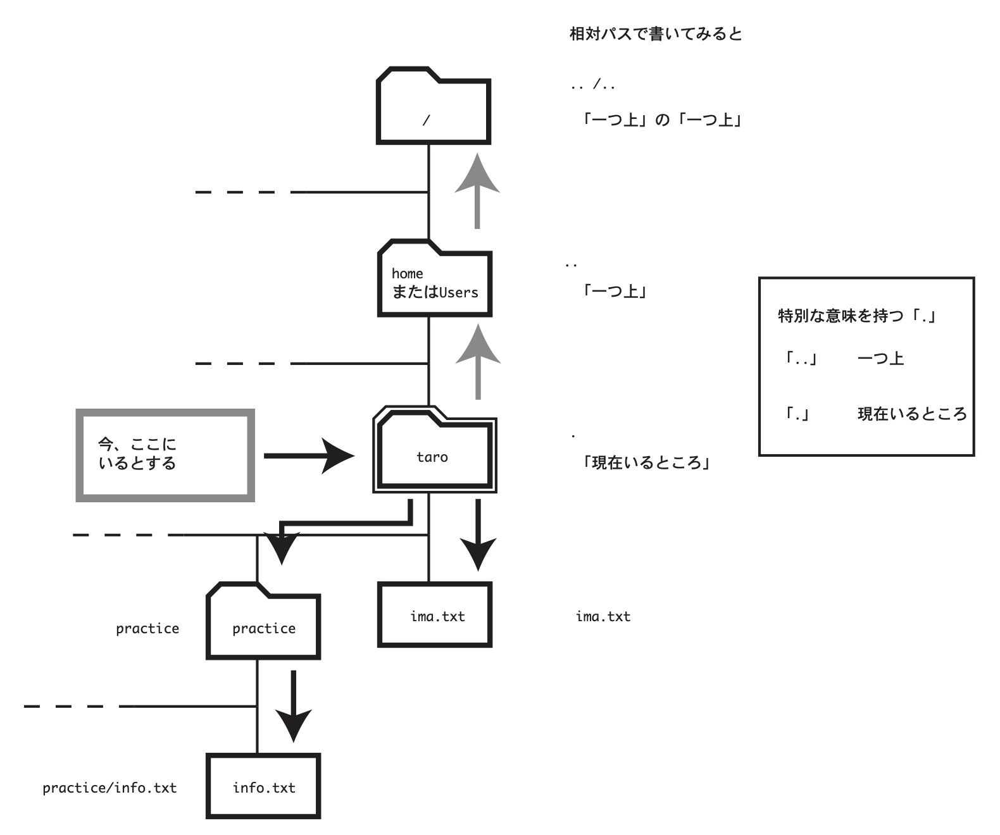
図6.7: `..` (ドット2つ) が親ディレクトリを指すことを示す図

例えば、カレントディレクトリが `/home/taro` の場合、「`..`」は `/home`（macOSでは `/Users`）を指す。

では、2つ上のディレクトリはどう表現するだろうか？
1つ上が「`..`」で、ディレクトリの区切りが「`/`」なので、2つ上は「`../..`」となる。つまり、`/home/taro` にいるとき、「`../..`」はルート・ディレクトリ `/` を指すことになる。

#### 相対パスは現在地によって変わる

絶対パスが常に同じ場所を指すのに対し、相対パスは**カレントディレクトリがどこかによって、実際に指し示す場所が変わる**という重要な特性がある。

例えば、カレントディレクトリが `/home/taro/practice`（macOSでは `/Users/taro/practice`）の場合を考えてみよう。

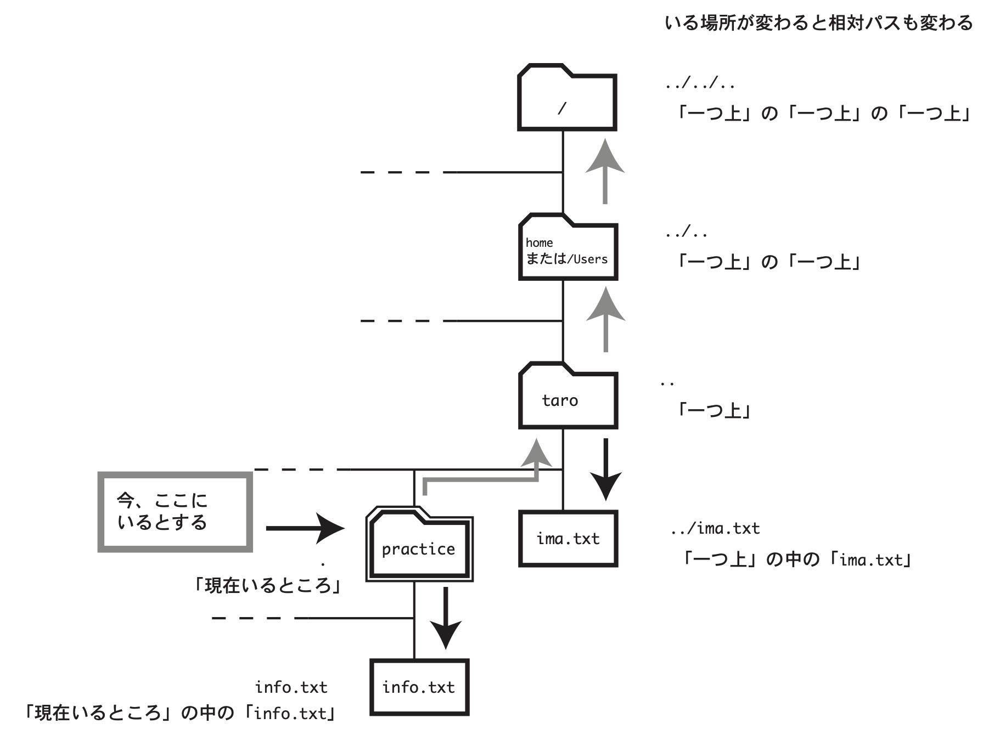
図6.8: カレントディレクトリが `/home/taro/practice` の場合の相対パスの例

*   この場所から見ると、親ディレクトリである `/home/taro` は相対パスで「`..`」となる。
*   `practice` ディレクトリ内にある `info.txt` ファイルは、相対パスで「`info.txt`」または「`./info.txt`」となる。

このように、相対パスは「自分（カレントディレクトリ）から見てどう見えるか」で表現される。

### 絶対パスと相対パス、どちらを使うべきか？

絶対パスと相対パスは、どちらを使ってもファイルやディレクトリを特定できる。どちらを使うかは状況によって使い分けるのが一般的である。

*   **相対パスが便利な場合**：
    *   カレントディレクトリの近くにあるファイルやディレクトリを指定する場合。タイプ量が少なく済む。
    *   シェルスクリプトなどで、そのスクリプトファイルからの相対的な位置で他のファイルを指定する場合。スクリプトをどこに置いても動きやすくなる。
*   **絶対パスが便利な場合**：
    *   カレントディレクトリから遠く離れた場所や、システムの標準的なディレクトリ（例：`/bin`, `/etc`）を指定する場合。
    *   どのカレントディレクトリからでも確実に同じ場所を指定したい場合。
    *   設定ファイルなどで、環境に依存しない固定的なパスを指定する場合。

両方の特性を理解し、状況に応じて使い分けることが大切である。

### ☆練習1: パスを書いてみよう☆

下の図の空欄に、指示された場所からの相対パスを記入してみよう。
（現在の場所は `/home/taro/practice` とする）

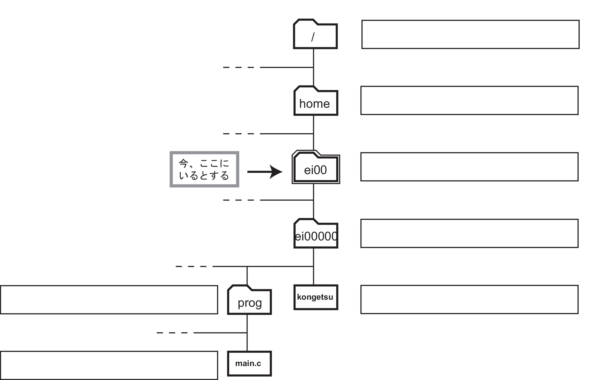
図6.9: 相対パスの練習問題

1.  `ima.txt` への相対パスは？
2.  `practice` ディレクトリへの相対パスは？
3.  `practice` ディレクトリ内の `info.txt` への相対パスは？
4.  ルートディレクトリ `/` への相対パスは？

## ディレクトリ操作コマンド：実際にディレクトリを扱ってみる

ここからは、実際にコマンドを使ってディレクトリを移動したり、作成・削除したりする方法を学ぶ。

### `pwd` (ピーダブルディー)：今どこにいるか確認する

自分が現在どのディレクトリで作業しているか（カレントディレクトリ）を表示するには、`pwd` コマンドを使用する。「`pwd`」は「**p**rint **w**orking **d**irectory」（作業ディレクトリを表示する）の略である。

使い方は簡単で、ターミナルに次のように入力するだけである。

```bash
pwd
```

例えば、ログイン直後にこのコマンドを実行すると、通常は自分のホーム・ディレクトリの絶対パスが表示される。
ユーザー `taro` がログインし、ホーム・ディレクトリが `/home/taro`（macOSでは `/Users/taro`）の場合：

```bash
% pwd
/home/taro
```
これで、現在地が `/home/taro` であることが確認できる。

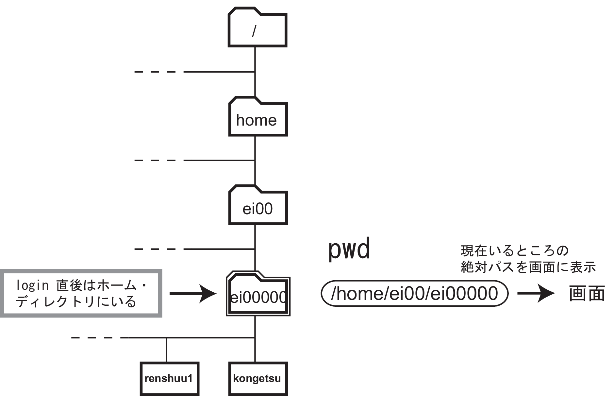
図6.10: `pwd` コマンドの実行例。カレントディレクトリの絶対パスが表示される。

### `cd` (シーディー)：ディレクトリを移動する

ディレクトリ間を移動するには、`cd` コマンドを使用する。「`cd`」は「**c**hange **d**irectory」（ディレクトリを変更する）の略である。
使い方は以下の通り。「パス」の部分には、絶対パスまたは相対パスのどちらでも指定できる。

```bash
cd 「移動先のパス」
```

#### 1つ上のディレクトリへ移動：`cd ..`

カレントディレクトリから1つ上の親ディレクトリへ移動するには、相対パス「`..`」を使う。
現在 `/home/taro` にいると仮定する。1つ上のディレクトリは `/home`（macOSでは `/Users`）である。

```bash
% cd ..
```
これで、1つ上のディレクトリに移動できた。`pwd` で確認してみよう。

```bash
% pwd
/home
```
確かに、`/home`（macOSでは `/Users`）に移動していることがわかる。

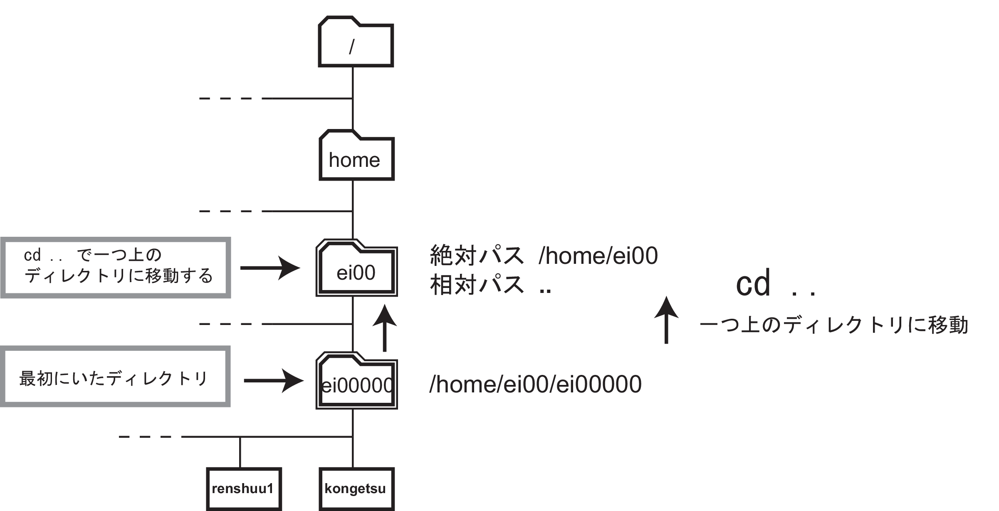
図6.11: `cd ..` を使って親ディレクトリへ移動する例

この状態で `ls` コマンドを実行すると、`/home`（または `/Users`）ディレクトリ内にある他のユーザーのホーム・ディレクトリなどが見えるかもしれない（アクセス権による）。

```bash
% ls
taro
tomoda
yamada
...
```

#### ファイルの種類を識別：`ls -F`

`ls` コマンドの実行結果だけでは、表示された名前がファイルなのかディレクトリなのか区別しにくいことがある。そのような場合は、`-F` オプションを付けて `ls -F` と実行してみよう。

「`-F`」は「**F**ile type」を意味し、ファイルの種類に応じて名前の後ろに記号を付けて表示する。
*   ディレクトリの場合は、名前に続けて `/` が表示される。
*   実行可能なファイルの場合は、名前に続けて `*` が表示される。
*   シンボリックリンクの場合は、名前に続けて `@` が表示される。

```bash
% ls -F
taro/
tomoda/
yamada/
...
```
このように、ディレクトリには `/` が付くため、見分けやすくなる。
`ls -F` のように、コマンド名の後に続く「`-`」で始まる文字列を**「オプション」**と呼ぶ。オプションはコマンドの動作を細かく制御するために使われ、コマンドごとに様々なオプションが用意されている。どのようなオプションがあるかは、前章で学んだ `man` コマンドで調べることができる (例: `man ls`)。

#### 絶対パスで一気に移動：`cd /bin`

次に、システムの基本的なコマンドが置かれている `/bin` ディレクトリに移動してみよう。

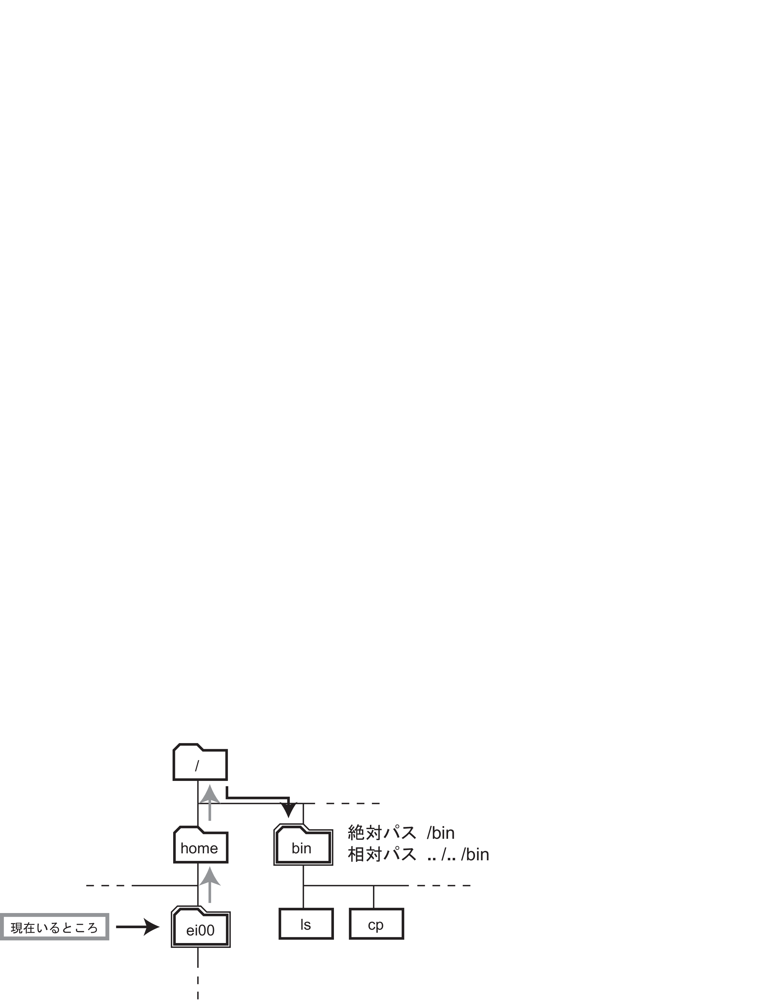
図6.12: `/bin` ディレクトリの位置のイメージ

カレントディレクトリが `/home`（macOSでは `/Users`）の場合、`/bin` へは相対パスで `../bin`（1つ上がってから `bin` へ）と書ける。しかし、絶対パスなら単に `/bin` と書けるので、こちらの方が簡単である。

```bash
% cd /bin
```
`pwd` で確認すると、`/bin` に移動できているはずである。

```bash
% pwd
/bin
```
ここで `ls -F` を実行すると、`cat*`, `chmod*`, `cp*` のように、実行可能なコマンドが多数表示されるだろう。

#### ホーム・ディレクトリへ戻る：`cd` または `cd ~`

作業の途中で、自分のホーム・ディレクトリに戻りたくなった場合は、引数を何も指定せずに `cd` コマンドを実行するだけでよい。

```bash
% cd
```
これで、どこにいても一瞬で自分のホーム・ディレクトリに戻ることができる。

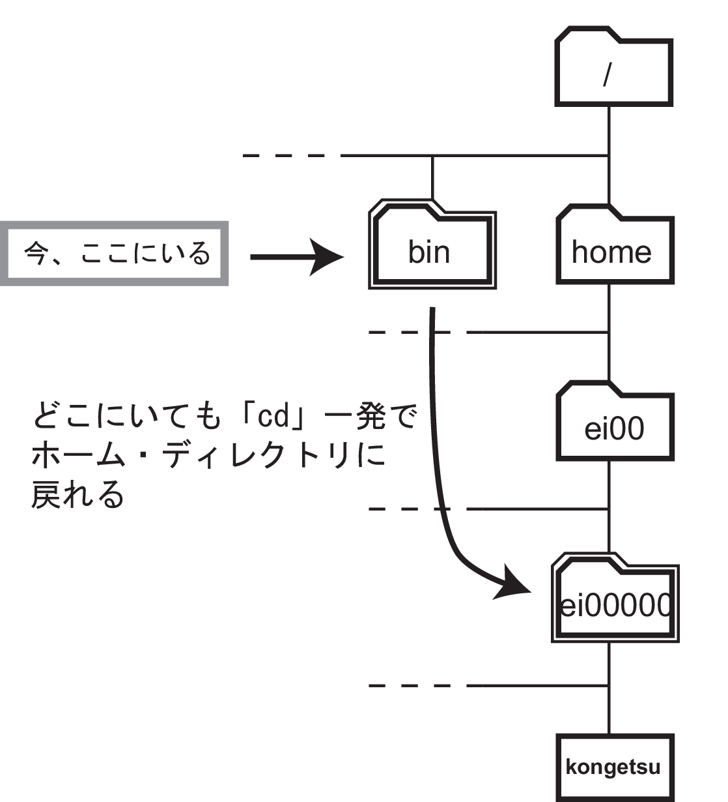
図6.13: 引数なしの `cd` でホームディレクトリに戻るイメージ

`pwd` で確認してみよう。

```bash
% pwd
/home/taro
```
確かにホーム・ディレクトリに戻っている。

また、自分のホーム・ディレクトリは特別な記号「`~`」（チルダ）で表すこともできる。そのため、「`cd ~`」と入力しても、引数なしの `cd` と同じくホーム・ディレクトリに戻れる。

試しに、まずルート・ディレクトリ `/` に移動してから `cd ~` を使ってみよう。

```bash
% cd /
% pwd
/
% cd ~
% pwd
/home/taro
```
チルダ「`~`」は、他人のホーム・ディレクトリを指す際にも使える。「`~ユーザー名`」とすることで、そのユーザーのホーム・ディレクトリを指定できる。例えば、「`~tomoda`」は `tomoda` さんのホーム・ディレクトリを指す（アクセス権限がない場合は移動できない）。


図6.14: チルダ `~` を使ったホームディレクトリの指定

### `mkdir` (エムケーディーアイアール、メイクディレクトリー)：新しいディレクトリを作る

新しいディレクトリを作成するには、`mkdir` コマンドを使用する。「`mkdir`」は「**m**a**k**e **dir**ectory」（ディレクトリを作る）の略である。
使い方は次の通り。

```bash
mkdir 「作成したいディレクトリ名」
```
「作成したいディレクトリ名」には、絶対パスまたは相対パスで指定できる。

では、自分のホーム・ディレクトリの下に `practice` という名前のディレクトリを作ってみよう。まず、ホーム・ディレクトリにいることを確認する（`cd` で戻る）。

```bash
% cd      # ホームディレクトリへ移動
% mkdir practice
```


図6.15: `mkdir practice` で `practice` ディレクトリを作成するイメージ

`ls -F` で確認すると、`practice/` というディレクトリが作成されているのがわかる。

```bash
% ls -F
2000nen/
2001nen/
2002nen/
3years/
ima.txt
practice/
...
```
(表示される内容は環境によって異なる)

作成した `practice` ディレクトリに移動してみよう。カレントディレクトリ（ホーム）からの相対パスは `practice` なので、次のように入力する。

```bash
% cd practice
% pwd
/home/taro/practice
```


図6.16: `cd practice` で `practice` ディレクトリに移動するイメージ

### `rmdir` (アールエムディーアイアール、リムーブディレクトリー)：空のディレクトリを削除する

ディレクトリを削除するには、`rmdir` コマンドを使用する。「`rmdir`」は「**r**e**m**ove **dir**ectory」（ディレクトリを削除する）の略である。
使い方は次の通り。

```bash
rmdir 「削除したいディレクトリ名」
```

**重要な注意点：`rmdir` コマンドで削除できるのは、中身が空のディレクトリだけである。** ファイルやサブディレクトリが中に残っている場合はエラーとなり削除できない。

先ほど作成した `practice` ディレクトリを削除してみよう。まず、`practice` ディレクトリが空であることを確認し（もし何かあれば `rm` コマンドで削除する）、親ディレクトリ（この場合はホーム・ディレクトリ）に移動する。

```bash
% cd ..  # ホーム・ディレクトリに戻る (現在地が /home/taro/practice の場合)
% rmdir practice
```


図6.17: `rmdir practice` で空の `practice` ディレクトリを削除するイメージ

`ls -F` で確認すると、`practice/` ディレクトリが削除されているのがわかる。

> **注意：中身のあるディレクトリを削除したい場合**
> `rmdir` は空のディレクトリしか削除できない。もしファイルやサブディレクトリを含むディレクトリを丸ごと削除したい場合は、`rm` コマンドに `-r` (recursive: 再帰的) オプションと `-f` (force: 強制) オプションを付けて `rm -rf 「ディレクトリ名」` のように実行する。しかし、これは非常に強力で危険なコマンドであり、**間違って使うと重要なファイルを復元不可能な形で消してしまう可能性がある**ため、使用には細心の注意が必要である。初心者のうちは、まずディレクトリの中身を個別に `rm` や `rmdir` で削除し、最後に空になったディレクトリを `rmdir` で削除する方が安全である。

### ディレクトリ間でのファイルの移動とコピー：`mv` と `cp`

ファイルやディレクトリを、あるディレクトリから別のディレクトリへ移動したりコピーしたりする方法を学ぶ。
`mv`（移動）や `cp`（コピー）コマンドの基本的な使い方は既に学んだが、ここでは移動先やコピー先としてディレクトリを指定する場合を見ていく。

準備として、ホーム・ディレクトリに `practice` ディレクトリがなければ作成し、`renshuu1` という名前のファイル（内容は任意）も用意しておこう。

```bash
% cd      # ホーム・ディレクトリへ
% mkdir practice # practice ディレクトリがなければ作成
% touch renshuu1 # renshuu1 ファイルがなければ作成 (空ファイルでよい)
% ls -F
renshuu1
practice/
```
(表示される内容は環境によって異なる)

#### ファイルをディレクトリにコピーする

`renshuu1` ファイルを `practice` ディレクトリの中にコピーしたい場合、`cp` コマンドを次のように使う。

```bash
cp コピー元ファイル コピー先ディレクトリ
```
または、コピー先でファイル名を変更したい場合は、
```bash
cp コピー元ファイル コピー先ディレクトリ/新しいファイル名
```

`renshuu1` を `practice` ディレクトリに同じ名前でコピーするには：
```bash
% cp renshuu1 practice
```
これは `cp renshuu1 practice/` や `cp renshuu1 practice/renshuu1` と書いても同じ意味になる。ディレクトリ名を指定すると、そのディレクトリ内に同じ名前でコピーされるのが一般的だ。


コピーできたか確認してみよう。`practice` ディレクトリに移動して `ls -F` を実行する。
```bash
% cd practice
% ls -F
renshuu1
```
`practice` ディレクトリ内に `renshuu1` がコピーされていることがわかる。

#### ファイルをディレクトリから移動する

次に、`practice` ディレクトリ内にある `renshuu1` ファイルを、1つ上のディレクトリ（ホーム・ディレクトリ）に `renshuu3` という名前で移動してみよう。
現在 `practice` ディレクトリにいるので、移動元は `renshuu1`（相対パス）、移動先は1つ上のディレクトリの `renshuu3` なので `../renshuu3`（相対パス）となる。

```bash
% mv renshuu1 ../renshuu3
```
まず、`practice` ディレクトリ内で `ls` を実行すると、`renshuu1` がなくなっていることがわかる。
```bash
% ls
```
次に、ホーム・ディレクトリに戻って `ls -F` を実行すると、`renshuu3` が作成されていることがわかる。
```bash
% cd ..
% ls -F
renshuu3
practice/
...
```


### 「移動」という言葉の整理：`mv` と `cd` の違い

UNIXコマンドには `mv` と `cd` があり、どちらも日本語では「移動」と訳されることがあるが、その対象と意味は明確に異なる。

*   **`mv`（move）**: **ファイルやディレクトリを**、ある場所から別の場所へ移動する。このとき、**自分自身（カレントディレクトリ）の位置は変わらない**。
*   **`cd`（change directory）**: **自分自身（カレントディレクトリ）が**、あるディレクトリから別のディレクトリへ移動する。ファイルやディレクトリの位置は変わらない。


図6.18: `mv` と `cd` の違いを示す図

この違いをしっかり理解しておこう。

## この章で紹介したコマンド

| コマンド | 説明                                     | 主な使い方                     |
| :------- | :--------------------------------------- | :----------------------------- |
| `pwd`    | 現在いるディレクトリ（カレントディレクトリ）を表示する | `pwd`                          |
| `cd`     | ディレクトリを移動する（カレントディレクトリを変更する） | `cd パス名`                    |
| `mkdir`  | 新しいディレクトリを作成する             | `mkdir ディレクトリ名`         |
| `rmdir`  | 空のディレクトリを削除する               | `rmdir ディレクトリ名`         |
| `ls -F`  | ファイルの種類を識別する記号付きで一覧表示 | `ls -F`                        |

（`mv` と `cp` については、ディレクトリを対象とした使い方を補足した）

### ☆練習1☆ の解答

カレントディレクトリが `/home/taro/practice` の場合：

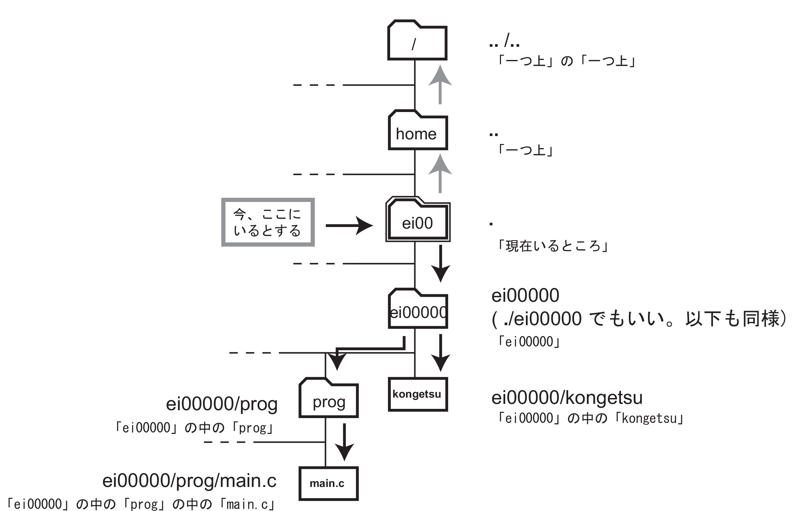

1.  `info.txt` -> `info.txt` または `./info.txt`
2.  `/home/taro` -> `..`
3.  `/home/taro/old` -> `../old`
4.  `/home/tomoda/memo` -> `../../tomoda/memo` (もし `/home` が `..` の親であると仮定した場合。図からは正確な関係が読み取れないが、一般的な構造を想定)
5.  `/` -> `../../..` (もし `/home` がルートの直下であると仮定した場合)

*注：4と5の解答は、図に描かれていない上位のディレクトリ構造を一般的なUNIX系システムに基づいて推測したものです。実際の環境や図の意図によっては異なる場合があります。*

### ☆練習2: コマンドを使ってみよう☆

# ファイルとディレクトリ操作の練習


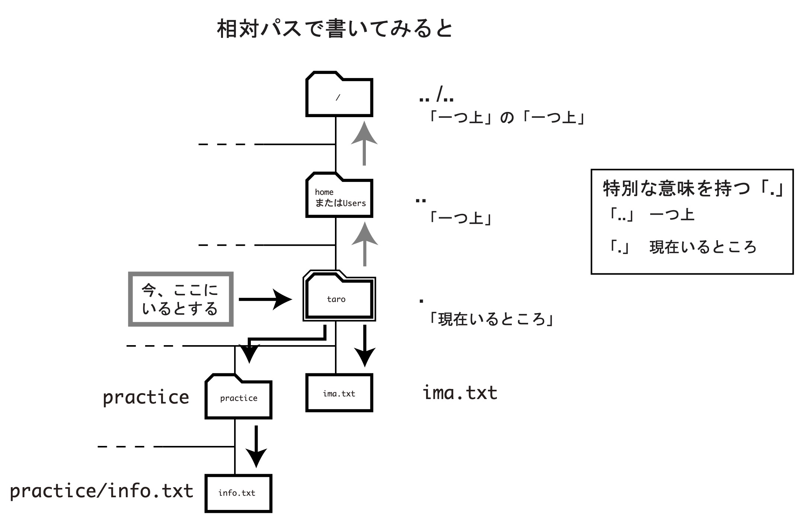

## ホームディレクトリに移動
### その1
```sh
cd # cdで引数なし
pwd # 確認
ls # 確認
```

### その2
```sh
cd ~ # ~（ホームディレクトリ）に移動
pwd # 確認
ls # 確認
```

## リダイレクトでファイルを作る
```sh
# 出力を確認
date "+%Y-%m-%d %H:%M:%S"
# ファイルにリダイレクト
date "+%Y-%m-%d %H:%M:%S" > ima.txt
# ファイルができているか確認
ls
# ファイルの中身を確認
cat ima.txt
```

## ホームディレクトリの一つ上に移動
Ubuntu /home、macOS /Users
### その1
一旦、ホームディレクトリに戻る
```sh
cd
pwd
ls
```

```sh
cd .. # ..（一つ上）に移動
pwd
ls
```

### その2
ディレクトリに入る
```sh
# Ubuntuの場合
cd /home # /home（一つ上に相当）に移動
# macOSの場合
cd /Users # /Users（一つ上に相当）に移動
pwd
ls
```

## 一番上のルートディレクトリ（/）に移動
### その1
```sh
cd / # /（ルートディレクトリ）に移動
pwd
ls
```

### その2
一旦、ホームディレクトリに戻る
```sh
cd
pwd
ls
```

```sh
cd ../.. # ../.. 1つ上の1つ上（ルートディレクトリ）に移動
pwd
ls
```

### その3
一旦、ホームディレクトリに戻る
```sh
cd
pwd
ls
```

```sh
cd .. # .. 1つ上に移動
pwd
ls
cd .. # .. 更に1つ上（ルートディレクトリ）に移動
pwd
ls
```

## /etcに移動

```sh
cd /etc # /etcに移動
pwd
ls
```

# ディレクトリpracticeを作る
一旦、ホームディレクトリに戻る
```sh
cd
pwd
```

## ディレクトリを作る
```sh
mkdir practice
ls
```

ディレクトリpracticeに入る
```sh
cd practice
pwd
ls
```

## ディレクトリpracticeを消す
一旦、ホームディレクトリに戻る
```sh
cd
pwd
```

ディレクトリpracticeとその中を確認
```sh
ls
ls practice
```

ディレクトリpracticeが空なら消す
```sh
rmdir practice
ls
```

## ディレクトリpracticeの中にファイルを作り、消す
### その1
ディレクトリpracticeを確認する
```sh
cd
pwd
ls
```

ディレクトリpracticeがなければ作る
```sh
mkdir practice
ls
```

ディレクトリpracticeの中にファイルを作る
```sh
uname -a > practice/info.txt
ls practice
cat practice/info.txt
```

作ったファイルを消す
```sh
rm practice/info.txt
ls practice
```

### その2
ディレクトリpracticeを確認する
```sh
cd
ls
```

ディレクトリpracticeがなければ作る
```sh
mkdir practice
ls
```

ディレクトリpracticeの中に入り、ファイルを作る
```sh
cd practice
uname -a > info.txt
ls
cat info.txt
```

作ったファイルを消す
```sh
rm info.txt
ls
```
