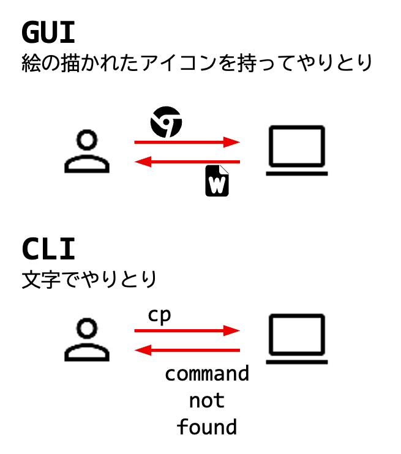
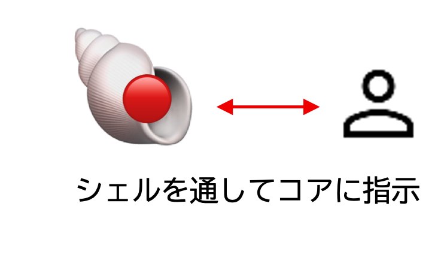

# シェル

## シェルとは何か？

「シェル（shell）」とは、英語で「貝殻」を意味する言葉である。UNIX系システム（macOSやLinuxなど）における**シェル**は、システムの中心部分（カーネルと呼ばれる）を包み込み、ユーザーがシステムと対話するための窓口となるプログラムである。

これまでターミナルでコマンドを入力してきたが、実はそのコマンドを受け取り、システムに伝えていたのがシェルなのである。シェルは、ユーザーの指示を解釈し、それをOSが理解できる形に翻訳する通訳のような役割を担っている。

この章では、シェルの基本的な機能と、それを活用してUNIX系システムをより快適に使う方法について学ぶ。

## ユーザーインターフェース：GUIとCLI

コンピュータの操作方法には、大きく分けて二つの方式がある。

### GUI（グラフィカル・ユーザーインターフェース）
GUIは、アイコンやウィンドウ、ボタンなどをマウスやトラックパッドで操作する方式である。macOSやWindowsのデスクトップ画面が代表的な例である。直感的に操作できるため、初心者にも馴染みやすい。ウェブブラウザやワープロソフトなど、多くのアプリケーションがGUIを採用している。

### CLI（コマンドライン・インターフェース）
CLIは、キーボードから文字（コマンド）を入力してコンピュータと対話する方式である。ターミナルを通じてシェルを利用するのが、この方式にあたる。特定のコマンドを覚える必要はあるが、慣れるとGUIよりも素早く、また複雑な操作や自動化も行いやすいという利点がある。



GUIは視覚的でわかりやすいが、定型的な作業の繰り返しや、大量のファイルに対する一括処理などには不向きな場合がある。一方、CUI/CLIは、シェルが提供する様々な機能を活用することで、これらの作業を効率的に行うことができる。

## シェルの役割

シェルは、ユーザーとUNIX系システムの核（カーネル）との間に位置し、以下のような重要な役割を担っている。

1. **コマンドの解釈と実行**: ユーザーが入力したコマンドを解釈し、カーネルに伝えて実行させる。
2. **ユーザー環境の提供**: コマンド入力の支援（後述する補完機能や履歴機能など）、環境変数の管理など、ユーザーが作業しやすい環境を提供する。
3. **プログラミング機能**: シェルスクリプトと呼ばれる簡易なプログラムを作成・実行することで、一連の作業を自動化できる。

シェルがあるおかげで、ユーザーはシステムの複雑な内部構造を意識することなく、コマンドを通じてシステムを操作できる。また、シェル自体を交換したりカスタマイズしたりすることで、ユーザーの好みに合わせた操作環境を構築することも可能である。



「システムはシンプルに、高度な機能はシェルに任せる」というのがUNIXの設計思想の一つである。


図3: シェルを変更すると、システムの見た目が変わる。図はエルンスト・ヘッケル『生物の驚異的な形』河出書房、2009年より。

## 代表的なシェル

UNIX系システムでは、様々な種類のシェルが利用できる。代表的なものをいくつか紹介する。

* **`sh` (シェル) (Bourne Shell)**: 初期の標準的なシェル。非常にシンプルである。多くのシステムでは、より高機能な`bash` (バッシュ) や`dash` (ダッシュ) へのエイリアス（別名）またはシンボリックリンクになっていることが多い。
* **`bash` (バッシュ) (Bourne Again SHell)**: `sh`を拡張して作られた高機能なシェルである。多くのLinuxディストリビューションで標準シェルとして採用され、WSL上のUbuntuでも採用されている。「ボーン・アゲイン・シェル」と読む。
* **`zsh` (ズィーシェルやゼットシェル) (Z Shell)**: `sh`や`bash`の機能を取り込み、さらに強力な補完機能やカスタマイズ性を持つシェルである。macOSではCatalina (10.15) 以降、標準シェルとなっている。

WSL上のUbuntuなど多くのLinux環境では`bash`、macOSでは`zsh` が、が起動することが一般的である。これらのシェルは、ターミナルでその名前（例: `bash`、`zsh`）を入力することで一時的に切り替えて使用することもできる。

## シェルの便利な機能

現代のシェル（特に`bash` や`zsh`）は、コマンド入力を助ける多くの便利な機能を備えている。

### 1. コマンド履歴（ヒストリー）機能

シェルは、過去に入力したコマンドを記憶している。これを履歴（ヒストリー）機能という。

まず、`who` (フー)、`ls` (エルエス)、`cal` (キャル)、`ps` (ピーエス) といったコマンドをいくつか実行してみよう。その後、`history` (ヒストリー) コマンドを実行すると、過去に入力したコマンドの一覧が表示される。

```sh
history
  501  who
  502  ls
  503  ps
  504  history
```
表示される番号や時刻は環境によって異なる。

記憶されたコマンドは簡単に再実行できる。

*   **`!数字`**: 指定した番号のコマンドを実行する。
    例えば、`!501`と入力すると、履歴の501番のコマンド（この例では`who` (フー)）が実行される。
    ```
    !501
    who
    kokubo   console  May  7 10:00
    kokubo   ttys000  May  7 10:02
    ```
*   **`!文字列`**: 指定した文字列で始まる直近のコマンドを実行する。
    例えば、`!c`と入力すると、直近で実行された`c`で始まるコマンド（この例では`cal` (キャル)）が実行される。
    ```
    !p
    ps
    PID TTY           TIME CMD
    9950 ttys001    0:00.05 /bin/zsh -il
    ```
    プログラムのコンパイル (`cc -o myprog myprog.c` のような長いコマンド) を一度入力すれば、次からは `!cc` や `!c` だけで再コンパイルできて便利である。

*   **`!!`**: 直前に入力したコマンドを再度実行する。

### 2. コマンドライン編集機能

入力中のコマンドラインや、履歴から呼び出したコマンドは、キー操作で編集できる。

*   **<kbd class="keyboard-key nowrap" lang="en" style="border: 1px solid #aaa; border-radius: 2px; box-shadow: 1px 2px 2px #ddd; background-color: #f9f9f9; background-image: linear-gradient(top, #eee, #f9f9f9, #eee); padding: 1px 3px; font-family: inherit; font-size: 0.85em;">↑</kbd> または <kbd class="keyboard-key nowrap" lang="en" style="border: 1px solid #aaa; border-radius: 2px; box-shadow: 1px 2px 2px #ddd; background-color: #f9f9f9; background-image: linear-gradient(top, #eee, #f9f9f9, #eee); padding: 1px 3px; font-family: inherit; font-size: 0.85em;">Ctrl</kbd> + <kbd class="keyboard-key nowrap" lang="en" style="border: 1px solid #aaa; border-radius: 2px; box-shadow: 1px 2px 2px #ddd; background-color: #f9f9f9; background-image: linear-gradient(top, #eee, #f9f9f9, #eee); padding: 1px 3px; font-family: inherit; font-size: 0.85em;">p</kbd>**: 一つ前の履歴コマンドを呼び出す。

*   **<kbd class="keyboard-key nowrap" lang="en" style="border: 1px solid #aaa; border-radius: 2px; box-shadow: 1px 2px 2px #ddd; background-color: #f9f9f9; background-image: linear-gradient(top, #eee, #f9f9f9, #eee); padding: 1px 3px; font-family: inherit; font-size: 0.85em;">↓</kbd> または <kbd class="keyboard-key nowrap" lang="en" style="border: 1px solid #aaa; border-radius: 2px; box-shadow: 1px 2px 2px #ddd; background-color: #f9f9f9; background-image: linear-gradient(top, #eee, #f9f9f9, #eee); padding: 1px 3px; font-family: inherit; font-size: 0.85em;">Ctrl</kbd> + <kbd class="keyboard-key nowrap" lang="en" style="border: 1px solid #aaa; border-radius: 2px; box-shadow: 1px 2px 2px #ddd; background-color: #f9f9f9; background-image: linear-gradient(top, #eee, #f9f9f9, #eee); padding: 1px 3px; font-family: inherit; font-size: 0.85em;">n</kbd>**: 一つ次の履歴コマンドを呼び出す。

*   **<kbd class="keyboard-key nowrap" lang="en" style="border: 1px solid #aaa; border-radius: 2px; box-shadow: 1px 2px 2px #ddd; background-color: #f9f9f9; background-image: linear-gradient(top, #eee, #f9f9f9, #eee); padding: 1px 3px; font-family: inherit; font-size: 0.85em;">→</kbd> または <kbd class="keyboard-key nowrap" lang="en" style="border: 1px solid #aaa; border-radius: 2px; box-shadow: 1px 2px 2px #ddd; background-color: #f9f9f9; background-image: linear-gradient(top, #eee, #f9f9f9, #eee); padding: 1px 3px; font-family: inherit; font-size: 0.85em;">Ctrl</kbd> + <kbd class="keyboard-key nowrap" lang="en" style="border: 1px solid #aaa; border-radius: 2px; box-shadow: 1px 2px 2px #ddd; background-color: #f9f9f9; background-image: linear-gradient(top, #eee, #f9f9f9, #eee); padding: 1px 3px; font-family: inherit; font-size: 0.85em;">f</kbd>**: カーソルを1文字右へ移動 (Forward)。

*   **<kbd class="keyboard-key nowrap" lang="en" style="border: 1px solid #aaa; border-radius: 2px; box-shadow: 1px 2px 2px #ddd; background-color: #f9f9f9; background-image: linear-gradient(top, #eee, #f9f9f9, #eee); padding: 1px 3px; font-family: inherit; font-size: 0.85em;">←</kbd> または <kbd class="keyboard-key nowrap" lang="en" style="border: 1px solid #aaa; border-radius: 2px; box-shadow: 1px 2px 2px #ddd; background-color: #f9f9f9; background-image: linear-gradient(top, #eee, #f9f9f9, #eee); padding: 1px 3px; font-family: inherit; font-size: 0.85em;">Ctrl</kbd> + <kbd class="keyboard-key nowrap" lang="en" style="border: 1px solid #aaa; border-radius: 2px; box-shadow: 1px 2px 2px #ddd; background-color: #f9f9f9; background-image: linear-gradient(top, #eee, #f9f9f9, #eee); padding: 1px 3px; font-family: inherit; font-size: 0.85em;">b</kbd>**: カーソルを1文字左へ移動 (Back)。

*   **<kbd class="keyboard-key nowrap" lang="en" style="border: 1px solid #aaa; border-radius: 2px; box-shadow: 1px 2px 2px #ddd; background-color: #f9f9f9; background-image: linear-gradient(top, #eee, #f9f9f9, #eee); padding: 1px 3px; font-family: inherit; font-size: 0.85em;">Ctrl</kbd> + <kbd class="keyboard-key nowrap" lang="en" style="border: 1px solid #aaa; border-radius: 2px; box-shadow: 1px 2px 2px #ddd; background-color: #f9f9f9; background-image: linear-gradient(top, #eee, #f9f9f9, #eee); padding: 1px 3px; font-family: inherit; font-size: 0.85em;">a</kbd>**: カーソルを行頭へ移動。

*   **<kbd class="keyboard-key nowrap" lang="en" style="border: 1px solid #aaa; border-radius: 2px; box-shadow: 1px 2px 2px #ddd; background-color: #f9f9f9; background-image: linear-gradient(top, #eee, #f9f9f9, #eee); padding: 1px 3px; font-family: inherit; font-size: 0.85em;">Ctrl</kbd> + <kbd class="keyboard-key nowrap" lang="en" style="border: 1px solid #aaa; border-radius: 2px; box-shadow: 1px 2px 2px #ddd; background-color: #f9f9f9; background-image: linear-gradient(top, #eee, #f9f9f9, #eee); padding: 1px 3px; font-family: inherit; font-size: 0.85em;">e</kbd>**: カーソルを行末へ移動 (End)。

*   **<kbd class="keyboard-key nowrap" lang="en" style="border: 1px solid #aaa; border-radius: 2px; box-shadow: 1px 2px 2px #ddd; background-color: #f9f9f9; background-image: linear-gradient(top, #eee, #f9f9f9, #eee); padding: 1px 3px; font-family: inherit; font-size: 0.85em;">Delete</kbd>キー (macOSでは <kbd class="keyboard-key nowrap" lang="en" style="border: 1px solid #aaa; border-radius: 2px; box-shadow: 1px 2px 2px #ddd; background-color: #f9f9f9; background-image: linear-gradient(top, #eee, #f9f9f9, #eee); padding: 1px 3px; font-family: inherit; font-size: 0.85em;">fn</kbd>+<kbd class="keyboard-key nowrap" lang="en" style="border: 1px solid #aaa; border-radius: 2px; box-shadow: 1px 2px 2px #ddd; background-color: #f9f9f9; background-image: linear-gradient(top, #eee, #f9f9f9, #eee); padding: 1px 3px; font-family: inherit; font-size: 0.85em;">Delete</kbd>) または <kbd class="keyboard-key nowrap" lang="en" style="border: 1px solid #aaa; border-radius: 2px; box-shadow: 1px 2px 2px #ddd; background-color: #f9f9f9; background-image: linear-gradient(top, #eee, #f9f9f9, #eee); padding: 1px 3px; font-family: inherit; font-size: 0.85em;">Ctrl</kbd> + <kbd class="keyboard-key nowrap" lang="en" style="border: 1px solid #aaa; border-radius: 2px; box-shadow: 1px 2px 2px #ddd; background-color: #f9f9f9; background-image: linear-gradient(top, #eee, #f9f9f9, #eee); padding: 1px 3px; font-family: inherit; font-size: 0.85em;">d</kbd>**: カーソル位置の1文字を削除。

*   **<kbd class="keyboard-key nowrap" lang="en" style="border: 1px solid #aaa; border-radius: 2px; box-shadow: 1px 2px 2px #ddd; background-color: #f9f9f9; background-image: linear-gradient(top, #eee, #f9f9f9, #eee); padding: 1px 3px; font-family: inherit; font-size: 0.85em;">Backspace</kbd>キー (macOSでは <kbd class="keyboard-key nowrap" lang="en" style="border: 1px solid #aaa; border-radius: 2px; box-shadow: 1px 2px 2px #ddd; background-color: #f9f9f9; background-image: linear-gradient(top, #eee, #f9f9f9, #eee); padding: 1px 3px; font-family: inherit; font-size: 0.85em;">Delete</kbd>)**: カーソル前の1文字を削除。

これらのキーを組み合わせることで、コマンドの打ち間違いを修正したり、過去のコマンドを少し変更して実行したりするのが容易になる。

### 3. エイリアス（コマンドの別名）機能

よく使うコマンドやオプションの組み合わせに、短い別名（alias エイリアス）を付けることができる。

例えば、`ls -F` というコマンドは、ファイルの種類を記号で表示してくれる便利なコマンドだが、毎回 `-F` を付けるのは少し手間である。そこで、`ls` と入力するだけで `ls -F` が実行されるようにエイリアスを設定できる。

```sh
alias ls='ls -F'
```
`alias` (エイリアス) は別名を定義するコマンドである。

これで、単に `ls` と入力すると、実際には `ls -F` が実行されるようになる。
```
ls
Applications/   Desktop/        Documents/      Downloads/      hello*          hello.c
```
ディレクトリ名の後ろに `/`、実行可能ファイルの後ろに `*` が付くようになった。

設定したエイリアスは、引数なしの`alias`で確認できる。この設定は、現在のターミナルでだけ有効である。今後もずっと設定したい場合には、シェルの設定ファイル（後述）に記述する。

また、`unalias 別名`で、その別名を削除することができる。

### 4. タブ補完（ファイル名やコマンド名の補完）機能

コマンド名やファイル名、ディレクトリ名の一部を入力した後に <kbd class="keyboard-key nowrap" lang="en" style="border: 1px solid #aaa; border-radius: 2px; box-shadow: 1px 2px 2px #ddd; background-color: #f9f9f9; background-image: linear-gradient(top, #eee, #f9f9f9, #eee); padding: 1px 3px; font-family: inherit; font-size: 0.85em;">Tab</kbd>キーを押すと、シェルが残りの部分を自動的に補完してくれる機能である。

例えば、カレント・ディレクトリに `Desktop` と `Documents` というディレクトリがある場合、
```
cd D
```
と入力した後に <kbd class="keyboard-key nowrap" lang="en" style="border: 1px solid #aaa; border-radius: 2px; box-shadow: 1px 2px 2px #ddd; background-color: #f9f9f9; background-image: linear-gradient(top, #eee, #f9f9f9, #eee); padding: 1px 3px; font-family: inherit; font-size: 0.85em;">Tab</kbd>キーを押すと、`D`で始まる候補が複数あるため、シェルは候補一覧を表示する（シェルの設定によってはビープ音が鳴る）。
```
cd D
Desktop/   Documents/
```
続けて `e` を入力し `cd De` となったところで再度 <kbd class="keyboard-key nowrap" lang="en" style="border: 1px solid #aaa; border-radius: 2px; box-shadow: 1px 2px 2px #ddd; background-color: #f9f9f9; background-image: linear-gradient(top, #eee, #f9f9f9, #eee); padding: 1px 3px; font-family: inherit; font-size: 0.85em;">Tab</kbd>キーを押すと、`De`で始まるものは `Desktop` しかないため、自動的に `cd Desktop/` と補完される。

候補が一つに定まらない場合は、もう一度 <kbd class="keyboard-key nowrap" lang="en" style="border: 1px solid #aaa; border-radius: 2px; box-shadow: 1px 2px 2px #ddd; background-color: #f9f9f9; background-image: linear-gradient(top, #eee, #f9f9f9, #eee); padding: 1px 3px; font-family: inherit; font-size: 0.85em;">Tab</kbd>キーを押すと候補一覧が表示されることが多い。この機能により、長い名前を正確に入力する手間が大幅に省け、タイプミスも減らせる。

### 5. ワイルドカード

ファイル名を指定する際に、複数のファイルに一致するような特殊なパターン文字（ワイルドカードまたはグロブパターン）を使用できる。

*   **`*` (アスタリスク)**: 任意の0文字以上の文字列に一致する。
    *   `*.txt`: `.txt` で終わるすべてのファイル (例: `document.txt`, `memo.txt`)
    *   `data*`: `data` で始まるすべてのファイル (例: `data1.csv`, `data_backup`)
    *   `a*z`: `a` で始まり `z` で終わるすべてのファイル (例: `az`, `applepie_is_amazing`)

*   **`?` (クエスチョンマーク)**: 任意の一文字に一致する。
    *   `data?.txt`: `data` の後に1文字があり、`.txt` で終わるファイル (例: `data1.txt`, `dataX.txt`。`data10.txt` には一致しない)
    *   `???.py`: 任意の3文字 + `.py`(例: `abc.py`, `xyz.py`)

*   **`[]` (角括弧)**: 角括弧内のいずれか1文字に一致する。
    *   `[abc].txt`: `a.txt`, `b.txt`, `c.txt` のいずれかに一致する。
    *   `data[0-9].txt`: `data0.txt` から `data9.txt` までに一致する。
    *   `data[!0-9].txt`: `data` の後に数字以外の1文字があり、`.txt` で終わるファイルに一致する（`!` は否定）。

例えば、カレント・ディレクトリにある `.py` で終わるすべてのC言語ソースファイルを表示したい場合は、以下のようにする。

```sh
ls *.py
hello.py  test.py  utils.py
```
`report_2025_01.txt`, `report_2025_02.txt`, ..., `report_2025_12.txt` というファイル群をまとめて削除したい場合は、以下のようにする。

```sh
rm report_2025_*.txt
```

**注意**: `rm` コマンドとワイルドカードを組み合わせる際は、意図しないファイルを削除してしまう危険性がある。事前に `ls` コマンドで対象ファイルを確認するなど、慎重に操作すること。特に `rm *` のようなコマンドは非常に危険である。

## シェルの設定をカスタマイズする

シェルの動作は、設定ファイルを編集することでカスタマイズできる。これにより、エイリアスを永続化したり、プロンプトの表示を変更したり、シェルの起動時に特定のコマンドを自動実行したりできる。

**WSL上のUbuntu(`bash`)**
* `~/.bashrc`: 対話的シェルが起動するたびに読み込まれる
* `~/.bash_profile`: ログイン時に読み込まれる

**macOS(`zsh`)**
* `~/.zshrc`: 対話的シェルが起動するたびに読み込まれる
* `~/.zprofile`: ログイン時に読み込まれる

それぞれファイル名の先頭にある `.` は、そのファイルが隠しファイルであることを意味する。
隠しファイルは`ls -a` コマンドで表示できる。

### 設定ファイルへのエイリアスの記述例

例えば、`ls -F` のエイリアスを `ls` として永続的に設定したい場合、

**WSL上のUbuntu(`bash`)**

`~/.bashrc` に以下のように記述（追記）する。
```sh
alias ls='ls -F'
```

**macOS(`zsh`)**

`~/.zshrc` に同様に記述（追記）する。
```sh
alias ls='ls -F'
```

ファイルを編集・保存した後、新しい設定を反映させるには、シェルを再起動するか、以下の`source`コマンドを実行する。

**WSL上のUbuntu(bash)**
```
source ~/.bashrc
```

**macOS(zsh)**
```
source ~/.zshrc
```
## この章で紹介したコマンド

| コマンド  | 説明                                     | 主な使い方の例                                           |
|-----------|------------------------------------------|----------------------------------------------------------|
| `history` | コマンドの履歴を表示する                 | `history`                                                |
| `!数字`   | 履歴番号で指定したコマンドを実行         | `!123`                                                   |
| `!文字列` | 指定文字列で始まる直近のコマンドを実行   | `!l`                                                     |
| `!!`      | 直前のコマンドを再実行する               | `!!`                                                     |
| `alias`   | コマンドの別名（エイリアス）を設定・表示 | `alias ls='ls -F'`、`alias`                              |
| `unalias` | 設定したエイリアスを解除.                | `unalias ls`                                             |
| `source`  | 設定ファイルを読み込む                   | WSL上のUbuntu `source ~/.bashrc`、macOS `source ~/.zshrc`|
