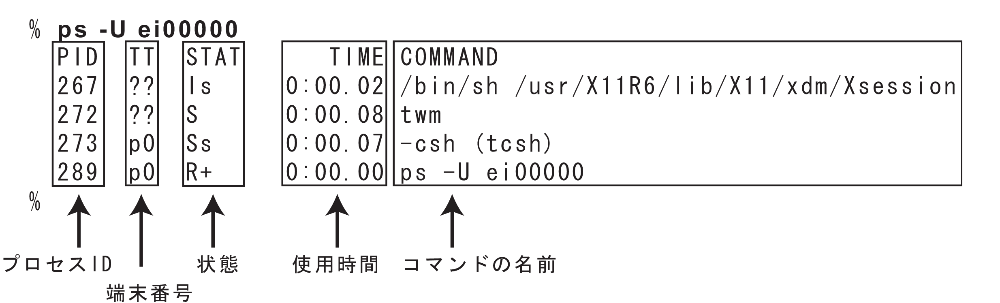
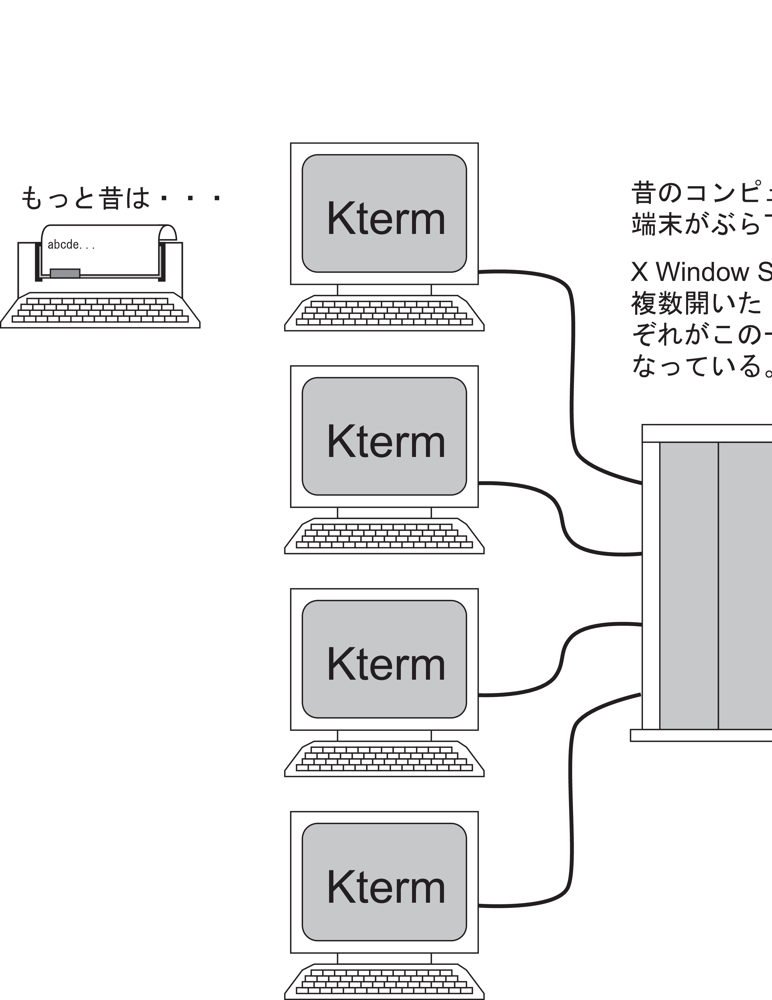

# プロセスとジョブ：コンピュータのマルチタスクを理解する

## プログラムを同時に実行する仕組み：マルチタスク

現代のコンピュータ、例えばノートパソコンやスマートフォンでは、ウェブブラウザで調べ物をしながら音楽を聴き、同時にチャットアプリでメッセージをやり取りする、といったことが当たり前のようにできる。これは、コンピュータが複数のプログラム（アプリケーション）を同時に実行しているからである。

このような、コンピュータが複数の作業（タスク）を同時に処理できる機能を「**マルチタスク** (multitask)」と呼ぶ。今でこそ当たり前の機能であるが、初期のコンピュータは一度に一つのプログラムしか実行できなかった。

UNIXが開発された1970年代頃、**タイムシェアリング** (Time Sharing) という画期的な技術が登場した。これは、CPUの処理時間を非常に短い単位で区切り、複数のプログラムに順番に割り当てることで、あたかも同時に複数のプログラムが動いているように見せる技術である。「時分割」とも呼ばれるこの仕組みによって、マルチタスクが実現され、一つのコンピュータで複数のウィンドウを開いたり、複数のユーザーが同時に作業したりすることが可能になった。

コンピュータ上で実行中のプログラム一つひとつを「**プロセス** (process)」と呼ぶ。マルチタスク環境では、常に多数のプロセスが同時に動いている。この章では、これらのプロセスをどのように確認し、制御するのかを学ぶ。プロセスを適切に管理できるようになると、コンピュータをより効率的に使えるようになり、応答しなくなったプログラムを強制的に終了させるなどの対処も可能になる。

## プロセスとは何か：実行中のプログラムの姿

macOSやLinux（WSL上のUbuntuを含む）のような現代的なOSでは、ユーザーが意識していなくても、裏側では多くのプロセスが動いている。例えば、複数のターミナルウィンドウを開き、テキストエディタで文章を書きながら、カレンダーで予定を確認し、音楽を再生する、といった操作は、それぞれが独立したプロセスとして実行されている。

つまり、「プロセス」とは、OSによってメモリ上に読み込まれ、CPUによって実行されているプログラムの実体のことである。

### プロセスの状態を表示する：`ps` (ピーエス) コマンド

現在どのようなプロセスが実行されているかを確認するには、`ps` コマンドを使用する。「`ps`」は「**P**rocess **S**tatus」（プロセスの状態）の略である。

ターミナルで単に `ps` と入力すると、そのターミナルから起動されたプロセスの一覧が表示される。

macOSの場合：
```bash
% ps
  PID TTY           TIME CMD
 1234 ttys000    0:00.12 -zsh  # Z Shell（現在のターミナルで動いているシェル）
 5678 ttys000    0:00.01 ps    # 今実行したpsコマンド自身
```
図7.1: `ps` コマンドの実行例 (macOS)

WSL Ubuntuの場合：
```bash
$ ps
  PID TTY          TIME CMD
  123 pts/0    00:00:01 bash  # Bashシェル（現在のターミナルで動いているシェル）
  456 pts/0    00:00:00 ps    # 今実行したpsコマンド自身
```
図7.2: `ps` コマンドの実行例 (WSL Ubuntu)

ただし、これはシステム全体で動いているプロセスのごく一部である。表示されているのは、現在のターミナルに関連するプロセスだけである。

#### 自分が実行している全てのプロセスを表示する

特定のユーザー（この場合は自分自身）が実行している全てのプロセスを表示するには、`ps -u ユーザー名` と入力する。（ユーザー名は自分のログイン名に置き換えること。）

macOSの場合（ユーザー名が `kokubo` の例）：
```bash
% ps -u kokubo
  PID TTY           TIME CMD
  456 ttys000    0:00.05 /bin/zsh -l                                    # ターミナルウィンドウ1のシェル
  789 ttys000    0:00.12 /Applications/Visual Studio Code.app/Contents/MacOS/Electron # VS Codeなどのアプリ
 1234 ttys001    0:00.15 -zsh                                         # ターミナルウィンドウ2のシェル
 5678 ttys001    0:00.01 ps -u kokubo                                 # psコマンド自身
```
図7.3: `ps -u ユーザー名` の実行例 (macOS)

WSL Ubuntuの場合（ユーザー名が `kokubo` の例）：
```bash
$ ps -u kokubo
  PID TTY          TIME CMD
  123 pts/0    00:00:01 bash      # ターミナルウィンドウ1のシェル
  456 pts/1    00:00:03 vim       # vimエディタなどのアプリ
  789 pts/0    00:00:00 ps -u kokubo # psコマンド自身
```
図7.4: `ps -u ユーザー名` の実行例 (WSL Ubuntu)


図7.5: `ps -u` コマンドの出力イメージ (内容は環境により異なる)

これが、指定したユーザーが実行している全てのプロセスの一覧である。
表示される各列の意味は以下の通り。

*   **`PID` (Process ID)**: プロセスID。OSが各プロセスを識別するために割り当てる一意の番号。同じPIDを持つプロセスは同時に存在しない。
*   **`TTY` (Teletypewriter)**: プロセスが関連付けられている端末（ターミナルウィンドウ）の番号。どのウィンドウから起動されたコマンドかを示す。`??` や `?` は、特定のターミナルから起動されていないプロセス（例：GUIアプリケーションやシステムデーモン）を指す。
*   **`TIME`**: プロセスがこれまでにCPUを使用した累積時間。
*   **`CMD` (Command)**: 実行されているコマンド（プログラム）の名前。

### ☆練習1: プロセスを確認してみよう☆

1.  いくつかのアプリケーション（ウェブブラウザ、テキストエディタ、音楽プレーヤーなど）を起動してみよう。
2.  その後、ターミナルで `ps -u 自分のユーザー名` を実行し、どのようなプロセスがリストに表示されるか確認してみよう。起動したアプリケーションに関連するプロセスが見つかるだろうか？ (ヒント: `CMD` 列に注目)

#### システム全体の全てのプロセスを表示する

ユーザーが直接起動したプロセスの他にも、OS自身やシステムサービスなど、バックグラウンドで多数のプロセスが動いている。これらはコンピュータが正常に機能するために不可欠なものである。

システム全体で実行中の全てのプロセスを表示するには、オプションが少し異なる。
*   macOSの場合: `ps -ax`
*   WSL Ubuntuの場合: `ps -aux` (より詳細な情報が表示される)

これらのコマンドは非常に多くの情報を出力するため、通常は前章で学んだ `less` コマンドと組み合わせて1画面ずつ表示できるようにする。

macOSの場合：
```bash
% ps -ax | less
```

WSL Ubuntuの場合：
```bash
$ ps -aux | less
```

実行結果の例：
macOS:
```
  PID TTY           TIME CMD
    1 ??         0:09.64 /sbin/launchd                # システム起動時に最初に実行されるプロセス
   53 ??         0:01.42 /usr/libexec/UserEventAgent  # ユーザーイベントを処理するエージェント
   54 ??         0:00.20 /usr/sbin/syslogd            # システムログを管理するデーモン
   55 ??         0:00.77 /usr/libexec/configd         # システム設定を管理するデーモン
  ...
```
図7.6: `ps -ax | less` の実行結果の一部 (macOS)

WSL Ubuntu:
```
USER       PID %CPU %MEM    VSZ   RSS TTY      STAT START   TIME COMMAND
root         1  0.0  0.1   8940  5132 ?        Ss   10:30   0:00 /init         # システム起動プロセス
root         8  0.0  0.0      0     0 ?        S    10:30   0:00 [kworker/0:0-eve] # カーネルワーカープロセス
kokubo      60  0.0  0.2  18688 10824 pts/0    Ss   10:31   0:00 -bash         # ユーザーのシェル
...
```
図7.7: `ps -aux | less` の実行結果の一部 (WSL Ubuntu)

`USER` 列が `root`（システム管理者）や `daemon`（バックグラウンドサービス）となっているものは、主にシステムによって実行されているプロセスである。

`ps` コマンドの主な使い方まとめ：

| コマンド           | 説明                                                     |
| :----------------- | :------------------------------------------------------- |
| `ps`               | 現在のターミナルで実行されているプロセスを表示             |
| `ps -u ユーザー名` | 指定したユーザーが実行している全てのプロセスを表示         |
| `ps -ax`           | (macOS) システム全体の全てのプロセスを表示               |
| `ps -aux`          | (WSL Ubuntu) システム全体の全てのプロセスを詳細に表示    |

### CPUをよく使っているプロセスを調べる：`top` (トップ) コマンド

`ps` コマンドは実行した瞬間のプロセスの状態を表示するが、リアルタイムでプロセスの活動状況を監視したい場合は `top` コマンドが便利である。`top` を実行すると、CPU使用率の高い順にプロセスが一覧表示され、情報は数秒ごとに自動的に更新される。

ターミナルで `top` と入力してみよう。終了するには `q` キーを押す。

macOSの場合：
```bash
% top
Processes: 427 total, 2 running, 425 sleeping, 1696 threads            10:45:22
Load Avg: 1.62, 1.70, 1.67  CPU usage: 7.12% user, 5.30% sys, 87.57% idle
SharedLibs: 242M resident, 49M data, 17M linkedit.
MemRegions: 128257 total, 2142M resident, 83M private, 1044M shared.
PhysMem: 15G used (2353M wired), 1125M unused.
VM: 1993G vsize, 1800M framework vsize, 0(0) swapins, 0(0) swapouts.

PID    COMMAND      %CPU TIME     #TH  #WQ  #POR MEM    PURG   CMPRS  PGRP
12345  Google Chro  25.0 01:23.58 12   2    145  254.5M 0B     0B     12340
23456  WindowServer 10.5 05:45.22 10   3    368  195.2M 4096B  31.4M  23456
...
```
図7.8: `top` コマンドの実行例 (macOS)

WSL Ubuntuの場合：
```bash
$ top
top - 10:46:23 up  0:16,  1 user,  load average: 0.15, 0.21, 0.23
Tasks: 134 total,   1 running, 133 sleeping,   0 stopped,   0 zombie
%Cpu(s):  2.0 us,  1.0 sy,  0.0 ni, 97.0 id,  0.0 wa,  0.0 hi,  0.0 si,  0.0 st
MiB Mem :   7950.8 total,   5621.3 free,   1041.4 used,   1288.1 buff/cache
MiB Swap:   2048.0 total,   2048.0 free,      0.0 used.   6674.0 avail Mem 

  PID USER      PR  NI    VIRT    RES    SHR S  %CPU  %MEM     TIME+ COMMAND
 1234 kokubo    20   0   12296   6904   6088 S   1.3   0.1   0:00.25 top
  789 kokubo    20   0   18688  10824   9372 S   0.0   0.1   0:00.12 bash
...
```
図7.9: `top` コマンドの実行例 (WSL Ubuntu)

`top` の表示はOSによって異なるが、一般的にCPU使用率 (`%CPU`)、メモリ使用量 (`MEM` や `RES`)、プロセスID (`PID`)、コマンド名 (`COMMAND`) などが表示される。これにより、どのプロセスがコンピュータの資源を多く消費しているかをリアルタイムで把握できる。

### プロセスを停止させる：`kill` (キル) コマンド

コマンドの実行を途中で止めたい場合、これまでは `Ctrl+C` を使う方法を紹介した。GUIアプリケーションであれば、ウィンドウの閉じるボタンをクリックすることもあるだろう。しかし、これらの方法で終了できないプロセスや、バックグラウンドで動いているプロセスを確実に終了させたい場合には `kill` コマンドを使用する。

`kill` コマンドは、指定したプロセスID（PID）を持つプロセスに対して「シグナル」と呼ばれるメッセージを送り、プロセスを終了させる。
使い方は以下の通り。

```bash
kill 「PID番号」
```

実際に試してみよう。まず、意図的に時間のかかるプロセスをバックグラウンドで起動する。ここでは `sleep` コマンド（指定した秒数だけ何もしないコマンド）を使う。

```bash
$ sleep 300 &
[1] 12345      # [ジョブ番号] プロセスID が表示される
```
`&` を付けてコマンドを実行すると、コマンドはバックグラウンドで実行され、すぐにプロンプトが戻ってくる。表示された `12345` がこの `sleep` プロセスのPIDである（実際のPIDは実行するたびに異なる）。

次に、この `sleep` プロセスを `kill` コマンドで終了させる。
```bash
$ kill 12345
```
成功すれば、しばらくして `[1]+  Terminated              sleep 300` のようなメッセージが表示され、プロセスが終了したことがわかる。

もしPIDが分からなければ、`ps -u ユーザー名 | grep コマンド名の一部` のようにして調べることができる。
例えば、`sleep` プロセスのPIDを調べるには：
```bash
$ ps -u kokubo | grep sleep
12345 pts/0    00:00:00 sleep 300
```

`kill` コマンドで送られるデフォルトのシグナルは `TERM`（terminate: 終了）シグナルで、プロセスに「終了してください」と丁寧に依頼するものである。しかし、プロセスがこの要求を無視して終了しない場合もある。そのような場合は、より強制的な `KILL` シグナル（シグナル番号9）を送ることができる。

```bash
kill -9 「PID番号」
```
または
```bash
kill -KILL 「PID番号」
```
これは非常に強力な方法で、プロセスはほぼ確実に終了するが、プロセスが終了処理（例えば、編集中ファイルの保存など）を行う機会を与えずに強制終了するため、データが失われる可能性がある。**最後の手段として使うべきである。**

### ☆練習2: プロセスを終了させてみよう☆

1.  ターミナルで `sleep 1000 &` のようにして、長時間スリープするプロセスをバックグラウンドで起動してみよう。
2.  `ps -u 自分のユーザー名` コマンドでその `sleep` プロセスのPIDを調べる。
3.  `kill PID番号` でそのプロセスを終了させてみよう。
4.  再度 `ps -u 自分のユーザー名` コマンドを実行し、プロセスがリストから消えていることを確認しよう。

## ジョブとは何か：ターミナルでの作業単位

### ジョブの概念：フォアグラウンドとバックグラウンド

コンピュータの歴史を遡ると、初期の大型コンピュータは複数の「ターミナル（端末）」が接続されて使われていた。これらのターミナルは文字しか表示できず、もちろんウィンドウのような概念もなかった。コマンドを実行すると、その処理が終わるまでユーザーは次のコマンドを入力できず、じっと待つしかなかった。


図7.10: 古い時代のコンピュータ端末のイメージ

時間のかかる計算処理などを実行すると、その間ターミナルが占有されてしまい非常に不便だった。この問題を解決するために、「**フォアグラウンドジョブ**」と「**バックグラウンドジョブ**」という考え方が生まれた。

*   **フォアグラウンドジョブ (foreground job)**: ユーザーが直接対話しながら操作する、画面の「前面」で実行される作業。ターミナルからの入力を受け付け、実行結果をターミナルに表示する。通常、一つのターミナルでは一度に一つのフォアグラウンドジョブしか実行できない。
*   **バックグラウンドジョブ (background job)**: ユーザーの直接的な操作なしに、画面の「背後」で実行される作業。ターミナルからの入力は受け付けないが、実行は継続される。一つのターミナルで複数のバックグラウンドジョブを同時に実行できる。


図7.11: フォアグラウンドジョブとバックグラウンドジョブの概念図

例えば、時間のかかるファイルの圧縮作業をバックグラウンドで実行させながら、フォアグラウンドでは別のコマンドを実行して他の作業を進める、といった使い方ができる。

### UNIX系システムにおけるジョブ管理

UNIX系システム（macOSやWSL上のUbuntuなど）では、シェル（コマンド入力の受付役）がこのジョブ管理機能を提供している。プロセスとジョブは密接に関連しているが、ジョブは特にシェルから見たコマンド実行の単位と考えると分かりやすい。

#### フォアグラウンドジョブの実行

ターミナルで通常通りコマンドを入力して実行すると、それはフォアグラウンドジョブとして扱われる。例えば `ls` と入力すると、`ls` コマンドがフォアグラウンドで実行され、その処理が終わるまでシェルは次のコマンド入力を待機する。多くのコマンドは一瞬で終わるので気にならないが、時間のかかるコマンドの場合はその間待たされることになる。

例として、30秒間何もしない `sleep 30` コマンドと、その後に `ls` を実行するコマンドをグループ化して実行してみよう。
```bash
% (sleep 30; ls)
```
このコマンドはフォアグラウンドで実行されるため、30秒間プロンプトは戻ってこず、他のコマンドも入力できない（入力しても実行は30秒後になる）。

#### バックグラウンドジョブの実行：`&` (アンパサンド)

コマンドをバックグラウンドジョブとして実行するには、コマンドの最後にアンパサンド `&` を付けて実行する。

```bash
% (sleep 30; ls) &
[1] 23456  # [ジョブ番号] プロセスID
```
コマンドの最後に `&` を付けると、コマンドはバックグラウンドで実行開始され、すぐにプロンプトが戻ってくる。これで、`sleep 30; ls` が裏で実行されている間に、別のコマンドをフォアグラウンドで実行できる。ジョブ番号 `[1]` とプロセスID `23456` が表示され、ジョブとして管理されていることがわかる。


図7.12: コマンド末尾の `&` によるバックグラウンド実行のイメージ

#### フォアグラウンドジョブを一時停止・バックグラウンドへ：`Ctrl+Z` と `bg` (ビージー)

フォアグラウンドで実行中のジョブを、途中で一時停止（サスペンド）させたり、バックグラウンド実行に切り替えたりすることができる。

まず、時間のかかるフォアグラウンドジョブを実行する。
```bash
% (sleep 180; ls)  # 180秒 (3分) スリープしてからlsを実行
```
このジョブの実行中に `Ctrl+Z` を押すと、ジョブは一時停止する。
```
^Z
[1]  + suspended  (sleep 180; ls)
```
`^Z` と表示され、ジョブ番号 `[1]` が `suspended`（一時停止中）になったことがわかる。プロンプトが戻ってくるので、他のコマンドが実行可能になる。

この一時停止中のジョブをバックグラウンドで実行再開するには、`bg` (background) コマンドを使用する。
```bash
% bg
[1]  + continued  (sleep 180; ls) &
```
これでジョブ `[1]` がバックグラウンドで実行を再開する。`bg` コマンドにジョブ番号 (`%1` など) を指定することもできるが、省略した場合は最後に一時停止したジョブが対象となる。


図7.13: `Ctrl+Z` と `bg` によるフォアグラウンドからバックグラウンドへの移行

#### バックグラウンドジョブをフォアグラウンドへ：`jobs` (ジョブズ) と `fg` (エフジー)

逆に、バックグラウンドで実行中のジョブをフォアグラウンドに戻すこともできる。
まず、`jobs` コマンドで現在実行中または一時停止中のジョブの一覧を確認する。

```bash
% jobs
[1]  + running    (sleep 180; ls) &
[2]  - running    (sleep 60; date) &
```
各行の先頭にある `[1]` や `[2]` がジョブ番号である。`+` はカレントジョブ（最後に対話したジョブ）、`-` はその前のジョブを示す。

特定のバックグラウンドジョブをフォアグラウンドに戻すには、`fg` (foreground) コマンドに続けて `%ジョブ番号` を指定する。
例えば、ジョブ番号 `[1]` をフォアグラウンドに戻すには：

```bash
% fg %1
(sleep 180; ls)
```
これで、ジョブ `[1]` がフォアグラウンドに戻り、その処理が終わるまでプロンプトは待機状態になる。`fg` コマンドでジョブ番号を省略した場合は、`+` が付いているカレントジョブがフォアグラウンドに戻る。


図7.14: `jobs` と `fg` によるバックグラウンドからフォアグラウンドへの移行

#### GUIアプリケーションの起動と `&`

macOSやLinuxでGUIアプリケーションをターミナルからコマンドで起動する場合、コマンドの最後に `&` を付けてバックグラウンドで実行するのが一般的である。

例えば、macOSでSafariブラウザを起動する場合：
```bash
% open -a Safari &
```
もし `&` を付けずにフォアグラウンドで起動すると、そのアプリケーションのウィンドウを閉じるまで、ターミナルのプロンプトが戻ってこなくなり、他のコマンドが実行できなくなってしまう。
WSL上のUbuntuでXサーバー（LinuxのGUIを表示する仕組み）を利用してGUIアプリを起動する場合も同様に `&` を付けると良い（例：`xeyes &`）。

## この章で紹介したコマンドとキー操作

### プロセス関連

| コマンド | 読み方 | 説明                                       | 主な使い方                                   |
| :------- | :----- | :----------------------------------------- | :------------------------------------------- |
| `ps`     | ピーエス | プロセスの状態を表示する                     | `ps`, `ps -u ユーザー名`, `ps -ax` (macOS), `ps -aux` (Ubuntu) |
| `top`    | トップ   | CPU使用率の高い順にプロセスをリアルタイム表示 | `top` (終了は `q` キー)                      |
| `kill`   | キル     | プロセスにシグナルを送り終了させる           | `kill PID番号`, `kill -9 PID番号` (強制終了)   |

### ジョブ関連

| コマンド/キー操作 | 読み方(該当する場合) | 説明                                     | 主な使い方         |
| :-------------- | :----------------- | :--------------------------------------- | :----------------- |
| `&` (末尾に)    | アンパサンド       | コマンドをバックグラウンドで実行する       | `コマンド &`       |
| `jobs`          | ジョブズ           | 現在のジョブ一覧を表示する                 | `jobs`             |
| `Ctrl+Z`        | コントロール ゼット  | フォアグラウンドジョブを一時停止（サスペンド）させる | (キーボード操作)   |
| `bg`            | ビージー           | 一時停止中のジョブをバックグラウンドで実行再開 | `bg %ジョブ番号` (省略可) |
| `fg`            | エフジー           | バックグラウンドジョブをフォアグラウンドに戻す | `fg %ジョブ番号` (省略可) |
