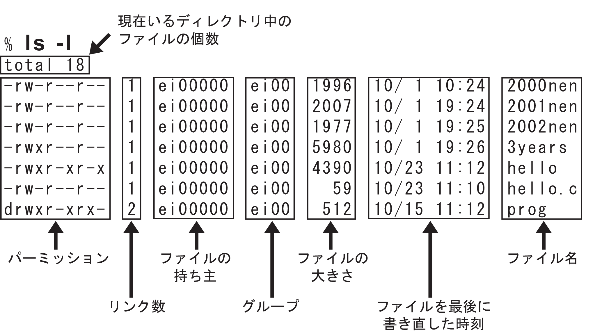
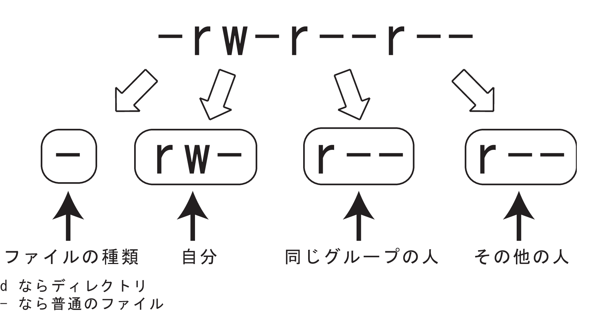
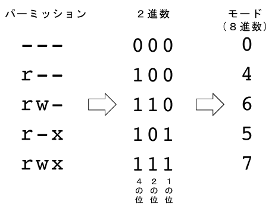
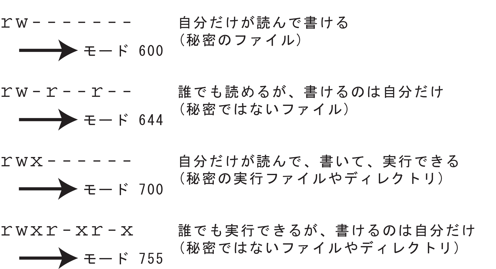

# シェルスクリプトとパーミッション

## シェルスクリプト入門

シェルは、一連のコマンドをファイルに記述しておき、それをまとめて実行する機能も持っている。このようなコマンドが書かれたファイルを**シェルスクリプト**と呼ぶ。

簡単なシェルスクリプトを作成してみよう。Visual Studio Codeで `myscript.sh` という名前のファイルを作成し、以下の内容を記述する。

```sh
# これはコメントです
echo "今日の情報を表示します："
date "+%Y-%m-%d %H:%M:%S"
echo "カレント・ディレクトリのファイル一覧："
ls -F
echo "スクリプトを終了します。"
```

ファイルを保存したら実行してみよう。

```sh
sh myscript.sh
ここに実行結果が表示される
```

このファイルに`chmod` コマンドで実行権限を与える。
`755`が何かは、後のパーミッションのところで説明する。

```sh
chmod 755 myscript.sh
```

実行権限を付けると、ファイル名を呼んで実行できる。
ファイルが現在のディレクトリにあるとき、ファイル名の前に `./` を付けて呼んでみよう。

```
./myscript.sh
ここに実行結果が表示される
```
このように、シェルスクリプトを使うと、定型的な作業を自動化できる。より複雑な条件分岐や繰り返し処理なども記述でき、強力なツールとなる。

## パーミッション: アクセス権限

「パーミッション -- permission」とは、「許可」という意味である。

UNIX系システム（WSL上のUbuntuやmacOSなど）では、「ファイルを読む許可」「ファイルを書いたり消したりする許可」「ファイルを実行する許可」の3種類のパーミッションがある。

ユーザーは自分のファイルに、この3種類のパーミッションを自由に設定できる。この機能を使うと、自分で間違って大事なファイルを消さないように設定したり、他人とファイルを共有したり、秘密のファイルを作ったりすることができる。

UNIX系システムでは、このパーミッションというしくみによって、セキュリティを確保しつつ、他の人と一緒に作業することもできるようになっている。

今回は、パーミッションの設定の仕方を紹介する。

### パーミッションの表示: `ls -l`

まず、ファイルのパーミッションがどうなっているかを見てみよう。

パーミッションなどの詳細なファイル情報を表示するには、「`ls -l` (エルエス エル)」を使う。「-l」オプションは「long」の意味で、詳細な情報を表示する。

実際に実行してみよう。



この出力では、ファイルのパーミッション、持ち主、グループ、ファイルサイズ、更新日時、ファイル名などが表示される。

### パーミッションの見方
パーミッションの読み方を具体的に紹介する。

UNIX系システムには、「読める(r: **r**ead)」「書ける(w: **w**rite)」「実行できる(x: e**x**ecute)」の3種類の基本的なパーミッションがある。

例えば、上記の`ls -l`の出力で「2025nen」というファイルのパーミッションが「-rw-r--r--」と表示されているとする。これは、以下のように4つのパートに分けて読む：



最初の1文字はファイルの種類を示している。
「`d`」であればディレクトリ、「`-`」であれば通常のファイルである。
例えば「`-rw-r--r--`」はファイル、「`drwxr-xr-x`」はディレクトリを表す。
他にもリンクファイルを示す「l」などがある。

その後の9文字は、3文字ずつの3つの組に分かれており、それぞれ以下の対象者に対するパーミッションを示している：

- 最初の3文字（例：「`rw-`」）は、所有者（自分自身、owner）に対するパーミッション
- 次の3文字（例：「`r--`」）は、グループ（group）に属しているユーザーに対するパーミッション
- 最後の3文字（例：「`r--`」）は、それ以外のユーザー（他人、others）に対するパーミッション

3文字1組のパーミッションは、次の図のように、順に「`r`」「`w`」「`x`」の3つの権限の有無を表す：


- 1文字目（「`r`」の部分）：「`r`」なら読める、「`-`」なら読めない
- 2文字目（「`w`」の部分）：「`w`」なら書き込める（変更や削除ができる）、「`-`」なら書き込めない
- 3文字目（「`x`」の部分）：「`x`」なら実行できる、「-」なら実行できない

なお、ディレクトリの場合、「`x`」の権限はそのディレクトリの中に入ることができる（`cd`できる）かどうかを意味する。
ディレクトリの内容を一覧表示するためには「`r`」権限も必要である。

### パーミッションの変更: `chmod`

ファイルのパーミッションを変更するには、`chmod` (**ch**ange **mod**e) コマンドを使う。
`chmod`は、次のように使う：

```
chmod 「モード」 「ファイル名」
```

ここで「モード」とは、パーミッションを数値（通常は8進数）で表したものである。

#### モード

モードの計算方法は以下のとおりである：



パーミッションは「`rwx`」の3つの権限のパターンである。このうち、「`r`」「`w`」「`x`」が与えられているところを「`1`」、「`-`」になっているところを「`0`」として2進数で表現する。この2進数を8進数に変換したものがモードの値となる。

各権限には以下の数値が対応していると考えると分かりやすい：
- 「`r`」 (読み取り) = 4
- 「`w`」 (書き込み) = 2
- 「`x`」 (実行) = 1

これらの数値を足し合わせることで、モードの値（0から7まで）が得られる。
例えば、「`rw-`」というパーミッションは、`r` (4) + `w` (2) + `-` (0) = 6 となる。

これを所有者、グループ、他人のそれぞれについて計算し、3桁の8進数として指定する。例えば、所有者に「`rw-`」(6)、グループに「`r--`」(4)、他人に「`r--`」(4) を設定したい場合は、モードは「644」となる。

よく使われるパーミッションとそのモード値を以下にまとめておく：



#### 実際のパーミッション操作

では、実際に「`my_script.sh`」を使って、パーミッションを変更してみよう。

まず、「`my_script.sh`」のパーミッションを `ls -l`で確認する：

```sh
ls -l my_script.sh
-rw-r--r--  1 taro    staff    76 May  3 15:19 my_script.sh
```

「`my_script.sh`」は誰でも読めるが、書き込めるのは所有者（自分）だけである。

次に「`my_script.sh`」を、他人から読めない秘密のファイルに変更してみよう。自分だけが読み書きできるパーミッションは「`rw-------`」であり、モードは「600」である。
```sh
chmod 600 my_script.sh
```

`ls -l`で確認すると：

```sh
ls -l my_script.sh
-rw-------  1 taro    staff  76 May  3 15:19 my_script.sh
```

確かに「`rw-------`」になっている。これで他人からは読めなくなった。

次に、「`my_script.sh`」を、誰にも読めない、書けない、実行できないという究極の秘密ファイルにしてみよう。このパーミッションは「`---------`」で、モードは「000」である：

```sh
chmod 000 my_script.sh
```

`ls -l`で確認すると：

```sh
ls -l my_script.sh
----------  1 taro    staff  76 May  3 15:19 my_script.sh
```

では、本当に読んだり書いたりできないか、確認してみよう。

Visual Studio Codeで「my_script.sh」のタブがあれば、これを閉じて再度開こうとすると警告が出るだろう。
書き換えようとしても、警告が出るだろう。

もちろん、`cat` コマンドで中身を表示しようとしても、同様のメッセージが表示される：

```sh
cat my_script.sh
cat: my_script.sh: Permission denied
```

次に、自分だけが読めるが書き込めないように変更してみよう。
パーミッションは「`r--------`」で、モードは「400」である：

```sh
chmod 400 my_script.sh
```

`ls -l`で確認すると：

```sh
ls -l hello.c
-r--------  1 taro    staff  76 May  3 15:19 my_script.sh
```

ただし、Visual Studio Codeを使っていると、書き換えて、保存しようとすると警告が出るが、強行できてしまう。


最後に元に戻そう。最初のパーミッションは「`rw-r--r--`」だったので、モードは「644」である：

```sh
chmod 644 my_script.sh
```

`ls -l`で確認すると、元に戻っていることが分かる：

```sh
ls -l my_script.sh
-rw-r--r--  1 taro    staff  76 May  3 15:19 my_script.sh
```

## この章で紹介したコマンド

| コマンド | 説明                                             | 使い方                                           |
| -------- | ------------------------------------------------ |------------------------------------------------- |
| `chmod`  | ファイルやディレクトリのパーミッションを変更する | `chmod 「モード」 「ファイル名/ディレクトリ名」` |
