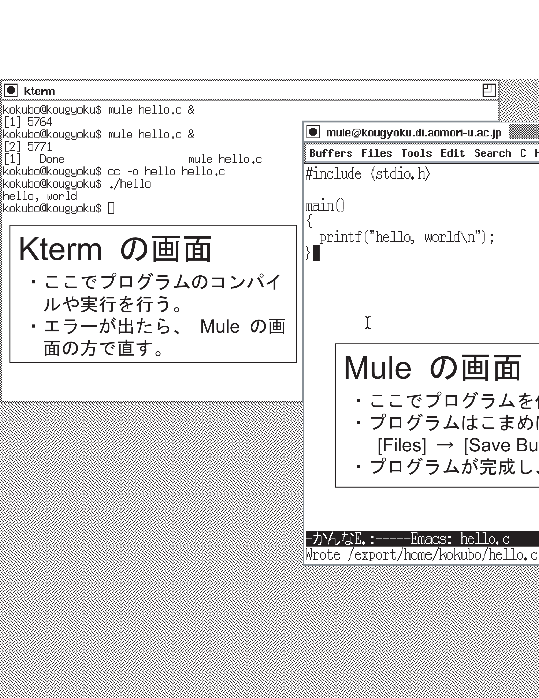
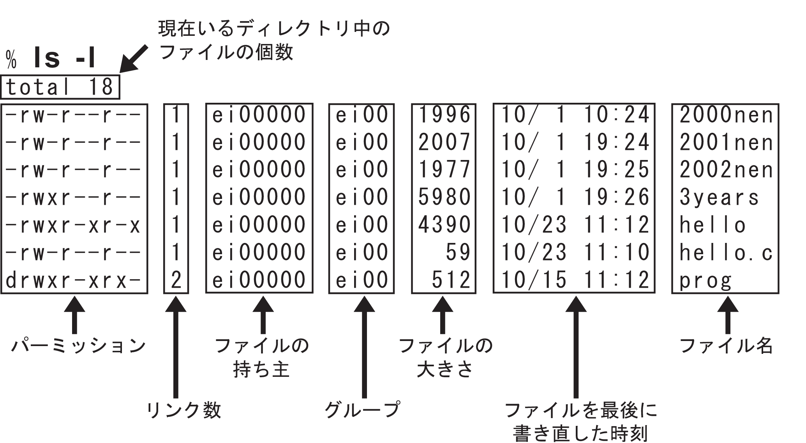
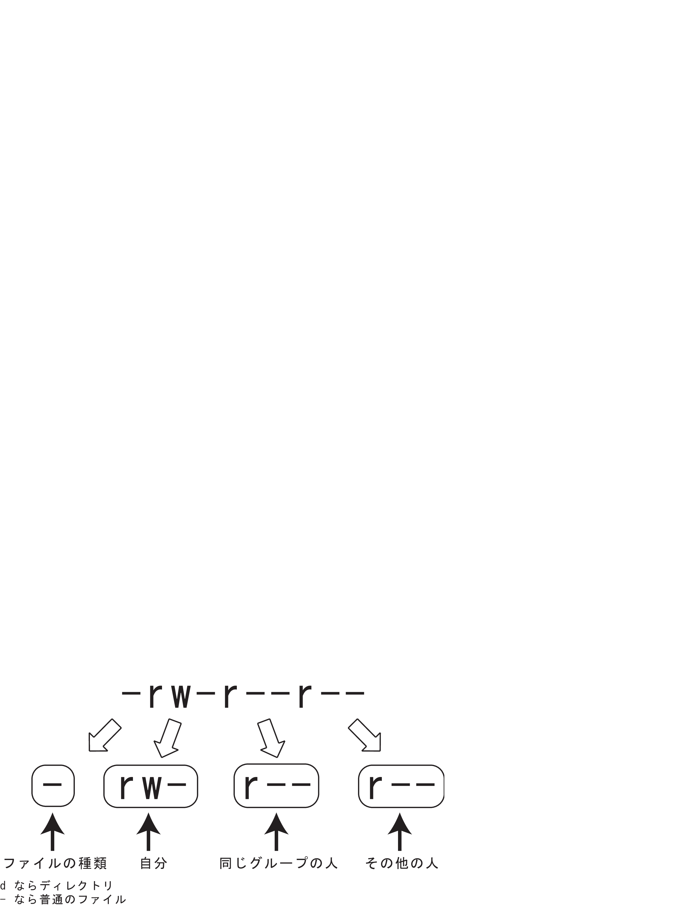
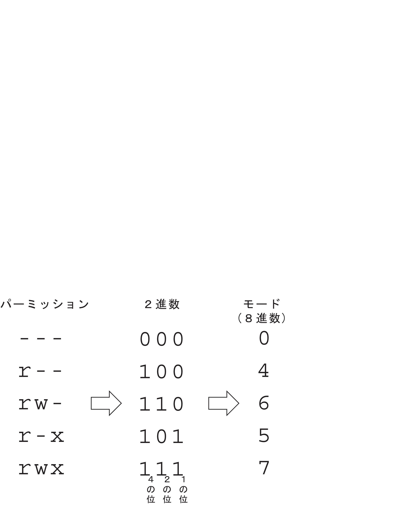
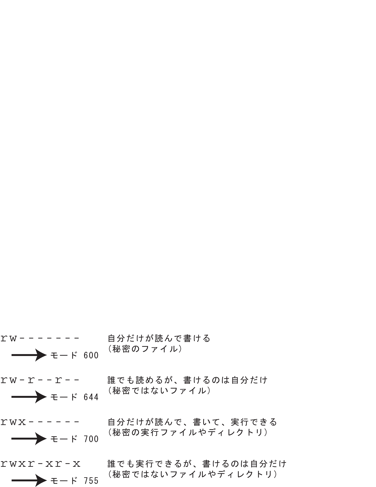
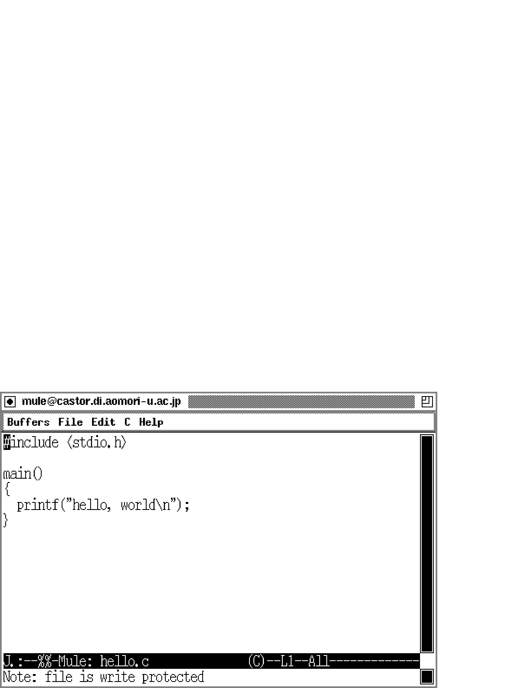

# パーミッション

## セキュリティとファイルの共有

「パーミッション -- permission」とは、「許可」という意味である。

UNIX系システム（macOSやLinux）では、ファイルに3種類のパーミッションがある。「ファイルを読む許可」「ファイルを書いたり消したりする許可」「ファイルを実行する許可」の3つである。

ユーザーは自分のファイルに、この3種類のパーミッションを自由に設定できる。この機能を使うと、自分で間違って大事なファイルを消さないように設定したり、他人とファイルを共有したり、秘密のファイルを作ったりすることができる。

UNIX系システムでは、このパーミッションというしくみによって、セキュリティを確保しつつ、他の人と一緒にプログラムを作ったりすることができるようになっている。

今回は、簡単なプログラムの作り方を説明しながら、パーミッションの設定の仕方を紹介する。

## プログラミング

UNIX系システム（macOSやWSL上のUbuntu）でプログラムを書くときには、まずテキストエディタ（Visual Studio Code、Vim、`nano` (ナノ)、Emacsなど）を使ってソース・コードを作成する。


図8.1: 開発環境の例

ソース・コードを作成したら、別のターミナルウィンドウでコンパイルのためのコマンドを実行する。エラーが出た場合は、エディタに戻って修正し、再度保存する。正常にコンパイルできたら、プログラムを実行する。

### ソース・コードの作成

実際にテキストエディタでソース・コードを作成してみよう。

C言語の入門で有名な例として、「hello, world」と表示するプログラムを作ってみる。

まず、テキストエディタを使って「hello.c」というファイルを作る。UNIX系システムでは、C言語のプログラムは慣習的にファイル名の末尾に「.c」を付ける。

macOSの場合：
```
% nano hello.c
```
(`nano` (ナノ) はシンプルなテキストエディタである。)

WSL Ubuntuの場合：
```
$ nano hello.c
```

または、お好みのエディタを使う：
```
% code hello.c  # Visual Studio Code を起動する場合
```
(`code` (コード) はVisual Studio Codeを起動するコマンドである。)

「hello.c」の中には、次のようなプログラムを書いて保存しよう：

```c
#include <stdio.h>

int main()
{
  printf("hello, world\\n");
  return 0;
}
```

> **注**: 現代のC言語では、`main`関数の戻り値を`int`型として宣言し、関数の最後で`return 0;`を記述するのが標準的である。これはプログラムが正常に終了したことをOSに伝える役割を持つ。

### コンパイル

C言語で書かれたソース・コードは、人間には理解しやすいが、コンピュータが直接実行できる形式ではない。そのため、Cコンパイラを使ってコンピュータが理解できるマシン語に変換する必要がある。この変換作業をコンパイルという。

では、次のようにしてCコンパイラを起動し、「hello.c」からマシン語の実行ファイル「hello」を作成しよう。`cc` (シーシー) コマンドは「C Compile（Cコンパイル）」の略である。

macOSの場合：
```
% cc -o hello hello.c
```

WSL Ubuntuの場合：
```
$ cc -o hello hello.c
```
(`-o hello` の部分は、出力される実行ファイルの名前を `hello` に指定するという意味である。)

うまくいくと、特に何もメッセージが表示されずに終了する。エラーがある場合は、メッセージが表示されるので、プログラムに誤りがないか確認すること。

たとえば、次のように5行目の`printf`内の`"hello, world\\n"`の終わりのダブルクォーテーション（`"`）を削除してからコンパイルしてみると：

```c
#include <stdio.h>

int main()
{
  printf("hello, world\\n);
  return 0;
}
```

以下のようなエラーメッセージが表示される：

macOSの場合：
```
% cc -o hello hello.c
hello.c:5:25: error: missing terminating '"' character
  printf("hello, world\\n);
                        ^
1 error generated.
```

WSL Ubuntuの場合：
```
$ cc -o hello hello.c
hello.c:5:25: error: missing terminating '"' character
    5 |   printf("hello, world\\n);
      |                         ^
hello.c:5:10: error: expected ')' before 'return'
    5 |   printf("hello, world\\n);
      |          ^~~~~~~~~~~~~
```

エラーが出なくなったら、実行ファイル「hello」が作成されているか `ls` (エルエス) コマンドで確認しよう：

macOSの場合：
```
% ls -F
hello*  hello.c  ...その他のファイル...
```

WSL Ubuntuの場合：
```
$ ls -F
hello*  hello.c  ...その他のファイル...
```

確かに「hello」というファイルができていて、実行可能を表す「*」が付いていることが確認できる。

### コマンドの実行

では、「hello」を実行してみよう。実行するには、ファイル名の先頭に「./」を付けて、「./hello」と入力する。

```
% ./hello
hello, world
```

すると「hello, world」と表示される。

「./hello」は、相対パスで「現在のディレクトリの中にあるhelloという名前のファイル」という意味である。UNIX系システムでは、このようにファイル名を指定するだけで、実行可能な場合には実行される。

UNIX系システムでは、これまで使ってきた`ls` (エルエス)、`cal` (キャル) などのコマンドも、このようにCなどのプログラミング言語で書かれ、コンパイルして作られたものである。

macOSやWSL上のUbuntuでは、C言語以外にも、Python、JavaScript、Java、Rust、Go、Rubyなどさまざまなプログラミング言語が利用できる。それぞれの環境で自分でプログラムを作成してみるとよいだろう。

## パーミッション

では、ここでは、前の節で作成した「hello.c」や「hello」を使って、パーミッションについて紹介する。

### パーミッションの表示: `ls -l`

まず、ファイルのパーミッションがどうなっているかを見てみよう。

パーミッションなどの詳細なファイル情報を表示するには、「`ls -l` (エルエス エル)」を使う。「-l」オプションは「long」の意味で、詳細な情報を表示する。

実際に実行してみよう。


図8.2: `ls -l` コマンドの出力例と見方

この出力では、ファイルのパーミッション、所有者、グループ、ファイルサイズ、更新日時、ファイル名などが表示される。

### パーミッションの見方

では次に、パーミッションの読み方を具体的に説明する。

UNIX系システムには、「読める(r: **r**ead)」「書ける(w: **w**rite)」「実行できる(x: e**x**ecute)」の3種類の基本的なパーミッションがある。

例えば、上記の`ls -l`の出力で「2000nen」というファイルのパーミッションが「-rw-r--r--」と表示されているとする。これは、以下のように4つのパートに分けて読む：


図8.3: パーミッションの構成要素

最初の1文字はファイルの種類を示している。「d」であればディレクトリ、「-」であれば通常のファイルである。他にもリンクファイルを示す「l」などがある。例えば「-rw-r--r--」はファイル、「drwxr-xr-x」はディレクトリを表す。

その後の9文字は、3文字ずつの3つの組に分かれており、それぞれ以下の対象者に対するパーミッションを示している：

- 最初の3文字（例：「rw-」）は、所有者（自分自身、owner）に対するパーミッション
- 次の3文字（例：「r--」）は、ファイルのグループ（group）に属しているユーザーに対するパーミッション
- 最後の3文字（例：「r--」）は、それ以外のユーザー（他人、others）に対するパーミッション

3文字1組のパーミッションは、次の図のように、順に「r」「w」「x」の3つの権限の有無を表す：


図8.4: `rwx`フラグの意味

- 1文字目（「r」の部分）：「r」なら読める、「-」なら読めない
- 2文字目（「w」の部分）：「w」なら書き込める（変更や削除ができる）、「-」なら書き込めない
- 3文字目（「x」の部分）：「x」なら実行できる、「-」なら実行できない

なお、ディレクトリの場合、「x」の権限は少し意味が異なり、そのディレクトリの中に入ることができる（`cd`できる）かどうかを意味する。ディレクトリの内容を一覧表示するためには「r」権限も必要である。

### パーミッションの変更: `chmod`

ファイルのパーミッションを変更するには、`chmod` (チェンジモード) コマンドを使う。これは「**ch**ange **mod**e -- モード変更」の略である。`chmod`は、次のように使う：

```
chmod 「モード」 「ファイル名」
```

ここでの「モード」とは、パーミッションを数値（通常は8進数）で表したものである。

#### モードとは？

モードの計算方法は以下のとおりである：


図8.5: パーミッションからモード値を計算する方法

パーミッションは「rwx」の3つの権限のパターンである。このうち、「r」「w」「x」が与えられているところを「1」、「-」になっているところを「0」として2進数で表現する。この2進数を8進数に変換したものがモード値となる。

各権限には以下の数値が対応していると考えると分かりやすい：
- 「r」 (読み取り) = 4
- 「w」 (書き込み) = 2
- 「x」 (実行) = 1

これらの数値を足し合わせることで、1つの対象者（所有者、グループ、他人）に対するモード値（0から7まで）が得られる。例えば、「rw-」というパーミッションは、r (4) + w (2) + - (0) = 6 となる。

これを所有者、グループ、他人のそれぞれについて計算し、3桁の8進数として指定する。例えば、所有者に「rw-」(6)、グループに「r--」(4)、他人に「r--」(4) を設定したい場合は、モードは「644」となる。

よく使われるパーミッションとそのモード値を以下にまとめておく：


図8.6: 代表的なパーミッションとモード値の対応

#### 実際のパーミッション操作

では、実際に「hello.c」や「hello」というファイルを使って、パーミッションの変更をしてみよう。

まず、「hello.c」と「hello」のパーミッションを `ls -l` (エルエス エル) で確認する：

macOSの場合：
```
% ls -l
-rwxr-xr-x  1 kokubo  staff  8432 May  3 15:20 hello
-rw-r--r--  1 kokubo  staff    76 May  3 15:19 hello.c
```

WSL Ubuntuの場合：
```
$ ls -l
-rwxr-xr-x  1 kokubo kokubo 16664 May  3 15:20 hello
-rw-r--r--  1 kokubo kokubo    76 May  3 15:19 hello.c
```

「hello」は誰でも読んだり実行できるが、書き込めるのは所有者（自分）だけである。「hello.c」は誰でも読めるが、書き込めるのは所有者（自分）だけである。

ここで「hello.c」を、他人から読めない秘密のファイルに変更してみよう。自分だけが読み書きできるパーミッションは「rw-------」であり、モードは「600」である。次のように `chmod` (チェンジモード) コマンドで変更する：

```
% chmod 600 hello.c
```

`ls -l`で確認すると：

```
% ls -l hello.c
-rw-------  1 kokubo  staff  76 May  3 15:19 hello.c
```

確かに「rw-------」になっている。これで他人からは読めなくなった。

次に、この「hello.c」を、誰にも読めない、書けない、実行できないという究極の秘密ファイルにしてみよう。このパーミッションは「---------」で、モードは「000」である：

```
% chmod 000 hello.c
```

`ls -l`で確認すると：

```
% ls -l hello.c
----------  1 kokubo  staff  76 May  3 15:19 hello.c
```

では、本当に読んだり書いたりできないか、テキストエディタ `nano` (ナノ) で開いて確認してみよう：

macOSの場合：
```
% nano hello.c
```

WSL Ubuntuの場合：
```
$ nano hello.c
```

すると「Permission denied」（許可されていません）というメッセージが表示されて、ファイルを開くことができないはずである。


図8.7: パーミッションがないためファイルにアクセスできない例

もちろん、`cat` (キャット) コマンドで内容を表示しようとしても、同様のメッセージが表示される：

```
% cat hello.c
cat: hello.c: Permission denied
```
(`cat` (キャット) はファイルの内容を表示するコマンドである。)

次に、自分だけが読めるが書き込めないように変更してみよう。間違って削除したくない重要なファイルは、このように設定しておくとよいだろう。

このパーミッションは「r--------」で、モードは「400」である：

```
% chmod 400 hello.c
```

`ls -l`で確認すると：

```
% ls -l hello.c
-r--------  1 kokubo  staff  76 May  3 15:19 hello.c
```

このファイルをテキストエディタで開いてみると、読み取り専用であることが示され、内容を変更することができない：


図8.8: 読み取り専用でファイルが開かれた例

何か文字を入力しようとすると、「読み取り専用です」というメッセージが表示される：


図8.9: 読み取り専用ファイルへの書き込み試行時の警告

最後に元に戻そう。最初のパーミッションは「rw-r--r--」だったので、モードは「644」である：

```
% chmod 644 hello.c
```

`ls -l`で確認すると、元に戻っていることが分かる：

```
% ls -l hello.c
-rw-r--r--  1 kokubo  staff  76 May  3 15:19 hello.c
```

次に「hello」という実行ファイルのパーミッションを変更してみよう。現在のパーミッションは以下のとおりである：

```
% ls -l hello
-rwxr-xr-x  1 kokubo  staff  8432 May  3 15:20 hello
```

誰でも読めて実行できるが、書き込めるのは所有者だけである。これを、読み書きに関しては変えずに、誰も実行できないように変更してみよう。そのパーミッションは「rw-r--r--」で、モードは「644」である：

```
% chmod 644 hello
```

`ls -l`で確認すると：

```
% ls -l hello
-rw-r--r--  1 kokubo  staff  8432 May  3 15:20 hello
```

実行権限がなくなった。では、実行できるか試してみよう：

```
% ./hello
zsh: permission denied: ./hello
```

macOSの場合は「zsh: permission denied: ./hello」、WSL Ubuntuの場合は「bash: ./hello: Permission denied」というメッセージが表示され、実行できないことが確認できる。

元に戻そう。最初のパーミッションは「rwxr-xr-x」だったので、モードは「755」である：

```
% chmod 755 hello
```

`ls -l`で確認する：

```
% ls -l hello
-rwxr-xr-x  1 kokubo  staff  8432 May  3 15:20 hello
```

実行できるか試してみよう：

```
% ./hello
hello, world
```

確かに実行できることが確認できた。

## この章で紹介したコマンド

### パーミッションの操作

| コマンド | ふりがな    | 説明                                   | 使い方                                     |
|----------|-------------|----------------------------------------|--------------------------------------------|
| `chmod`  | チェンジモード | ファイルやディレクトリのパーミッションを変更する | `chmod 「モード」 「ファイル名/ディレクトリ名」` |

### Cコンパイラ

| コマンド | ふりがな | 説明                                     | 使い方                                               |
|----------|----------|------------------------------------------|------------------------------------------------------|
| `cc`     | シーシー   | C言語のソースコードをコンパイルして実行ファイルを作成する | `cc -o 「実行ファイル名」 「ソースのファイル名」` |

(表にふりがな列を追加し、説明を少し補足しました。)
