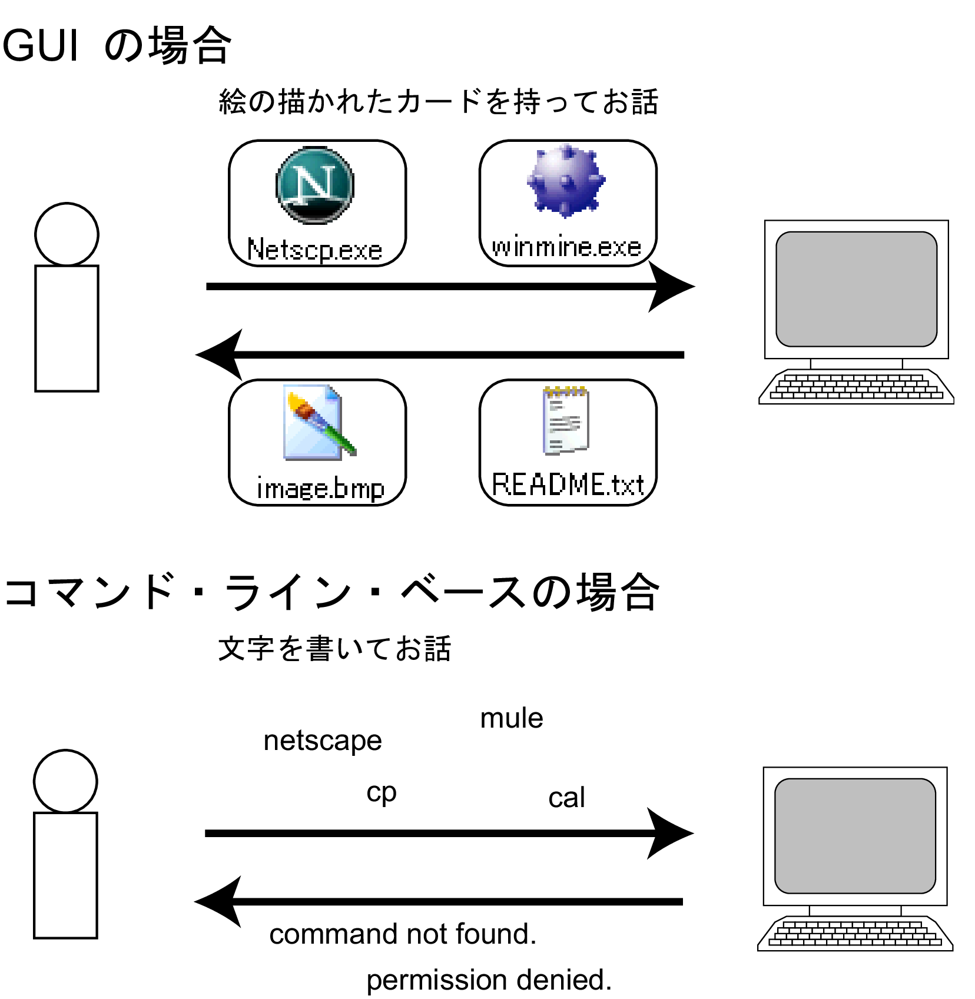
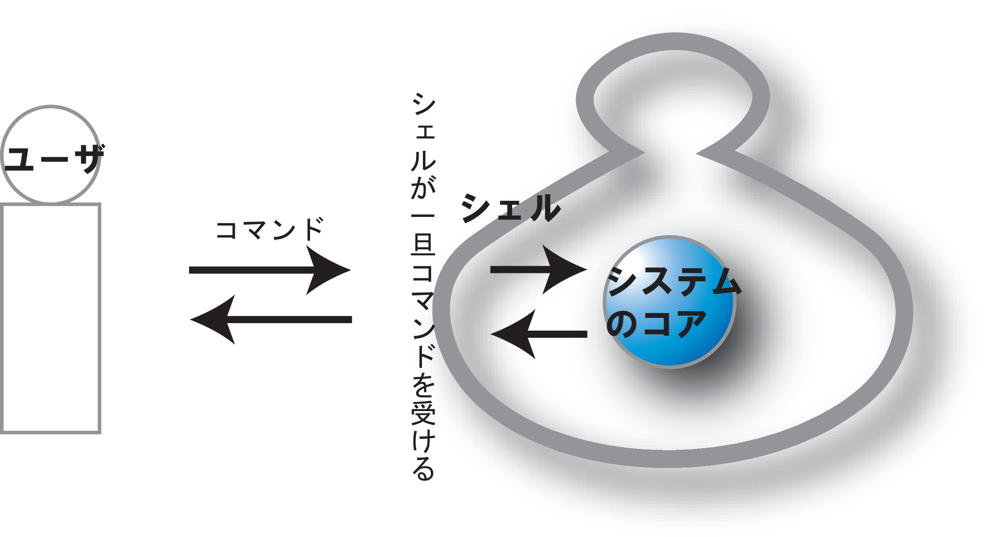
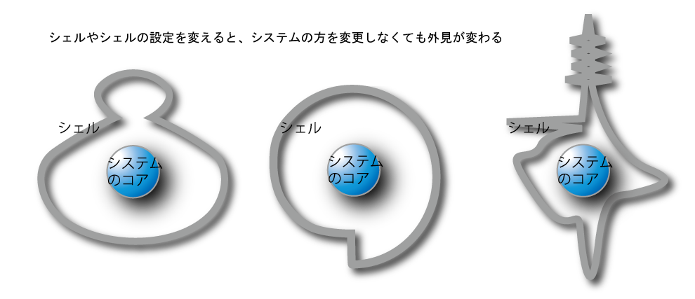

# シェル

## シェルとは何か？

「シェル（shell）」とは、英語で「貝殻」を意味する言葉である。UNIX系システム（macOSやLinuxなど）における**シェル**は、システムの中心部分（カーネルと呼ばれる）を包み込み、ユーザーがシステムと対話するための窓口となるプログラムである。

これまでターミナルでコマンドを入力してきたが、実はそのコマンドを受け取り、システムに伝えていたのがシェルなのである。シェルは、ユーザーの指示を解釈し、それをOSが理解できる形に翻訳する通訳のような役割を担っている。

この章では、シェルの基本的な機能と、それを活用してUNIX系システムをより快適に使う方法について学ぶ。

## ユーザーインターフェース：GUIとCUI (CLI)

コンピュータの操作方法には、大きく分けて二つの方式がある。

### GUI（グラフィカル・ユーザーインターフェース）
GUIは、アイコンやウィンドウ、ボタンなどをマウスやトラックパッドで操作する方式である。macOSやWindowsのデスクトップ画面が代表的な例である。直感的に操作できるため、初心者にも馴染みやすい。ウェブブラウザやワープロソフトなど、多くのアプリケーションがGUIを採用している。

### CUI（キャラクター・ユーザーインターフェース）またはCLI（コマンドライン・インターフェース）
CUI/CLIは、キーボードから文字（コマンド）を入力してコンピュータと対話する方式である。ターミナルを通じてシェルを利用するのが、この方式にあたる。特定のコマンドを覚える必要はあるが、慣れるとGUIよりも素早く、また複雑な操作や自動化も行いやすいという利点がある。


図9.1: GUIとCUIの違い

GUIは視覚的でわかりやすいが、定型的な作業の繰り返しや、大量のファイルに対する一括処理などには不向きな場合がある。一方、CUI/CLIは、シェルが提供する様々な機能を活用することで、これらの作業を効率的に行うことができる。

## シェルの役割

シェルは、ユーザーとUNIX系システムの核（カーネル）との間に位置し、以下のような重要な役割を担っている。

1.  **コマンドの解釈と実行**: ユーザーが入力したコマンドを解釈し、カーネルに伝えて実行させる。
2.  **ユーザー環境の提供**: コマンド入力の支援（後述する補完機能や履歴機能など）、環境変数の管理など、ユーザーが作業しやすい環境を提供する。
3.  **プログラミング機能**: シェルスクリプトと呼ばれる簡易なプログラムを作成・実行することで、一連の作業を自動化できる。

シェルがあるおかげで、ユーザーはシステムの複雑な内部構造を意識することなく、コマンドを通じてシステムを操作できる。また、シェル自体を交換したりカスタマイズしたりすることで、ユーザーの好みに合わせた操作環境を構築することも可能である。


図9.2: シェルによるユーザーとカーネルの仲介

「システムはシンプルに、高度な機能はシェルに任せる」というのがUNIXの設計思想の一つである。


図9.3: シェルは交換可能であることのイメージ

## 代表的なシェル

UNIX系システムでは、様々な種類のシェルが利用できる。代表的なものをいくつか紹介する。

*   **`sh` (エスエイチ) (Bourne Shell)**: 初期の標準的なシェル。非常にシンプルである。多くのシステムでは、より高機能な`bash` (バッシュ) や`dash` (ダッシュ) へのエイリアス（別名）またはシンボリックリンクになっていることが多い。
*   **`bash` (バッシュ) (Bourne Again SHell)**: `sh`を拡張して作られた高機能なシェルである。多くのLinuxディストリビューションで標準シェルとして採用され、WSL上のUbuntuでも採用されている。「ボーン・アゲイン・シェル」と読む。
*   **`zsh` (ゼットエスエイチ) (Z Shell)**: `sh`や`bash`の機能を取り込み、さらに強力な補完機能やカスタマイズ性を持つシェルである。macOSではCatalina (10.15) 以降、標準シェルとなっている。

現在、macOSのターミナルを起動するとデフォルトで`zsh` (ゼットエスエイチ) が、WSL上のUbuntuなど多くのLinux環境では`bash` (バッシュ) が起動することが一般的である。これらのシェルは、ターミナルでその名前（例: `bash`、`zsh`）を入力することで一時的に切り替えて試すこともできる。

## シェルの便利な機能

現代のシェル（特に`bash` (バッシュ) や`zsh` (ゼットエスエイチ)）は、コマンド入力を助ける多くの便利な機能を備えている。

### 1. コマンド履歴（ヒストリー）機能

シェルは、過去に入力したコマンドを記憶している。これを履歴（ヒストリー）機能という。

まず、`who` (フー)、`ls` (エルエス)、`cal` (キャル)、`ps` (ピーエス) といったコマンドをいくつか実行してみよう。その後、`history` (ヒストリー) コマンドを実行すると、過去に入力したコマンドの一覧が表示される。

```
$ history
  501  who
  502  ls
  503  ps
  504  history
```
表示される番号や時刻は環境によって異なる。

記憶されたコマンドは簡単に再実行できる。

*   **`!数字`**: 指定した番号のコマンドを実行する。
    例えば、`!501`と入力すると、履歴の501番のコマンド（この例では`who` (フー)）が実行される。
    ```
    $ !501
    who
    kokubo   console  May  7 10:00
    kokubo   ttys000  May  7 10:02
    ```
*   **`!文字列`**: 指定した文字列で始まる直近のコマンドを実行する。
    例えば、`!c`と入力すると、直近で実行された`c`で始まるコマンド（この例では`cal` (キャル)）が実行される。
    ```
    $ !p
    ps
    PID TTY           TIME CMD
    9950 ttys001    0:00.05 /bin/zsh -il
    ```
    プログラムのコンパイル (`cc -o myprog myprog.c` のような長いコマンド) を一度入力すれば、次からは `!cc` や `!c` だけで再コンパイルできて便利である。

*   **`!!`**: 直前に入力したコマンドを再度実行する。

### 2. コマンドライン編集機能

入力中のコマンドラインや、履歴から呼び出したコマンドは、キー操作で編集できる。

*   **上矢印キー (↑) または `Ctrl+P`**: 一つ前の履歴コマンドを呼び出す。
*   **下矢印キー (↓) または `Ctrl+N`**: 一つ後の履歴コマンドを呼び出す。
*   **左矢印キー (←) または `Ctrl+B`**: カーソルを1文字左へ移動 (Back)。
*   **右矢印キー (→) または `Ctrl+F`**: カーソルを1文字右へ移動 (Forward)。
*   **`Ctrl+A`**: カーソルを行頭へ移動。
*   **`Ctrl+E`**: カーソルを行末へ移動 (End)。
*   **`Delete`キー (macOSでは `fn+delete`) または `Ctrl+D`**: カーソル位置の1文字を削除。
*   **`Backspace`キー (macOSでは `delete`)**: カーソル前の1文字を削除。

これらのキーを組み合わせることで、コマンドの打ち間違いを修正したり、過去のコマンドを少し変更して実行したりするのが容易になる。

### 3. エイリアス（コマンドの別名）機能

よく使うコマンドやオプションの組み合わせに、短い別名（エイリアス）を付けることができる。

例えば、`ls -F` (エルエス エフ) というコマンドは、ファイルの種類を記号で表示してくれる便利なコマンドだが、毎回 `-F` を付けるのは少し手間である。そこで、`ls` (エルエス) と入力するだけで `ls -F` (エルエス エフ) が実行されるようにエイリアスを設定できる。

```bash
$ alias ls='ls -F'
```
(`alias` (エイリアス) は別名を定義するコマンドである。)

これで、単に `ls` (エルエス) と入力すると、実際には `ls -F` (エルエス エフ) が実行されるようになる。
```
$ ls
Applications/   Desktop/        Documents/      Downloads/      hello*          hello.c
```
ディレクトリ名の後ろに `/`、実行可能ファイルの後ろに `*` が付くようになった。

設定したエイリアスは、`alias` (エイリアス) コマンド（引数なし）で確認できる。この設定は、現在のシェルセッションでのみ有効である。永続的に設定するには、シェルの設定ファイル（後述）に記述する。

### 4. タブ補完（ファイル名やコマンド名の補完）機能

コマンド名やファイル名、ディレクトリ名の一部を入力した後に `Tab`キーを押すと、シェルが残りの部分を自動的に補完してくれる機能である。

例えば、カレントディレクトリに `Desktop` と `Documents` というディレクトリがある場合、
```
$ cd D
```
と入力した後に `Tab`キーを押すと、`D`で始まる候補が複数あるため、シェルは候補一覧を表示する（シェルの設定によってはビープ音が鳴る）。
```
$ cd D
Desktop/   Documents/
```
続けて `e` を入力し `cd De` となったところで再度 `Tab`キーを押すと、`De`で始まるものは `Desktop` しかないため、自動的に `cd Desktop/` と補完される。

候補が一つに定まらない場合は、もう一度 `Tab`キーを押すと候補一覧が表示されることが多い（`zsh` (ゼットエスエイチ) の場合など）。この機能により、長い名前を正確に入力する手間が大幅に省け、タイプミスも減らせる。

### 5. ワイルドカード（グロブ）

ファイル名を指定する際に、複数のファイルに一致するような特殊なパターン文字（ワイルドカードまたはグロブパターン）を使用できる。

*   **`*` (アスタリスク)**: 任意の0文字以上の文字列に一致する。
    *   `*.txt`: `.txt` で終わるすべてのファイル (例: `document.txt`, `memo.txt`)
    *   `data*`: `data` で始まるすべてのファイル (例: `data1.csv`, `data_backup`)
    *   `a*z`: `a` で始まり `z` で終わるすべてのファイル (例: `az`, `applepie_is_amazing`)

*   **`?` (クエスチョンマーク)**: 任意の一文字に一致する。
    *   `data?.txt`: `data` の後に1文字があり、`.txt` で終わるファイル (例: `data1.txt`, `dataX.txt`。`data10.txt` には一致しない)
    *   `???.c`: 任意の3文字で `.c` で終わるファイル (例: `abc.c`, `xyz.c`)

*   **`[]` (角括弧)**: 角括弧内のいずれか1文字に一致する。
    *   `[abc].txt`: `a.txt`, `b.txt`, `c.txt` のいずれかに一致する。
    *   `data[0-9].txt`: `data0.txt` から `data9.txt` までに一致する。
    *   `data[!0-9].txt`: `data` の後に数字以外の1文字があり、`.txt` で終わるファイルに一致する（`!` は否定）。

例えば、カレントディレクトリにある `.c` で終わるすべてのC言語ソースファイルを表示したい場合は、以下のようにする。
```
$ ls *.c
hello.c   main.c   utils.c
```
`report_2024_01.txt`, `report_2024_02.txt`, ..., `report_2024_12.txt` というファイル群をまとめて削除したい場合は、以下のようにする。
```
$ rm report_2024_*.txt
```
(`rm` (アールエム) はファイルを削除するコマンドである。)

**注意**: `rm` (アールエム) コマンドとワイルドカードを組み合わせる際は、意図しないファイルを削除してしまわないよう、事前に `ls` (エルエス) コマンドで対象ファイルを確認するなど、慎重に操作すること。特に `rm *` のようなコマンドは非常に危険である。

## シェルの設定をカスタマイズする

シェルの動作は、設定ファイルを編集することでカスタマイズできる。これにより、エイリアスを永続化したり、プロンプトの表示を変更したり、シェルの起動時に特定のコマンドを自動実行したりできる。

代表的なシェルの設定ファイルは以下の通りである。これらは通常、ユーザーのホームディレクトリに置かれる。

*   **`bash` (バッシュ)**: `~/.bashrc` (対話的シェルが起動するたびに読み込まれる), `~/.bash_profile` (ログイン時に読み込まれる)
*   **`zsh` (ゼットエスエイチ)**: `~/.zshrc` (対話的シェルが起動するたびに読み込まれる), `~/.zprofile` (ログイン時に読み込まれる)

ファイル名の先頭にある `.` は、そのファイルが隠しファイルであることを意味する。`ls -a` (エルエス エー) コマンドで表示できる。

### 設定ファイルへのエイリアスの記述例

例えば、`ls -F` (エルエス エフ) のエイリアスを `ls` (エルエス) として永続的に設定したい場合、

**`bash` (バッシュ) ユーザーの場合**: `~/.bashrc` に以下のように記述する。
```bash
# My Custom Aliases
alias ls='ls -F'
alias ll='ls -lFh' # 詳細表示のエイリアスも追加
```

**`zsh` (ゼットエスエイチ) ユーザーの場合**: `~/.zshrc` に同様に記述する。
```bash
# My Custom Aliases
alias ls='ls -F'
alias ll='ls -lFh'
```

ファイルを編集・保存した後、新しい設定を反映させるには、シェルを再起動するか、以下のコマンドを実行する。

`bash` (バッシュ) の場合:
```
$ source ~/.bashrc
```
(`source` (ソース) は指定したファイルの内容を現在のシェル環境で実行するコマンドである。)

`zsh` (ゼットエスエイチ) の場合:
```
$ source ~/.zshrc
```

**注意**: 設定ファイルを編集する前には、念のためバックアップを取っておくと安心である。
例: `cp ~/.bashrc ~/.bashrc.backup` (`cp` (シーピー) はファイルをコピーするコマンドである。)

## この章で紹介したコマンド

| コマンド        | ふりがな     | 説明                                   | 主な使い方例                               |
|---------------|--------------|----------------------------------------|-------------------------------------------|
| `history`     | ヒストリー   | コマンドの履歴を表示する                   | `history`                                 |
| `!数字`       |              | 履歴番号で指定したコマンドを実行する         | `!123`                                    |
| `!文字列`     |              | 指定文字列で始まる直近のコマンドを実行する     | `!ls`                                     |
| `!!`          |              | 直前のコマンドを再実行する                 | `!!`                                      |
| `alias`       | エイリアス   | コマンドの別名（エイリアス）を設定・表示する | `alias ls='ls -F'`, `alias`             |
| `unalias`     | アンエイリアス | 設定したエイリアスを解除する               | `unalias ls`                              |
| `source`      | ソース       | シェル設定ファイルを現在のシェルに読み込む   | `source ~/.bashrc`                        |
| `echo`        | エコー       | 文字列や変数の値を表示する                 | `echo "Hello"`                            |

シェルを使いこなすことで、UNIX系システムでの作業効率は格段に向上する。様々な機能を試して、自分にとって使いやすい環境を構築していこう。
